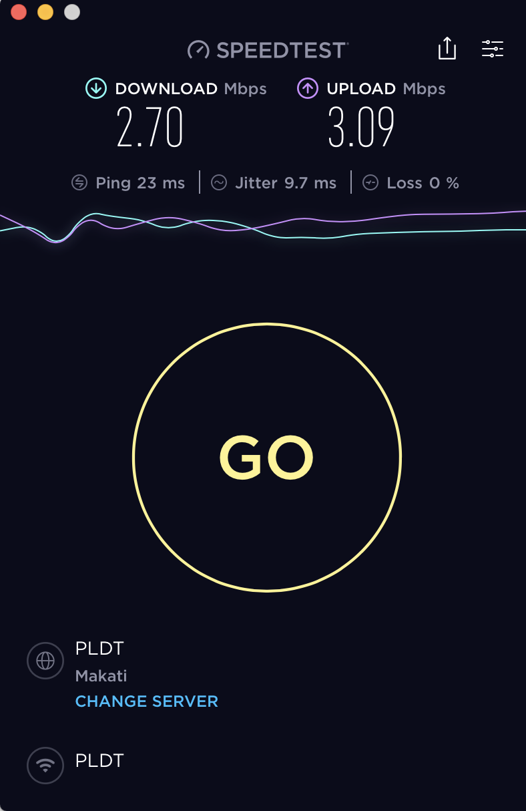
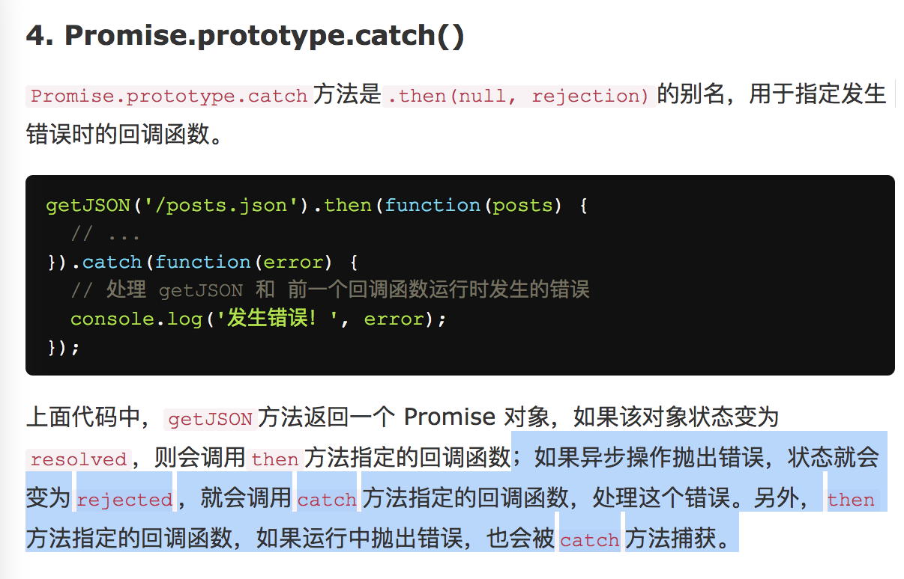

## 运营商 x 兆网速和实际网速

运营商 兆 网速 指的是 兆比特/秒 位(宽带传输单位)，一个字节 = 8 位, 1Byte = 8 bit，所以与实际网速转换关系为

Mbps / 8




实际网速为 2.7兆比特/s /8 = 337.5kb /s


## mac 系统可执行命令

- 位于 user/local/bin 目录的文件

```
下载两个对应插件 imgls imgcat
去掉后缀名，把文件拷贝到 /usr/local/bin 中，并修改权限 chmod 755 /usr/local/bin/imgls /usr/local/bin/imgcat
然后就可以使用啦，如上图所示。另外一种用法是 cat avatar.jpg | imgcat，也是同样的效果：

curl -O {downloadUrl}

下载文件后 放入 user/local/bin 文件夹, 赋予可执行权限后，可以直接在终端使用此命令

imgls || imgcat
```

### nodeMoudle 软连接到 user/local/bin ?


### try catch

promise http, 中 err => {}, 表示 404， .. server 500, 服务器交流成成功后，错误根据 与server 规定状态码

try catch 也可以捕获这个 callback 的 error, await 没有 callback 用try catch 捕获




## window 32 64 位

- 如果你使用的是64位处理器，则需要安装64位版本的Windows，当然32位版本的Windows也能在64位处理器上工作。不过不能在32位处理器上安装64位版本的Windows。

- 驱动和软件不同，32位和64位是不能通用的。即使是软件也只能是64位系统可以运行32位软件，反过来则不行，
