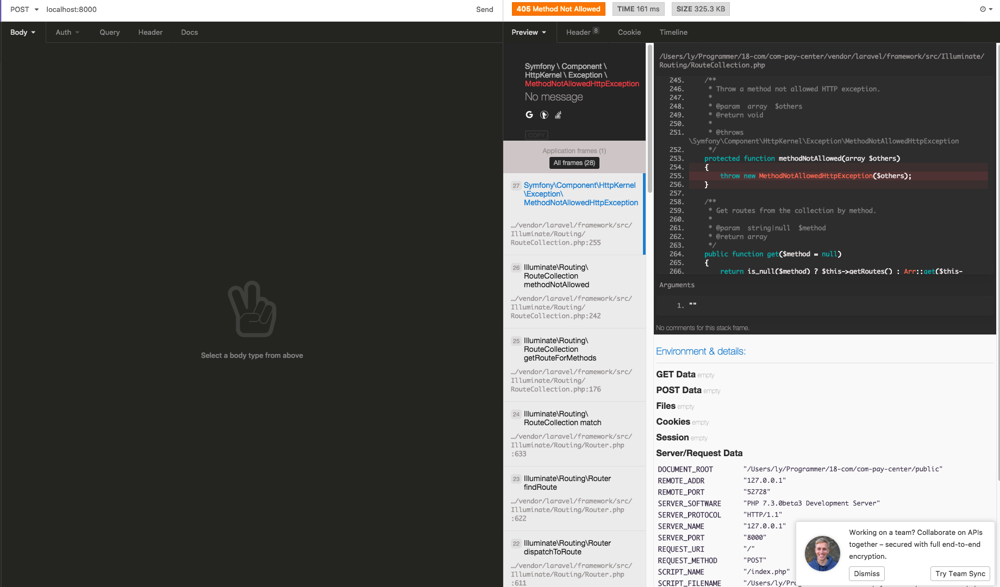

## 网络安全

- ddos 肉机攻击，很多肉机同时请求服务器，对服务器造成负担

- csrf

> 目的使页面访问者，和请求发起者是同一个人

> 之前在编写代码的时候，遇到 ajax 请求 php 不成功，因为缺少  csrf, 如下图

网站在生成表单页时生成唯一令牌。此令牌用于将数据发送/获取回服务器。

因为令牌是由您的站点生成的，并且只有在生成带有表单的页面时才会提供，所以其他站点无法模仿您的表单--它们将没有令牌，因此无法将其发布到您的站点。

