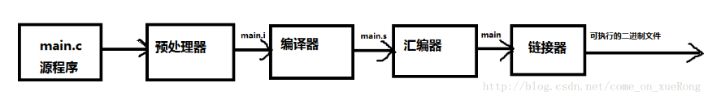

## 计算机是如何进行工作的
可执行的二进制文件是计算机“认识”的文件，可以直接执行。


## 二进制算法

```js

正数转二进制
以 66 为例子
66 / 2 = 33 % 0
33 / 2 = 16 % 1
16 / 2 = 8 % 0
8 /  2 = 4 % 0
4 /  2 = 2 % 0
2 / 2  = 1 % 0
1 / 2  = 0 % 1

除到 商 为 0，倒序组装 余数, 高为 补 0
0  1 0 0 0 0 1 0

负数转二进制
对正数取二进制 然后取反 + 1
-66 的二进制位
      0 1 0 0 0 0 1 0
~     
      1 0 1 1 1 1 0 1
+                   1
      1 0 1 1 1 1 1 0  // 逢 2 进 1

```

## 位运算在 Js 中的应用

### 字符串 indexOf
```js

// 普通写法
url.indexOf（'?'） > -1 ? '&' : '?'

// 如果url含有?号，则后面拼上&符号，否则加上?号
url += ~url.indexOf("?") ? "&" : "?";
```


## REFER
https://fed.renren.com/2018/03/06/js-bit-algorithm/

https://juejin.im/post/5a98ea2f6fb9a028bb186f34


## FAQ
- 二进制与机器识别执行
二进制只是一个数值编码方式，与编程语言没有直接关系,早期的语言用二进制编码，
二进制编程是 比 汇编更接近 机器的语言，事实上，所有编程语言(包括汇编)最后都会翻译成二进制来执行

- 二进制与字节数组
1字节=8位即8个二进制位。

- 汇编
- 计算机执行原理
- 数据在内存中是以 二进制 存储的
- 文件 io 传输，以 字节数组形式，一个字节 = 8 bit, 8 位 为一个二进制基本组成
- 汉字转二进制，根据编码获取 汉字对应的编码数字，再将数字转为 二进制

```Java

static void Main(string[] args)
        {
            getByte();
        }

        public static void getByte()
        {
            String unicodeString = "汉字与二进制码的转换";
            Byte[] encodedBytes = Encoding.GetEncoding("gb2312").GetBytes(unicodeString);
            for (int i = 0; i < encodedBytes.Length; i++)
            {
                Console.Write(encodedBytes[i]+" ");
            }
            Console.WriteLine();
            String strName = Encoding.GetEncoding("gb2312").GetString(encodedBytes);
            Console.Write(strName);
            Console.Read();
        }
```
