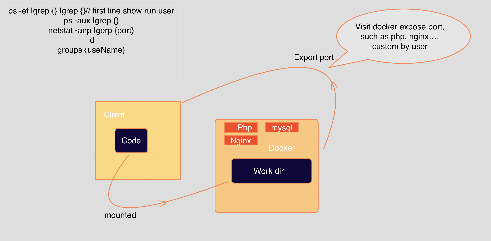

## 用户与权限

```sh
sudo adduser {username} // root 用户的命令 新建用户并分配目录

> 增加 root 权限

- 方式 1
sudo adduser {username} root // 将其放入 root 组 使其拥有 root 权限

// 或
sudo usermod -G sudo username

- 方式 2

vim /etc/solders

new_username ALL=(ALL:ALL) ALL


```

### 添加到 root 组 与solder 文件区别

https://superuser.com/questions/1077489/what-is-the-difference-between-adding-a-user-to-sudoers-vs-root-group

The 'root group' as in what you would specify in /etc/group is about unix permissions. Every file has user, group, and 'other' permissions. If a file is set such that users in group root can read it, then you can grant a user the ability to read that file by putting the user in group root. Of course then that user can read every file which has the read bit set for group root.

The sudoers file is about running commands with the effective ID of other users. You have more granular control over what commands each user can run, and as as whom. So if you want a user to only be able to run one specific command as root, then you would set that in the sudoers file

root 组是根据文件权限来的，而 solders 文件让一个用户可以运行其他用户的命令，可以更精细控制每个用户可以运行的命令

## apt

refer: https://askubuntu.com/questions/222348/what-does-sudo-apt-get-update-do

### apt-get update

apt-get update 将source list 中的包 有更新的版本以及 新添加到 source.list 的包 同步到 apt-get 中

### apt-get upgrate

apt-get upgrate 将sorce.list 中 安装在本机上的包进行更新

## linux iptable 防火墙
```sh
service iptables start/stop
service iptables status
```

## 查看端口使用

```sh
netstat -anp|grep {port}
```

## 查看本机进程

```sh
ps -ef |grep {node}
```

## 查找nginx 位置

- find / -name nginx

- 找到 sbin 目录 下边为nginx 可执行文件，将其配置入 .bashrc

- nginx -t 查找配置文件，监听访问即可

## 流量出口 网关，用户权限

## docker 权限，原理，以及工作中常用  Linux 命令总结

- 任何框架都是为了让问题简单化
- 任何描述某个原理性的东西 都有自我出发理解至于同一感觉

> 查看是否存在某个服务进程

```
ps -ef |grep {name} |grep {work folder}
```

> 已知端口查看是否处于 监听状态

```
netstat -anp |grep {port}
```

> 查看某个进行运行用户，以及对其文件所拥有的权限
```sh
ps -ef |grep 第一列 || ps -aux |grep 第一列

# such as

ps -ef |grep node |grep vpn
```

> 查看系统存在哪些用户

```
less | more /etc/passwd
```

> 查看用户所属组

```
groups {uId}
```

## Docker

- docker ， 本地文件挂载到docker中，本地文件权限，同docker权限一致，本地文件 增删改查，同步到docker中

## docker 工作原理图



> Curl -L 追踪冲重定向

```
curl -L localhost:8081 // web-admin
```

> Curl -O {address} | bash

## Sudo run server, ps -ef 将看到用户执行是 root

## 禁用 Ping 功能

```
centos7系统

临时修改

echo 1 >/proc/sys/net/ipv4/icmp_echo_ignore_all

    1 表示禁ping

    0 表示开启ping


或者：

sysctl -w net.ipv4.icmp_echo_ignore_all=1

    1 表示禁ping

    0 表示开启ping
```

## 匹配文本 grep -p {text} ./*

## 测试端口服务

> 服务器为了安全起见可能会关闭  ping，这个时候，可以使用

> iptable 可以拦截 ping 请求

> 去除 iptable ping 拦截

查看iptables策略，使用-D删除相应的icmp报文策略
具体的策略
iptables -D INPUT  -p icmp  -m state --state ESTABLISHED,RELATED -j ACCEPT
iptables -D INPUT  -i eth0 -p icmp -j DROP

> 原理

ping其实就是发送icmp包，并得到相应。路由可以丢弃icmp包，服务器，亦可以忽略之

> ping 关闭的服务器如何测试  | hping

https://www.slashroot.in/what-tcp-ping-and-how-it-used

> hping3 功能测试


- 防火墙测试
- 高级端口扫描
- 网络测试，使用不同的协议，TOS，分片
- 手动路径MTU发现
- 在所有支持的协议下，高级traceroute
- 远程操作系统指纹
- 远程正常运行时间猜测
- TCP/IP协议栈审计
- hping也可以用于学习TCP/IP的学生

> install hping3

```
do this in terminal:
brew uninstall hping
cd ~
mkdir hping
cd hping
git clone https://github.com/antirez/hping.git
brew install tcl-tk
brew install libpcap
./configure
make
sudo make install
hping

// 将 命令 拷贝至 /usr/local/sbin 下， ~/.bashrc 配置 path 后source 即可

PATH=$PATH:/usr/local/sbin

// hping3 -h // 使用时 加 sudo
```
