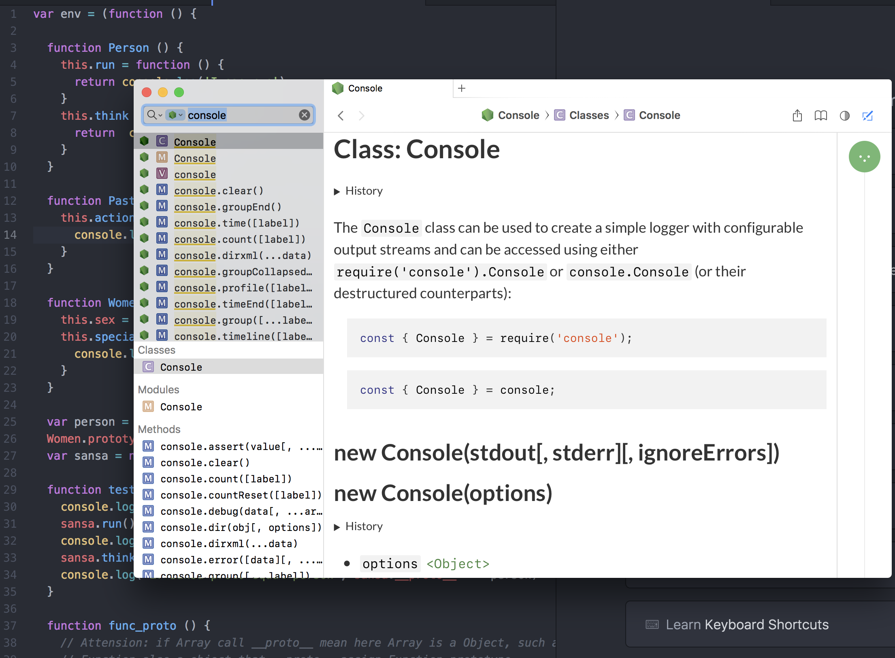
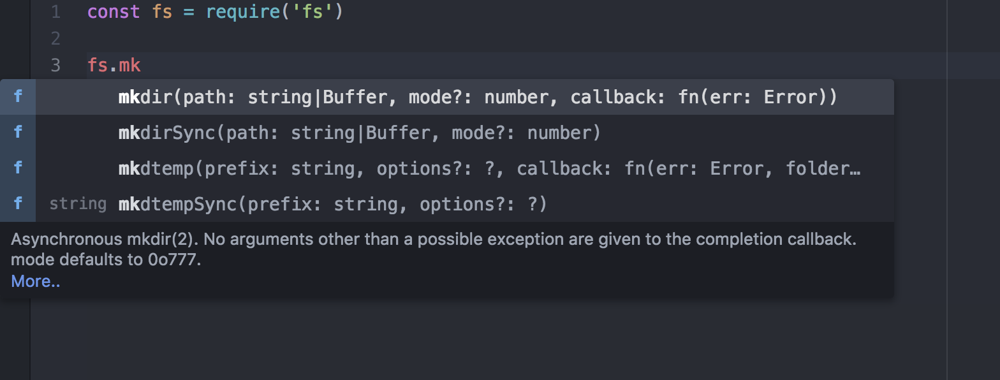

## Mac develop env


## Nvm

https://github.com/creationix/nvm


## Alfred

- translate

https://github.com/xfslove/alfred-google-translate


- steakoverflow

https://github.com/deanishe/alfred-stackoverflow

- dash workflow

https://www.alfredapp.com/blog/productivity/dash-quicker-api-documentation-search/

- mail

http://www.packal.org/workflow/mailapp-search

- workflow 齐全地址

https://github.com/zenorocha/alfred-workflows


- top10 alfred

https://medium.com/sammich-shop/here-10-alfred-workflows-that-will-improve-your-life-639202df7db

- google map

dirfw Show directions from Work to address

- alfred config dash

1. Download Dash

2. Open Dash and go to Preferences > Integration > Alfred


## mac os application is damaged

https://apple.stackexchange.com/questions/262355/xxx-cant-be-opened-you-should-move-it-to-trash-for-flash-projector-applicat


```sh
Option I For a certain application run in Terminal:

> sudo xattr -rd com.apple.quarantine /Applications/[LockedApp].app
Option II

To disable checks globally run in Terminal:

> sudo spctl --master-disable

```

## Atom 配合 dash

> Ctrl + h

https://github.com/blakeembrey/atom-dash#readme



## Atom code prompt, tern-js

- download atom-tern.js

- package config project

- restart server




##  video player
- https://wistia.com/product/player
