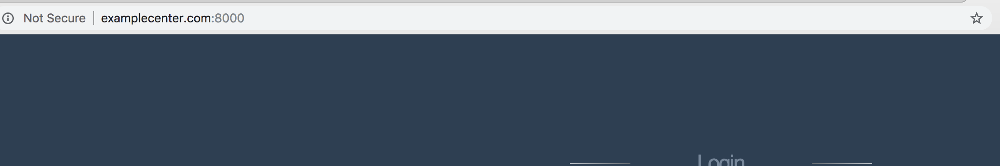

## nginx server name

- nginx tow vhost listen same 80 port, divide project by server name equal domain

- If not listen 80, if need add port when use domian

If you change port 8000, you need type url

```
domain:8000
```


