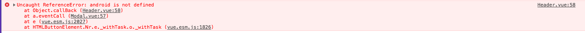
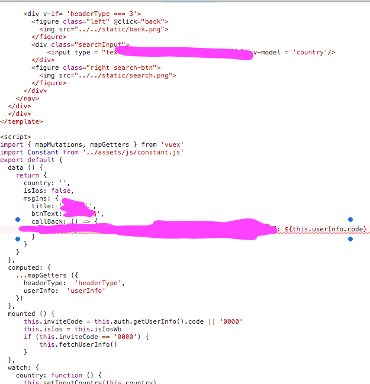
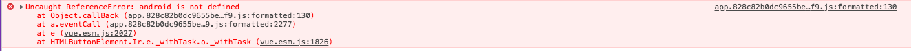
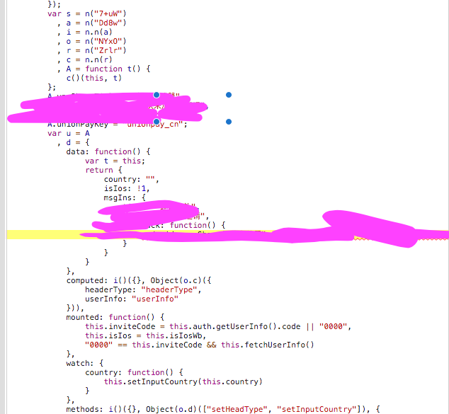

Source map, 由于 Js 文件合并压缩后部署上线，遇到错误时，很难定位问题，主要体现在以下两个方面
-  往往定位在 app.[timestamp].js 文件中，很难辨别其所对应的源文件，2)
-  代码文件经过minify, uglify 之后辨别难

source map 为解决以上问题而生，使用 sourcemap 后， 将压缩混淆后的 js 代码与源代码形成映射关系，可以方便错误的定位

## 使用

生成 source map 文件后，在对应源代文件的最后一行加入对应的 map 文件 (可存放于本地或服务器)

```
//# sourceMappingURL=app.828c82b0dc9655be36f9.js.map
```

## 作用
在代码执行错误时，错误提示将对应到 源代码文件




在不添加 source map 时看到的错误为





## 补充
vue 框架，build 模式默认 sourcemap 为开启状态，如果不想生成 map 文件，从 "config/index.js" 中关闭 build 对象的sourcemap 即可
