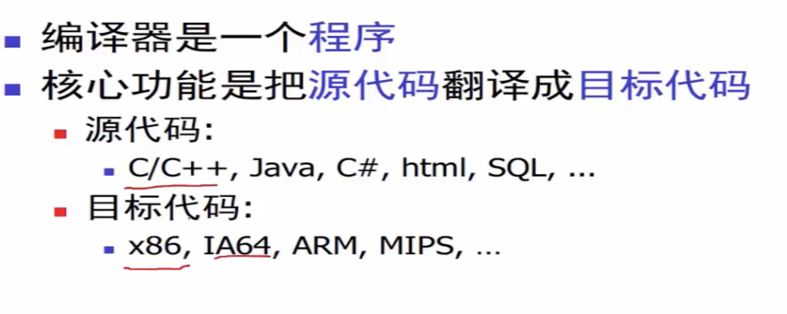

任何话语言都无法在计算机上直接执行，需要通过编译器翻译成计算机可以识别的二进制文件，进行执行(代码不开源，编译成二进制即可，因为编译成二进制有多重代码，很难进行反编译)

## 编译器

把源代码变成目标代码 一般是可执行程序

世界上第一个编译器是 Fortran 编译器

如下, c 语言先编译成 汇编，在再编译成计算机识别的 二进制文件

- 编译成的代码 有目标机器的结构 不同机器是不一样的 如 android 打包成不同架构 如下

- 编译流程如下

- 为什么学习编译器呢

## 解释器

输出是程序执行的结果
