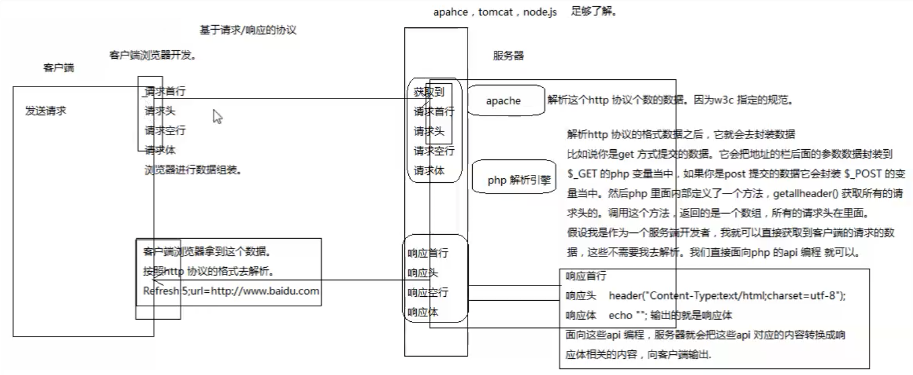
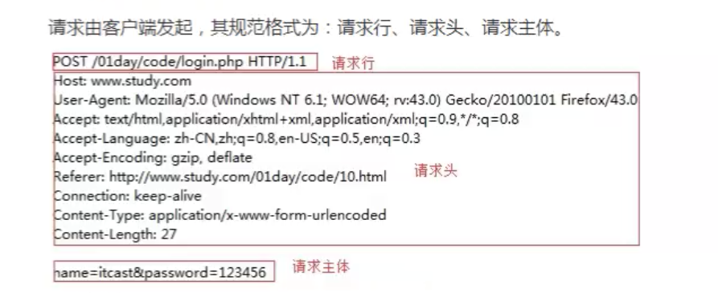
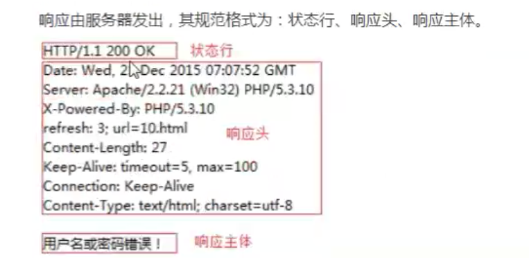
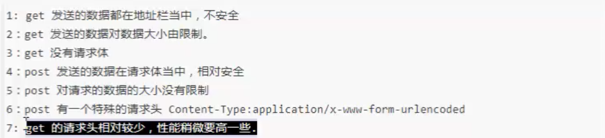
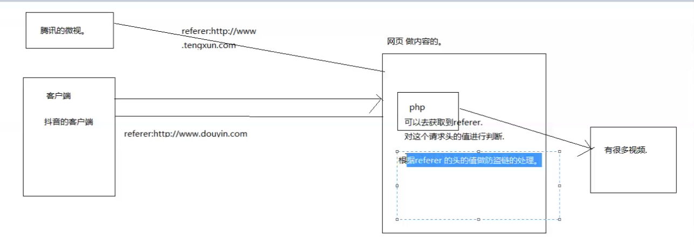
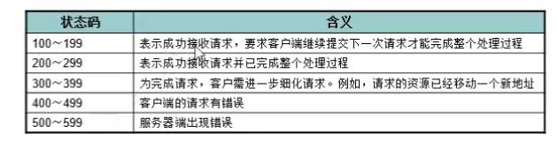
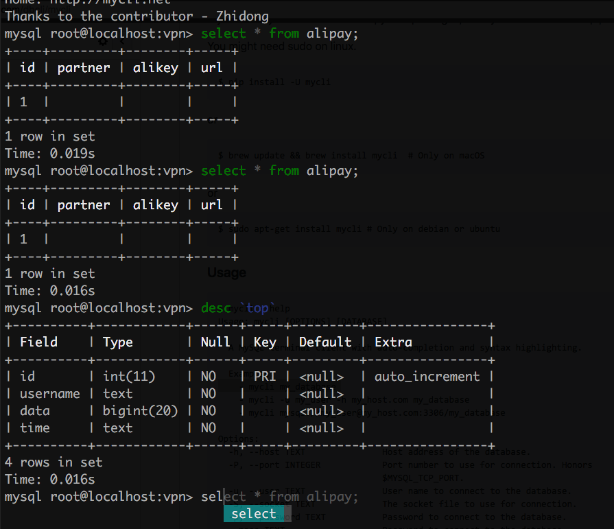
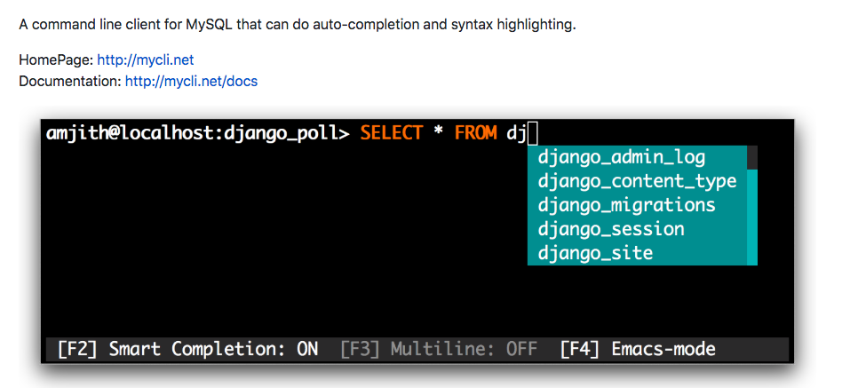

## Http 协议
### 概念
超文本传输协议，用来约束客户端与服务器通讯的标准, 通讯即数据交换，数据交换走网络，走网络必有协议

### http 通讯流程图

### 请求 和 响应
- 请求首行 请求头 请求空行 请求体

- 响应首行 响应头 响应空行 响应体

### Post Get 请求对比

默认情况下浏览器会对数据进行一个编码, 中文每三个 % 代表一个中文，在 header Form Data 点击 viewsource 可以看到

### Response 与 Preview
Response 是服务器返回的数据，preview 是浏览器以自己的方式 解析 reposne, 所以 reponse 内容可能不乱码，preview 乱码

### Refer

### Http 状态码

## 数据库

- 关系型数据库
面向表存储, mysql, oracel, sqlserver, db2, sysbase

- 非关系型数据库
redis, mongodb

- 表关系
根据项目逻辑，一对多，多对一， 多对多(需要中间表)

### 表约束

- PRIMARY KEY 主键约束 | 唯一且不能重复
- FOREIGN KEY 外键约束 约束两张关联表
- NOT NULL 非空约束
- UNIQUE 唯一约束
- DEFAULT 默认值约束，用于设置字段的默认值

- 区块链(对后端的颠覆)

文件存储，现在硬盘速度转速很快，也可以

### 终端工具 mycli

mycli {databaseName} -u root

https://github.com/dbcli/mycli

## FAQ
- keepalive 请求头里
- gulp 压缩可以逆吗
- sass 编译可以增加兼容性吗 css3 -> 2 选择器
- 重定向对比存储转发
- 老师的笔记?
- okex 日盈利 统计， 收入计算

## 小点
- 之前即时通讯需要 用一层 flash, 现在 websocket 成熟了，可以直接搞了
- 即时通讯协议，XMPP
- 架构需要深入了解协议，了解透了，方便爬取简历等，因为服务器通常有安全限制，熟悉后方可绕开
- 企业账号 智联招聘
- charles 客户端抓包
- chrome http plugin
- 对http 协议足够了解之后，可以写微型浏览器，发送http 请求，按照http 协议解析数据，写服务器，响应客户端请求(非服务器语言)
- 遵守http 协议后， 如http 通讯流程图，get 提交数据后，后端语言会将 对应参数封装到 对应变量里，如 php $_GET
- 隐藏，服务器信息，可以通过服务器设置，返回头等进行隐藏
- 本身浏览器 network 就是一个简单的抓包
- 有了协议才会有 可以拿到 浏览器信息等，否则，不同厂家不同实现，难以编码
- 写过 http 协议的书，java 写过服务器
- 爬虫抢购，限购物品，挂号..., 注册僵尸号, 也叫逆向开发
- 验证码打码平台
- 304 后端文件没有改变，可能是后端缓存
- 重定向会发送两次请求
- 前端工程师 三年 年薪 50w, 两年30+ 长沙
- 有时候数据千万条，使用 Limit 进行分页查询
- 压测工具 wrk https://github.com/wg/wrk

## Homework
php 增删改查， refer 127.0.0.1 res img else res text
