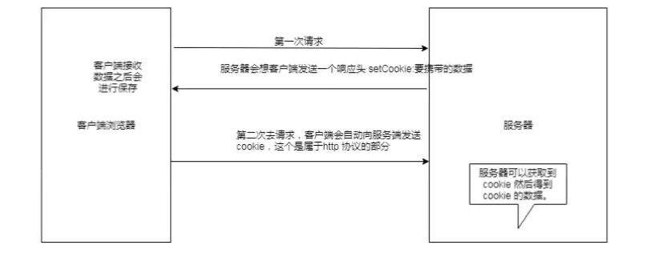
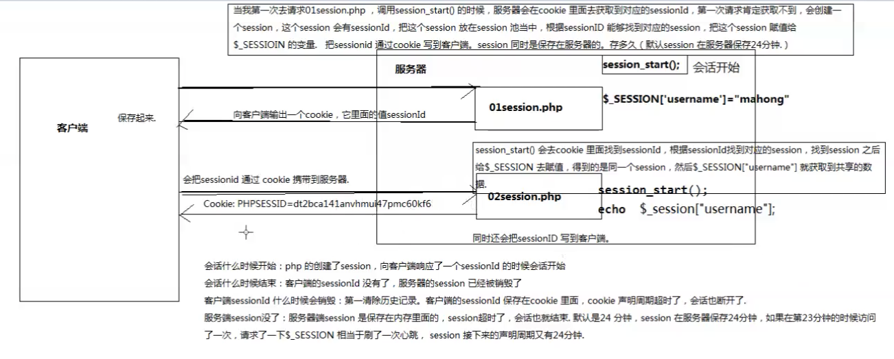

# 11\_php\_sql\_session\_cookie

This class for php record user status by cookie, session & connect mysql exec sql query ....

http 由于其无状态，服务器难以识别再次过来的客户端请求，一次会话之间难以共享数据，服务端session 会话，通常为 在客户端第一次请求服务器后，服务器向客户端 写入 cookie, php session 方法中内部封装了 cookie 的写入，在第一次会话之后，客户端将携带 cookie 到服务器

## 补作业

讲解客户端登录，php 数据库查询用户，根据是否存在此用户 使用 header 进行 页面重定向处理

### php 连接数据库部分

```php
// @php 5.6
$con = mysql_connect('127.0.0.1', 'root', '')
if (!$con) {
  // output error to client
  die('can not establish mysql'.mysql_error())
}
// connect sql db
mysql_select_db('huike', $con)
$sql = 'insert ...'
if(!mysql_query($sql, $con)) {
  die("Error:".mysql_error())
}
// close connection
// establish conect ervery time, close every time
mysql_close($con)
```

### php api 部分

* mysql\_query\({$sql, $con}\) return true \|\| false check sql exec result
* mysql\_fetch\_array 对 mysql result 进行处理，有数据返回数据，没有数据返回 false ？ 返回结果

## cookie\(小甜饼\)

### 概念

Cookie 是服务器暂存在你电脑里的资料\(.txt格式的文件\)

### cookie 工作机制



### php 设置cookie

```php
// set
setcookie('user', '', time() + 3600)
// get
$_COOKIE[{key}]
```

### cookie 种类

* 内存 Cookie

  ```javascript
    setCookie({name}, {val})
  ```

  如果不是设事件默认就是内存, cookie, 存于浏览器内存中，客户端浏览器关闭会将 cookie 清除

* 硬盘 Cookie

  ```javascript
    header('Content-Type:text/html;charset=utf-8')
    // set save one day
    setCookie({key}, {value}, time()+3600*24)
    echo 'php set cookie'
  ```

* 追杀 Cookie

```javascript
setCookie({name}, '', -1)
```

把 cooklie 的 value 设置为空，失效时间设置为 -1, 这样即是 追杀 cookie, 把客户端 cookie 清除

## sesssion\(会话\)

### 概念

我们可以在一个站点发送两次请求，每次请求都是独立的，多次请求构成一次会话，我们需要在请求间共享数据，我们需要使用到 session

### php 中设置获取  session

```php
// set cookie, set.php
session_start()
$_SESSION['name'] = 'lisi'
// get cookie get.php
session_start()
echo " php cookie contains name is '$_SESSION['name']' "
```

## session cookie 原理图



## 小点

* 不同的浏览器可能会对 cookie 做一个扩展，像猎豹， 360 服务器可以写入 20k 左右
* cookie http 协议的一部分
* 浏览器的无痕模式关闭后会清除历史记录和cookie
* cookie 可以设置为 只读 cookie, 通常都是在后端处理 cookie
* java session 30分钟，超时时间服务器均可设置
* 服务器可以设置 session 到硬盘中进行长时间存储
* 判断在线人数一般是 通过看 session 的总数，java 中有  session 监听机制
* cookie 中不可以直接保存中文
* 硬盘 cookie 从请求头中是看不到 过期时间的

## FAQ

* 客户端cookie 中 sessionId 没了 服务端怎么处理
  * 客户端清除历史记录，客户端 cookie 声明周期超时了，会话也就断开了
* 服务端session 超过 24 分钟怎么处理 \(php\)
  * 如果在23分钟的时候重新访问了一次，请求了一下，session 接下来声明周期，又会有 24 分钟
  * 举例: 网站，登录 20分钟后，需要重新登录
* 单点登录，openId ?
  * 1 xmpp 协议
  * 2 http 长连接
* session 隔离  
* 第二次访问 cookie 再次返回

  cookie 中存放  sessionId（内部含有当前时间）, 第二次会话建立时，更新sessionId

* 案例，cookie 永用户名记录
* 案例，登录状态 24 小时记忆，session 中存放登录状态，session 存 24小时即可

