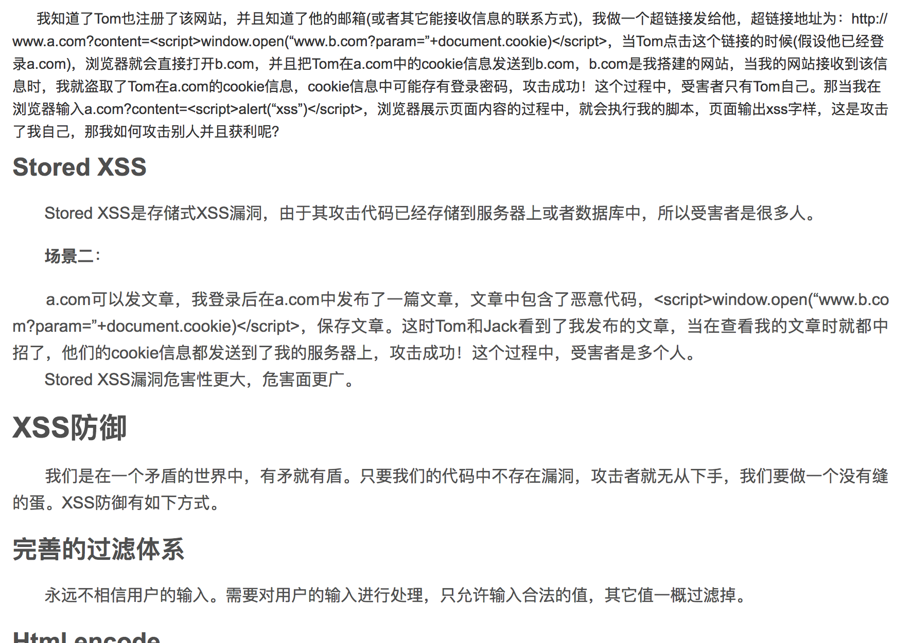

This class for cookie, http only, path, domain, as jquery build ajax framework that finish 80% jquery ajax func .

## httponly, domain, path

- path

cookie 所在的目录, 设置目录，在不同目录下 cookie 不可以跨开访问,如:
```js
/test     // 只能访问自己
/test/cd  // 可以访问 cd 与 /test
/test/dd  // 可以访问 dd 与 /test
```

- domain

cookie 的域名，只能设置当前域的上级域，例如 在一个 a.b.com 的页面，可以设置 domain 为b.com, a.b.com（只能在 a.b.com中访问 cookie, 但设置为 b.com 后便可以在 其他b.com 域下访问

- httponly

如果cookie 中设置了 httponly 属性，那么通过 js 将无法读取 cookie 信息，这样 能有效防止  XSS 攻击(所有可输入的地方且没有对数据进行处理的话都有xss攻击的可能).

refer:

https://blog.csdn.net/ghsau/article/details/17027893



### php set cookie function

```php
setcookie(name,value,expire,path,domain,secure)
```

## 同步交互与异步交互
### 同步交互
客户端发送请求给服务器，服务器给客户端做一个响应，响应内容覆盖旧内容

### 异步交互
客户端给服务器发送请求，返回数据不会覆盖页面

## ajax 封装
- 利用 XMLHttpRequest 去交互

.1 创建对象
```js
var xhr  = new XHRHttpRequest()
```
.2 打开连接
```js
xhr.open('get', login.php?paran = 1)
```
.3 发送服务器
```js
xhr.send(null)  // or pass post data
```
.4 处理响应
```js
if (xhr.readyState === 4) {
  if (xhr.status === 200 || xhr.status === 304) {
    obj.success && obj.success()
  } else {
    obj.error && obj.error()
  }
  obj.complete && obj.complete()
}

```

beforeSend 处进行参数校验

## 小点
- 在主域名相同情况下可以使用 cookie 传输，sessionId (非前后端分离情况下)
- sessionStorage 在单一一个页面有用

## FAQ
- 服务器返回的数字 没有引号 就是 Number 类型吗
