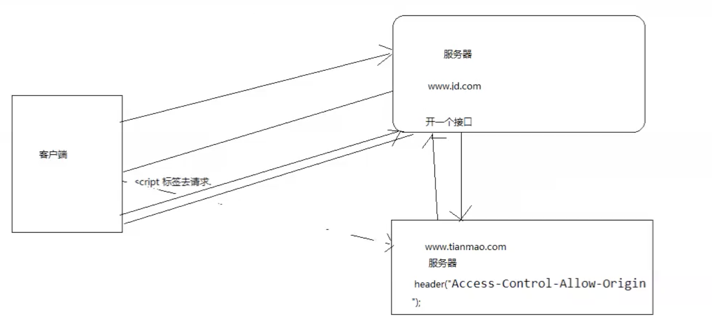
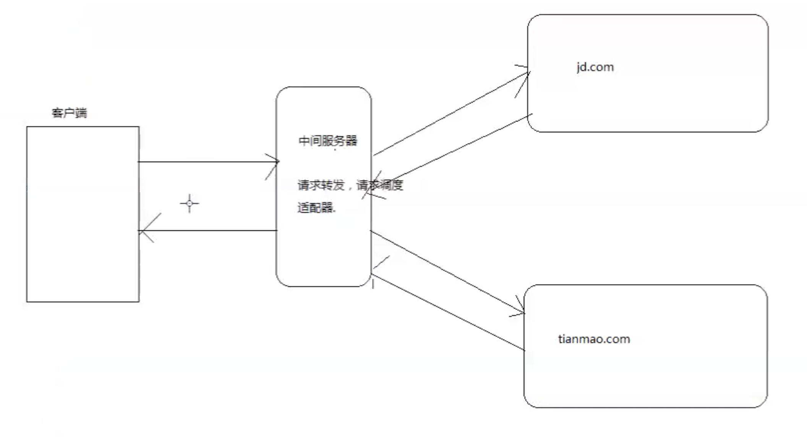
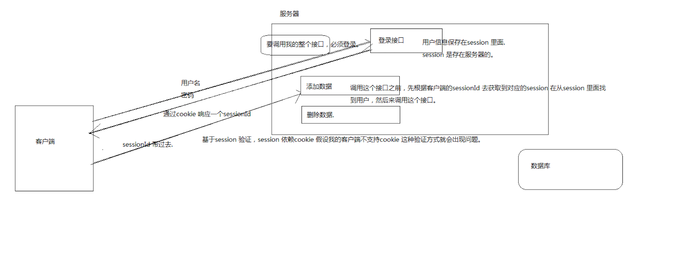
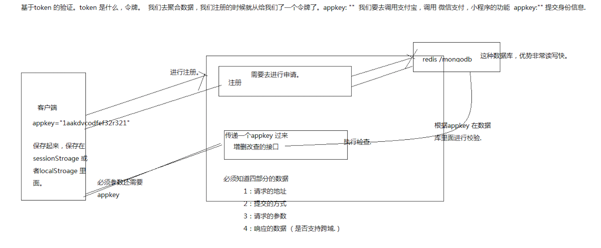
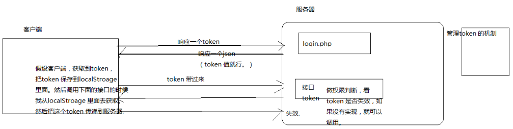
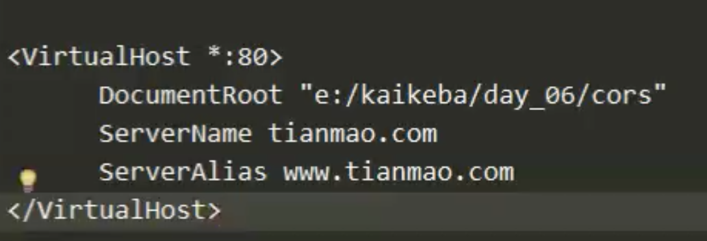
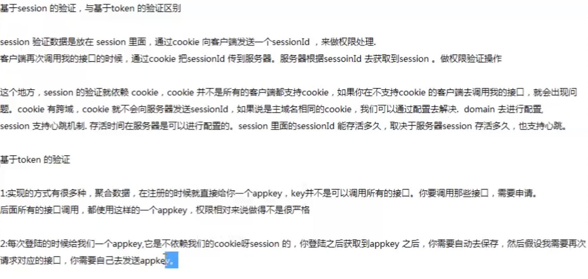
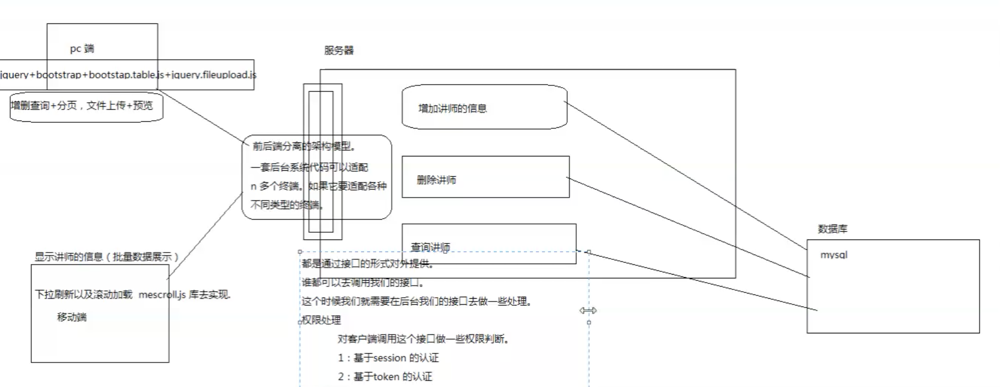

# 14\_cors\_xhr2\_formdata

This introduce xhr, xhr2, cors, jsonp origin, formdata .

## xhr2 新特性

* 可以设置HTTP请求的时限。
* 可以使用FormData对象管理表单数据。
* 可以上传文件。
* 可以请求不同域名下的数据（跨域请求）。
* 可以获取服务器端的二进制数据。
* 可以获得数据传输的进度信息。

```javascript
xhr.onprogress = updateProgress;
xhr.upload.onprogress = updateProgress;
```

## Jsonp 跨域原理

* 动态创建 script 标签，使用script 标签 src 进行数据请求，根据callBack 函数获取服务器返回值

### Jsonp 方式客户端处理如下

```javascript
function getInfo(info){
  console.log(info);
  //解析数据，放在页面上面。
}
document.querySelector("input").onclick=function(){
  //使用script 标签去发送一个跨域请求.
  var script=document.createElement("script");
  script.src="jsonp.php?callback=getInfo";
  document.body.appendChild(script);
}
```

### Jsonp 方式服务端处理如下

```php
<?php
$callback=$_GET['callback'];
//getInfo({"status":"ok"})
// 直接返回 callback 字符串前端执行
echo $callback.'({"status":"ok"})';
?>
```

## cors 方式处理跨域

### js

```javascript
var xhr=new XMLHttpRequest();
//CORS 跨域，客户端不用做任何的处理，服务端需要做一些处理，需要给一个响应头
xhr.open("get","http://t.tianmao.com/jsonp.php");
xhr.send(null);
xhr.onreadystatechange=function(){
  if(xhr.readyState==4 && xhr.status==200) {
    console.log(xhr.responseText);
  }
}
</script>
</body>
</html>
```

### php

```php
header("Access-Control-Allow-Origin: *");
header("Access-Control-Allow-Headers: *");
```

## Jsonp 对比 xhr2

jsonp 方式为较早的跨域解决方案，使用时候只支持 "get" 请求， 需要在服务端大量代码兼容，xhr2 只需要在服务端进行配置, 配置简单编写代码少, 兼容 get post 方式, 需要浏览器支持 xhr2

## 中间代理



由于服务器端不存在同源策略限制，可以用服务端代理客户端发送请求， 将数据返回给客户端，如 www.taobao.com 想请求 www.jingdong.com 的数据，只需要在 taobao.com 的服务器代码上 氢气数据，将数据给前端即可

## 请求转发服务器\(请求调度适配器方式 \|\| 反向代理\)

和上一种方式基本类似，通常运维进行配置，如同 nginx 负载，转发服务器，需要 "高载宽，高响应速度\(cpu 处理速度\)"



## SEO & ISO

seo 关键词搜索排名 & 手机app 搜索排名，有一些逆向手段，刷榜，一台手机控制 多台电脑刷

## 服务端认证

### 基于 session 方式



### 基于 token 方式





## ajax 文件上传

* ajax 使用 formdata 进行文件数据以及form表单其他数据， 自定义数据\(appendData\) 提交

```javascript
var formData=new FormData(document.getElementById("formDataId"));
 var xhr=new XMLHttpRequest();
 xhr.open("POST","formData.php");
 //api 有兼容性.
 formData.append("age",99);
 xhr.send(formData);
 xhr.onreadystatechange=function() {
       if(xhr.readyState == 4 && xhr.status == 200 ){
              var data=xhr.responseText;
              console.log(data);
       }
 }
}
```

## 虚拟主机

* 两个域名解析到 同一个服务器，根据域名不同，区分目录共用 80 端口

 因为服务启动地址为 127.0.0.1

客户端 vhosts 文件中配置，127.0.0.1 www.tianmao.com

## 前后端分离的优势

可以兼容多套终端，但是可能不兼容 cookie session, 高度解耦，后期服务器更换之后，客户端不需要变化

## 封装

行重复抽方法，方法多了抽类，类多了抽模块，模块多了抽服务\(如 用户中心模块\)

## token 对比 session

token 安全性更高，兼容性更好, token 也可以做成 心跳\(未失效情况下，请求时，再延长时间\) 

## 案例

pc 端补一个瀑布流 

## 小点

* ie 6 7 8 可以使用 jquery 的 fileuploader
* jq22.com jquery plugin
* mui 太烂了
* 12306 刷票
* 自动抢购，黄牛被抓
* 短信不走 http,有特殊协议, 走电信网
* 银行转账24小时到账，可以回退，防止刷，诈骗
* 北京医院挂号平台，黄牛被抓
* \* 只要拿到 sessionId 半个小时内冒充是没有问题的
* php json\_encode 将数组转换成 json 数据

## Recommend

* [https://github.com/flutter/flutter](https://github.com/flutter/flutter)

## Homework

### token auth front & back


### get some data by spider
