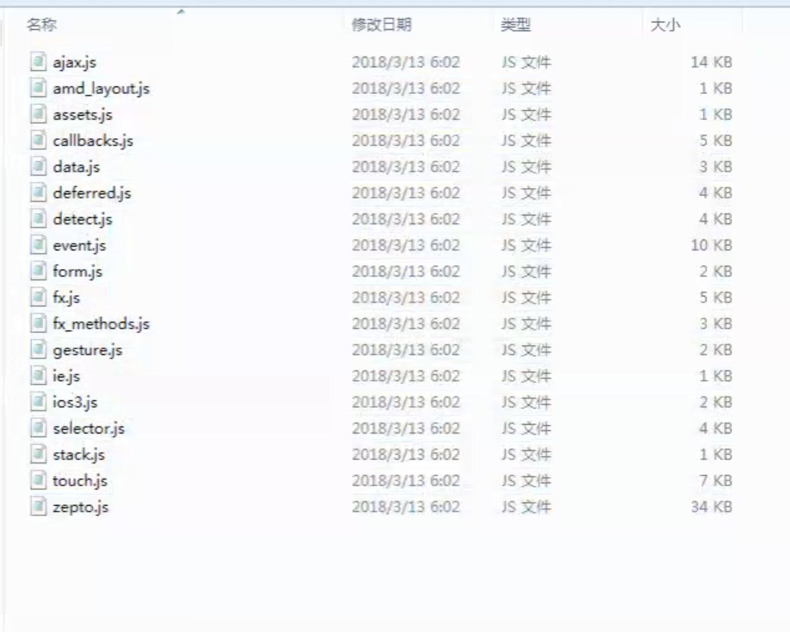

Course due to flight delay . Filled on August 6th, delay 3 day.


| Today    | md | Homework |
| -------- | -------- | ------ |
| jquery fileupload  |  done     | done  |
| php upload logic  | done     | done  |
| bootstrapTable  | done     | done  |
| echarts  | done     | done  
| zepto.js | done    | done  


## Lastday homework .

- use filereader show (just like day1 filereader)
- use formdata upload file

```js

    var result=document.getElementById("result");
    var file=document.getElementById("file");
    //判断浏览器是否支持FileReader接口
    if(typeof FileReader == 'undefined'){
        result.InnerHTML="<p>你的浏览器不支持FileReader接口！</p>";
        //使选择控件不可操作
        file.setAttribute("disabled","disabled");
    }
    file.onchange=function(){
         readAsDataURL();
    }
    function readAsDataURL(){
        //检验是否为图像文件
        var file = document.getElementById("file").files[0];
        if(!/image\/\w+/.test(file.type)){
            alert("看清楚，这个需要图片！");
            return false;
        }
        var reader = new FileReader();
        //将文件以Data URL形式读入页面
        reader.readAsDataURL(file);
        reader.onload=function(e){
            var result=document.getElementById("result");
            //显示文件
            result.innerHTML='';
        }
    }
    document.querySelector("input[type=button]").onclick=function(){
            var formData=new FormData(document.querySelector("#formId"));
            var xhr=new XMLHttpRequest();
            xhr.open("POST","upload.php");
            xhr.send(formData);
            xhr.onreadystatechange=function(){
                 if(xhr.readyState==4 && xhr.status ==200) {
                     console.log(xhr.responseText);
                 }
            }
    };

```

```php
echo var_dump($_POST)
echo var_dump($_FILES)
```

移动端使用 filereader 可以，pc 端 使用q jquery fileuploader 保证兼容性

## 继续昨日，添加新的数据后自动进行刷新

- bootstrap table 插件自带 刷新方法

```js
// frame
$('#').bootstrapTable('refresh')
```

- 通过 queryParams 回调函数 设置分页参数 (设计原理)

- bootstrap table 国际化js文件引入

- 事件委派设置删除按钮事件

  按钮在响应数据完成后添加至，bootstrap table 插件， 想在外围设置事件需要使用事件冒泡， 在响应数据处设置事件代码不优雅. todo:? 代码如下

      https://www.jianshu.com/p/847568e6149e


  - 事件委托是通过事件冒泡的原理，利用父级去触发子级的事件。

  - 如下html，如果不用事件委托，将每一个li都去添加click事件监听，非常麻烦。

  - 另外就是如果通过js动态创建的子节点，需要重新绑定事件。

  - 利用事件委托的话，只需要给父级绑定一个事件监听，即可让每个li都绑定上相应的事件。


- data 于按钮中存放 删除 条目 id


插件使用

- 最早 jquery 插件 >> expjs >>　jquery easyui(丑) >>　bootstrap (amazeui 模仿bootstrap)


## 使用 Echarts 展示 bootstrap table 数据

### Echarts 数据报表统计

- 柱状图
- 标图
- 折线图


## 移动端数据展示 ，通常使用列表

### zepto.js


## zepto 加 mecroll 编写 案例

- 体积小，针对移动端浏览器，少很多代码(核心库不到1000行代码)
> 模块化将功能打散，可以根据需求使用

- 封装了很多移动端事件，swiper...

## zepto 定制
> 如果使用哪个模块引入哪个模块，会遇到模块引入顺序，浏览器多次请求问题

### zepto 定制方式如下

zepto.js 定制的步骤
1、安装Nodejs环境
2、下载zepto.js
3、解压缩
4、cmd命令行进入解压缩后的目录
5、执行npm install 命令
6、编辑make文件，没有后缀,添加自定义模块并保存，如下图 41行
7、然后执行命令 npm run-script dist
8、查看目录dist即构建好的zepto.js


## d3

## FAQ

- [x] 9:05 jquery delegate 事件委派


> 前端请求js 资源出现缓存时， 可以通过， get 增加参数方式, 避免缓存， 如
在编写， table添加完刷新时，更改index.js 未进行刷新，更改 html index.js 引入为 index.js ? data = {xxx}

- mysql 对比 mongodb

MySQL 复杂时使用，支持事物 可以回滚

mongodb 做集群分布式存储非常方便, 不支持事物

- 知识变现，写一个 js 库，放到 git 上 也能赚一点点钱，知识变现

- zepto 中文文档类翻译网站 一个月广告 两三万

- 删除使用 data-id

- 区块链目前没有实际落地项目, 目前养的阶段

- 基础 Lower  一万两万

- 前端3年多

- 工资根据岗位，筛选

- .net 由于 window 发展不是很好

- 转前端，找个网站，补html, css ， 找个网站能写出，写几遍

- 原则上说, 区块链今年可以很火, 处于风口，但是现在属于，底层公链技术不是很成熟，比如 以太坊，eos

- 区块链方向，币圈 信奉 炒作，链圈(信奉技术)

- 方向，前端区块链，go 区块链，去中心化应用，不需要有后台，前端直接跟区块链对接

- 有个同学去中心化的交易所

- MetaMask 以太坊钱包，从交易所买币放到钱包

- 日本，北京一些店酒吧 望京，麦当劳，支持比特币支付

- 讲区块链就要发币，发币就要讲

- 区块链技术可以，被传销的那帮人搞坏了，持币但不常看，持币装死

- 老大国内做区块链比较知名的大佬
