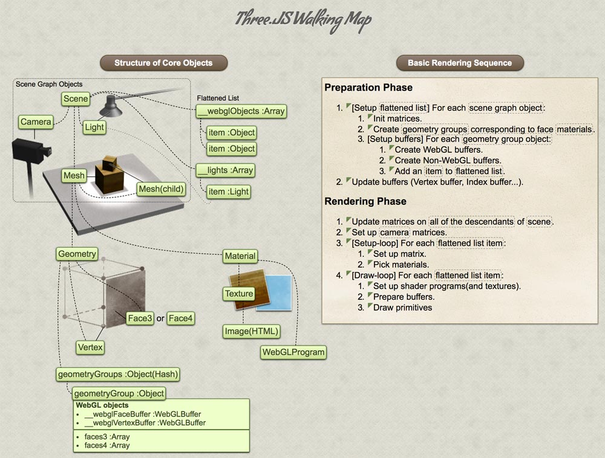

# 17\_graphics\_d3\_three\_webgl

This class for froent graphics.

## LastHomework

| Yesterday | Today | done\(md\) | done\(homework\) |
| :--- | :--- | :--- | :--- |
| Homework | d3.js | √ | graphics animation √ |
| mescroll | three.js\(webgl framework\) |  |  |
| drop loading & refresh |  |  |  |

### 下拉刷新和滚动加载使用 mescroll 实现

lodash 防抖， js 节流, \(手指按住弹簧松开时，弹起触发一次\)

## 前端图形学

### Echarts 对比  d3.js

1. Echarts 简单方便，可定制性差
2. d3 相对灵活, 去中心化交易所，参考 火币，技术站方向做技术选型\(根据定制要求，d3通常可以满足需求，Echarts 80%\)

### d3.js

* 专门操作 svg 的库. 用法类似 jquery
* d3 可以直接操作 dom 元素, 如Jquery 一样使用
* 主要任务， 操作 svg 绘制图形

```text
// set style
d3.select('h3').style('color', red)

// set event
d3.select('h3').on('click', () => {alert(1)})
```

### d3绘制图形

```javascript
var data=[21,22,11,35,78];
d3.select("body").append("svg").attr("width",400)
        .attr("height",400)
        .selectAll("svg")
        .data(data)
        .enter()
        .append("rect");
```

## canvas & webgl

webgl 借助 canvas 绘制 3d 图形, three.js 为 webgl 框架, WebGL \(2D的canvas 我们叫做canvas，3d 的canvas 我们叫做webGL,three.js 是一个用来操作canval 的webGL 库\)

### webgl 绘制



```text
需要有一个“舞台”来放置元素
需要有一台“摄像机”记录“舞台”上发生的事情
舞台上需要有“演员”
创建演员需要一些操作
首先创建一个 “几何体”
再次对几何体进行 “包装”
通过 canvas 标签来对“摄像结果”进行展示

  1:需要有一个舞台
  2:准备一个摄像机
  3:舞台上面需要有演员
  4:创建演员，演员准备各种各样动作
  5:创建演员，实际就是一个立方体，可以对立方体进行包装.
  6：使用canvas 对设想的结果进行一个展示.
```

## canvas & svg & Animation

Canvas

* 依赖分辨率
* 不支持事件处理器
* 弱的文本渲染能力
* 能够以 .png 或 .jpg 格式保存结果图像
* 最适合图像密集型的游戏，其中的许多对象会被频繁重绘

SVG

* 不依赖分辨率
* 支持事件处理器
* 最适合带有大型渲染区域的应用程序（比如谷歌地图）
* 复杂度高会减慢渲染速度（任何过度使用 DOM 的应用都不快）
* 不适合游戏应用

SUMMARY

* Canvas 是基于像素的即时模式图形系统，最适合较小的表面或较大数量的对象，canvas不支持鼠标键盘等事件
* SVG 是基于形状的保留模式图形系统，更加适合较大的表面或较小数量的对象。Canvas 和 SVG 在修改方式上还存在着不同。绘制 Canvas 对象后，不能使用脚本和 CSS 对它进行修改。\(iconfont 使用 svg 后，用户可以根据需要对样式进行修改\) 但是，因为 SVG 对象是文档对象模型的一部分，所以可以随时使用脚本和 CSS 修改它们。

Animation

* Animation 可定制型不是很好，js 操作svg 可以做很多优秀效果

svg 标签内画 各种形状标签, svg 画矩形圆如下

```javascript
 <svg>
      <rect width="200" height="200" fill="pink"></rect>
 </svg>
```

## webGL 立方体 于 css3 立方体

## Tip

* d3.js 和  three.js 可同时使用

## FAQ

* * [x] 930 rest 10 re listen
* * [x] 22:35 to　end　
* * [x] 22:02 - 22: 06 re listen
* webscoket 时时 渲染 图形
* requestAnimationFrame
* remember base
* svg 在 html 页面中没有使用 xlmns 命名空间依旧可以工作

Refer

[https://stackoverflow.com/questions/18467982/are-svg-parameters-such-as-xmlns-and-version-needed](https://stackoverflow.com/questions/18467982/are-svg-parameters-such-as-xmlns-and-version-needed)

如果是 text/html 的文件格式可以省略此命名空间，如果是 保存为svg 文件，则必不可少

```markup
<html xmlns:svg="http://www.w3.org/2000/svg">
```

### webgl 绘制随鼠标移动立方体

* 最先 立方体面 鼠标 移动事件
* 控制相机 让其随着鼠标行为 旋转 \(使用第三方js库\)

## homework

* 定制一个柱状图, 刷新每个柱子加一个缓动动画

https://codepen.io/googleliyang/pen/bjmvMm

preview class

* [x] Preview next class
* [x] Read teacher current class md
