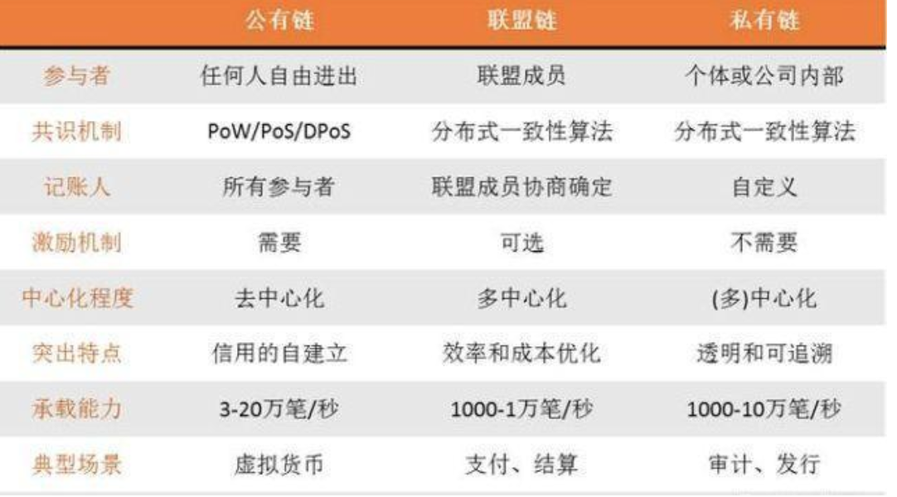
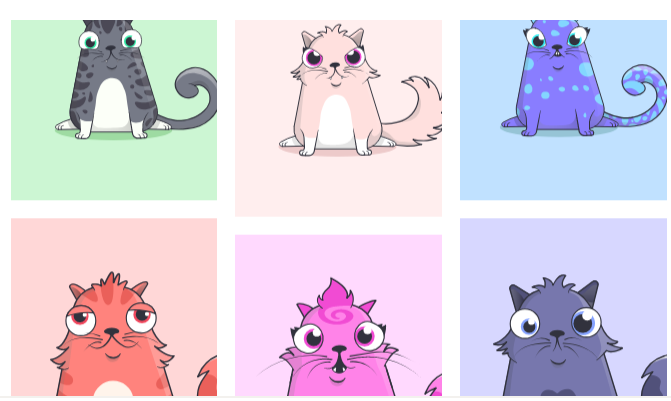
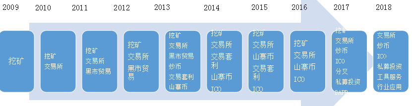
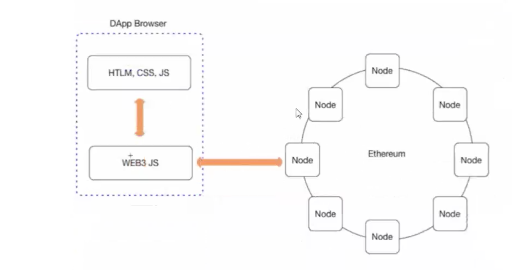
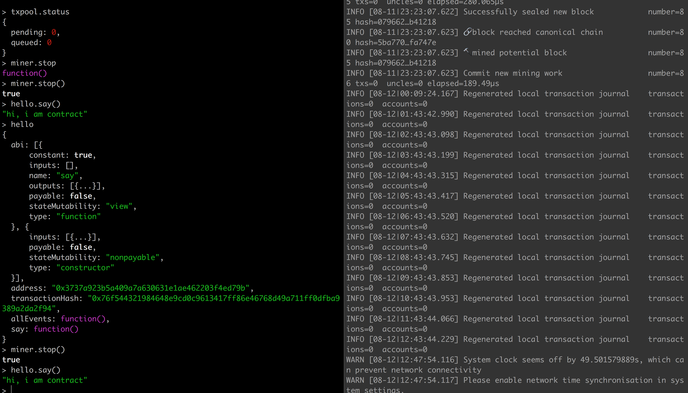

朱老师的最后一堂课, 下堂课 Nodejs

| 课程   |  Done
| :------------- | :------------- |
|  three 雪花效果       |   √     |
|   区块链       |    √    |
|   eth 上层开发       | √ |
|   Dapp 开发       | √ |


## 区块链

### 公链，联盟链，私有链 对比

refer: https://baijiahao.baidu.com/s?id=1594363970294582337&wfr=spider&for=pc&isFailFlag=1


### 区块链的四种玩法
- 投资：尚币哥、沈波、李笑来
- 发币：达鸿飞、帅初、孙宇晨
- DAPP开发：加密猫、创世狗、唐飞虎
- “卖水”：imtoken、林嘉鹏


### 区块链应用

#### 基于 eth 上层虚拟机，交易猫



### 2018 年区块链市场的整体判断

- 挖矿：算力增长迅猛，门槛越来越高，机会在于人工智能挖矿决策

- 炒币：二级市场炒币赚钱的难度迅速提升，大市的波动带来一定机遇

- 交易所：数量迅速增长，流量集中化趋势明显，结构亟待变革

- ICO：空气项目大量破灭，上市成本不断攀高，但优质项目仍能浮出

- 私募投资：投资逻辑发生根本变化，开始回归价值投资理性

- 工具与服务：机会丰富，但是服从互联网流量逻辑，门槛较高

- DAPP：面对巨大蓝海，但对于区块链及经济系统的理解要求较高



## 前端区块链




### 比特币原理

### btn, eth, eos

### 区块链在前端的应用

  目前前端依旧是中心化服务器，中心化服务器难以避免, 信息滥用，数据被篡改等问题，使用区块链后数据不属于某一个实体，它的数据都放在区块链的平台上面，程序透明且无法随意篡改. 可用于 "投票系统", "赌博" 中

### 中心化服务器主要存在以下问题

  1：信息滥用

  2：信息不透明，黑箱操作

  3: 数据丢失问题

  4: 单点失效风险

>  而 DApp 的架构如下 去中心化的app ，数据不属于某一个实体，它的数据都放在区块链的平台上面.

## 区块链平台以及主流币简介

> 区块链的本质是 去中心化的数据库

区块链的平台：区块链1.0 比特币，区块链2.0 以太坊 小v 94 ，区块链3.0 EOS 柚子 BM

比特币 它的定位是一个全球统一账本. 保证硬盘上面的数据同步 并且数据不会被篡改

以太坊: 全球统一的计算机 (保证cpu 同步，硬盘也要同步) ，它是可以参与运算的。

以太坊节点上面有虚拟机，这个虚拟机可以理解成系统，这个虚拟机可以运行程序，在以太坊上面运行的程序，我们叫做智能合约. 基于以太坊上面的语言叫做solidity ，这门语言跟js 语法比较相近. 我们假设我们要往这个以太坊上面发布程序，是需要收费，我假设要调用我写好的这些程序，假设这些有交易的话，也是需要收费.

区块链3.0 柚子，在这个以太坊上面做了改进

性能 eos 在以太坊做了改进。 全球21 个超级节点，只要21 个节点进行数据确认，数据存储就算完成，这个性能生面就有了很大提升。 eos 的发布合约到节点需要收费，整个交易的过程，存数据的过程不收费。

以太坊的设计，是将以太坊所有的节点，构成一个世界计算机。程序员可以把程序发布到世界计算机后，程序的执行和结果都无法篡改，只忠于预先设定的逻辑，是一个可信的流程。这个程序在以太坊世界计算机中，被称之为 “智能合约”。智能合约可以在一个节点上发布，它的函数，可以被其他节点执行。智能合约目前可以用于投票，交易，博彩等行业。

## 智能合约

智能合约也是一个交易(Transaction)，保存在区块链中。以太坊节点提供了一个协议，这个协议jsonrpc 协议。


## web3.js
web3.js是以太坊提供的一个Javascript库，它封装了以太坊的JSON RPC API，提供了一系列与区块链交互的Javascript对象和函数，包括查看网络状态，查看本地账户、查看交易和区块、发送交易、编译/部署智能合约、调用智能合约等，其中最重要的就是与智能合约交互的API。

> 层实现上，它通过RPC 调用与本地节点通信。web3.js可以与任何暴露了RPC接口的以太坊节点连接。


### web3.js 调用

```js
//去连接区块链的某个节点.
var web3 = new Web3(new Web3.providers.HttpProvider("http://127.0.0.1:8545"));  
//我可以去获取到这个节点上面的账户。
web3.eth.getAccounts(function(error,result){
    if(!error)
    resp.send(result);
});
//创建账号 1234 密码
web3.personal.newAccount(" 1234",function(error,result){
    if(!error)
    resp.send(result);
});
//解锁账号.0xc40b465e28a386c56806058571d0baf303af079c ，密码 可以把这个理解成登录.
personal.unlockAccount("0xc40b465e28a386c56806058571d0baf303af079c","123",function(error,result){
    if(!error)
    resp.send(result);
});

```


## DAPP 开发

> DAPP 实质上就是  前端加智能合约

使用 DAPP 前端工程师充当了 全栈的职位

### 编写 dapp, 智能合约

1: 安装一个节点，加入到以太坊的世界计算机当中 （它会把以太坊上主网上面数据同步到你的电脑本地，这个过程）

2: 进行挖矿，创建账户。启动geth 会自动一个命令行的客户端（直接可以在上面执行命令）

personal.newAccount("123456");

eth.getBalance("地址"); 去获取余额

miner.start() 开启挖矿.

3: 使用solidity 编写程序 （编写的这个程序叫做智能合约）

4: 我们需要使用一个开发工具去编写solidity 这个开发工具叫做remix，remix 工具它是网页版的.

5: 我就可以把我的智能合约发布到节点上

6: 我需要去做一个前端界面. 界面怎么弄，android ，ios 客户端，微信小程序，都无所谓.

7: 去下载一个web3.js 库, 与eth区块链通讯

8: 我的客户端做了之后，我就要跟链上的数据进行交互

### 环境搭建

环境搭建

### geth 将自己的计算机加入以太坊的节点
首先，我们知道以太坊的设计，是将以太坊所有的节点，构成一个世界计算机，那我们怎么样把我们的计算机加入到以太坊的节点里面，参加运算勒，这个时候我们需要装一个客户端软件geth。

### Remix
Remix 是一个 IDE (integrated development environment 集成开发环境)，用于智能合约开发，使用的语言是 solidity，是一个基于浏览器的 IDE，也是以太坊官方的 IDE。

Remix 在线 IDE： http://remix.ethereum.org/

开发智能合约(集成了 solidity 编辑器)
- 动态调试 (debug) 智能合约
- 访问已部署的智能合约的状态和属性
- 代码分析，编译错误检查
- 调试和测试 Dapp

### 编写一个简单的合约 - Greetings

```solidity
pragma solidity ^0.4.20;

contract Greetings {

    // 保存在全局区的消息
    string message;

    function Greetings() public {
        message = "i am ready";
    }

    function setMessage(string _message) public {
        message = _message;
    }

    function getMessage() public constant returns (string) {
        return message;
    }
}

```

## 实战 Dapp helloWorld 程序编写

1. geth 部分

- 下载并配置 geth

```bash
mkdir -p ~/chainwork/private
```

- 创建一个配置文件 genesis.json 用于创建创世块和设置网络
```bash
{
// nonce 和 mixhash 是作为输入，让每个节点都可以通过计算来做
// proof-of-work，确认这个区块的挖掘者确实做了足够多的计算找到了合法的
// nonce 和 mixhash
"nonce": "0x0000000000000042",
"mixhash": "0x0000000000000000000000000000000000000000000000000000000000000000",
// difficulty 就是制定了本链一开始的挖矿难度，在我们的私有测试节点中，
// 这个值设得很低，这样就比较容易挖到矿
"difficulty": "0x400",
// alloc 可以预分配一些以太币给某些地址，这里我们不做预分配
"alloc": {},
// coinbase 就是当成功挖出 genesis 区块后，接收奖金的地址
"coinbase": "0x0000000000000000000000000000000000000000",
// timestamp 本区块挖出来的时间戳，全网将依据前后
// 两个区块的时间戳之差来调整挖矿的难度
"timestamp": "0x0",
// parentHash 指向前一个区块的哈希指针，创世纪区块中的 parentHash 接地
"parentHash": "0x0000000000000000000000000000000000000000000000000000000000000000",
// extraData 可用于存储任何信息
"extraData": "0x",
// gasLimit 规定了每一个区块中能够消耗的最大的 gas 值，也就事实上
// 限制了区块的大小
"gasLimit": "0xffffffff",
// config 用来为这个私有网络确立一系列参数
"config": {
// chainId 是本私有链的 ID
"chainId": 4224,
// homesteadBlock 指明 Homestead 版本的兼容的区块开始编号
"homesteadBlock": 0,
// EIP155 兼容的区块开始编号
// EIP155 - "Simple Relay Attack Protection"
"eip155Block": 0,
// EIP158 兼容的区块开始编号
"eip158Block": 0
}
}
```

- 初始化 genesis.json 文件, 启动 geth

```bash
初始化genesis配置文件
cd ~/chainwork/private 目录
geth --datadir . init genesis.json
会在 private 目录下面创建两个目录 geth/keystore
启动节点 初始化数据目录， 网络id, 注意命令行空格
geth --datadir . --networkid 4224 --rpc --rpcport 8545 --port 30303 --rpccorsdomain="*" -rpcapi eth,web3,personal,net console 2> log.txt
```

> 以上操作创建了一个以太坊节点，这个节点并没有接入主网，而是一个私有网络。目前在该网络中，只有一个节点，并且没有任何的账户。用户可以通过命令行来对以太坊网络进行交互。

> geth 常用命令

```sh
// user1 is password
personal.newAccount("user1");

// 挖矿
miner.start()
miner.stop()

// 查看账户和账户余额
eth.accounts
eth.getBalance(eth.accounts[0])

// 解锁账户
personal.unlockAccount(eth.accounts[0])；

```


2. 添加并解锁账户
```
personal.newAccount("123456");
personal.unlockAccount(eth.accounts[0])
```
3. 开始挖矿(准备余额)
```
miner.start()
```

4. 编写智能合约
```
 在线 Remix 合约编写,  http://remix.ethereum.org/

 pragma solidity ^0.4.18;
contract hello{
    string greeting = "hi i am contract";

    function hello(string _greeting) public {
        greeting = _greeting;
    }

    function say() constant public returns (string) {
        return greeting;
    }
}
```

5. geth 同步合约
```
 编写完成后，无语法错误后，点击 detail, 将 web3 部分粘贴入，geth 交互终端
 键入 txpool  查看合约状态
 此时会发现 pending: 1
 开始挖矿让合约同步
 再次检查 txpool status, 直到 pending: 0
 输入 合约名.方法 调用合约
 ```

 

6. web3.js 调用合约, 代码如下

```js
var contract = {
  address: '0x3737a923b5a409a7a630631e1ae462203f4ed79b',
  abi: [
    {
      "constant": true,
      "inputs": [],
      "name": "say",
      "outputs": [
        {
          "name": "",
          "type": "string"
        }
      ],
      "payable": false,
      "stateMutability": "view",
      "type": "function"
    },
    {
      "inputs": [
        {
          "name": "_greeting",
          "type": "string"
        }
      ],
      "payable": false,
      "stateMutability": "nonpayable",
      "type": "constructor"
    }
  ]
}

  // personal.unlockAccount(eth.accounts[0]);
  web3 = new Web3(new Web3.providers.HttpProvider("http://localhost:8545"));
  // console.log(web3.personal.newAccount("123456"))
  console.log(web3)
  console.log('get account', web3.eth.accounts)
  // web3 call

  var myContract = new web3.eth.Contract(contract.abi, contract.address);
  myContract.methods.say().call().then(res => {console.log('the contract res is', res)});

  //分析 new web3.eth.Contract(jsonInterface[, address][, options])

```


## Tip
- 当在 webstorm 中 点击 window 上的方法时，如 requestAnimationFrame 可以看到此方法 挂在 window 对象的原型上，而内部实现则由 v8 引擎分装暴露出来

- three.js 可以做 qq 开启时候的 前边动画

- 前端区块链相比于 go 区块链 风向更广，go 不可以进行区块链共链开发

- 区块链目前尚无落地应用

- 瑞安币 两千五百万倍

- 比特币 中本聪， 100万个

- 上币 2000万人民币，或者有用户社区，交易所主动邀请

- 美元涨比特币跌

- 比特大陆控制了 比特币 50% 算力

- 腾讯投资了 比特大陆，区块链财富自由

- 腾讯封杀一款区块链微信小程序，防止拉高砸盘

- eth 上层依旧可以发币

- 区块链项目，企业员工，员工拿公司利润 70%

- 选好方向 2-三万，高走，大公司 4万，上取决于方向

- 结束课程 预计 2 - 3 万很简单

- 17 年下到 18 年上， 规定 ico 非法，暴跌

- 比特币总量 2100万个  

- 交易套利，于其他平台卖另一个平台买来的币

- 学以太坊与前端接近

- 最早比特币由黑色产业带火

- 目前在赌场，华尔街，以及中国很多地方已经开始接受比特币

- 人工智能代表先进的生产力，区块链代表先进的生产关系


## FAQ

- 雪花案例必须要用几何体吗

      需要几何体盛放演员

- 比特币原理
- 比特币以太坊的数据结构对比
- RPC
- 合约地址  undefined https://stackoverflow.com/questions/48219804/undefined-when-contract-code-is-copied-in-geth

## TODO

- eos 实体钱包，1000 个， 等1000 元  100 万 rmb

- make phone background

- 北京见面会

- 开启挖矿后，余额显然增大
