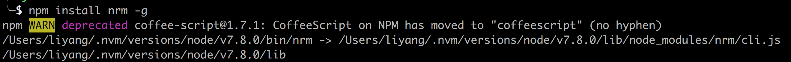

This class just introduce node, nvm, nrm, nxmj explain by Mr Guo
Node class will take about two week, then front framework take one or two month

>  This class aim to rebuild footer spider better.

| 8.10     |      |
| :------------- | :------------- |
|  Env       |  √       |
|  Moudle       | √       |
|  Code       | √       |


## Node.js

Node.js® is a JavaScript runtime built on Chrome's V8 JavaScript engine.

Node.js 是基于 v8 引擎的 可以用来编写服务器的 js 运行环境

Nodejs 实现了 CommonJs 规范，可以使用 exports modules.exports 导出模块, require 加载模块

### 应用场景

(1) 实时应用：如在线聊天，实时通知推送等等（如socket.io）

(2) 分布式应用：通过高效的并行I/O使用已有的数据

(3) 工具类应用：海量的工具，小到前端压缩部署（如grunt），大到桌面图形界面应用程序

(4) 游戏类应用：游戏领域对实时和并发有很高的要求（如网易的pomelo框架）

(5) Web服务器：利用稳定接口提升Web渲染能力

(6) 前后端编程语言环境统一：前端开发人员可以非常快速地切入到服务器端的开发（如著名的纯Javascript全栈式MEAN架构

### 特点

- 全局 对象为 gloabl
- 依旧可以兼容浏览器端的 js 语法
- 文件读写
- 进程管理
- 数据库操作
- 无法再进行 dom 操作

### 网易 pomelo

pomelo 是网易在 Node Js 基础上的 开发服务器框架，网易游戏大都基于此开发

### 版本分歧

nodejs 最初激进派和保守派，分离，形成 Node.js io.js, 后又合并，形成 lts 版本和 最新版本

### 安装

```
1. 先卸载 NodeJs
2. 安装 nvm
3. nvm install {nodeVersion}
4. npm install nrm // node registry manager
```

### node 中常用命令(npm, nvm, nrm ...)

nrm install path



NVM 进行Node.js的版本管理
```
- list ls 列举所有已安装的版本
- list available ls-remote 列出所有官网的版本
- nvm install 版本号 安装对应版本号的node.js
- nvm use 版本号 切换node.js版本

NRM 进行包的源管理
- npm 安装nrm
- nrm ls 列出所有可用的npm包源
- nrm use 源
- nrm add 添加一个源
- nrm del 删除一个源

```

```
npx // 对于 使用一次之后 不再使用的 模块 使用npx, 使用完后，会自动卸载，如
npx vue-cli vue-app
```

### nodeMon 时时检测插件

```
nodemon app.js
```

### 模块


早先解决模块问题, 使用 命名，文件开头引入, 如 table 依赖 jquery 则命令为
```
table_jquery.js
```

#### exports 重新指向问题
exports 重新指向后, 将不改变 Module.exports 暴露出模块的值，该模块暴露出的值将是 {}, module.exports 重新赋值后， 可以正常导出

#### amd, cmd, CommonJs

```
amdjs 规范 实现的代表是  require.js
cmdjs 规范 实现的代表是  sea.js
common.js 规范实现的 代表是 Node.js
```

### 常用变量

```
_ _dirname
_ _filename 当前模块的文件名称
console

//module
module.id: 模块的唯一标识
module.loaded：标记模块是否加载
module.parent: 引用模块的模块

```

### 运行
有两种方式来运行node.js

- 直接在终端上执行node命令：REPL
- 书写js文件 通过node命令 加上 参数 入口文件
- 安装nodemon 时时检测文件变化，自执行。

>npm install -g nodemon


### SUMMARY

- require 加载模块时，建议不加  .js 后缀， 因有可能重复添加
- require 加载进的模块，通常用 const 接收
- common.js seajs requirejs 加载模块都用 require
- 如果使用 exports 进行变量导出，防止  exports 被直接赋值，建议 加一句 exports = moudule.exports = {}
- 如果是 主模块(node {file.js}) 将有  _ _main_ _变量


## CommonJs 规范

Node.js的模块系统就采用CommonJS规范。CommonJS标准规定：

- 一个单独的文件就是一个模块，
- 模块内将需要对外暴露的变量放到exports对象里，可以是任意对象，函数，数组等，未放到exports对象里的都是私有的。
- 用require方法加载模块，即读取模块文件获得exports对象。

nodeJs 中支持
```js

module.exports = exports

require 加载模块

```
## Tip

- 装完之后会出现 安装路径，即这个 sh 运行的路径
- nodeJs 本身基于 v8 引擎，不支持模块，但是作为服务器语言，需要模块，所以基于 common.js 规范实现模块化
- repl 交互式解析器
- nodeJs 一个文件就是一个模块
- 京东分类 刷新 设计原因，迭代不改旧逻辑
- 源码编译成二进制, 难以逆向
- 源码阅读业务逻辑不明，易被绕, 如 jquery 迭代到现在
- 书本阅读，不如文档更新速度, 最初遇到问题，搜索结果不新，查找文档
- npm 随着 node 安装而自动安装，切换 node 版本 npm 对应版本也会变动
- npm use 原理为 将选择版本 Node  拷贝到 对应目录
- what where how ： 进悟是怎为替
- exports = {} error, module.exports = {}  right

## FAQ

- package.json 中的 指定 Pm2 和 全局的有什么区别
