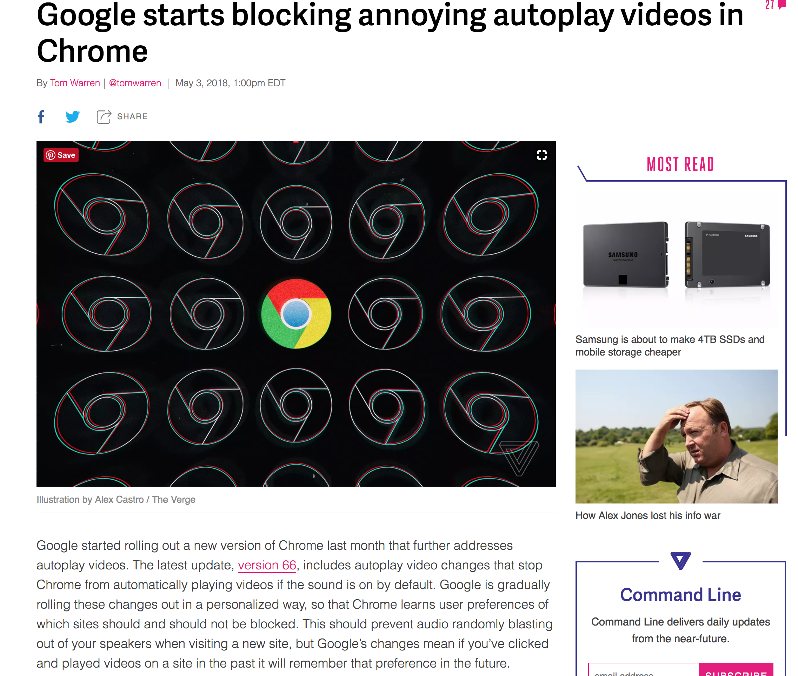

# 1\_html5\_foundation\_filereader

## 1\_html5\_foundation\_filereader

### .1 html semantic tag

* header, nav, , main, article, section, aside, footer, small, mark

{% embed data="{\"url\":\"https://codepen.io/googleliyang/pen/EpdYEJ\",\"type\":\"rich\",\"title\":\"EpdYEJ\",\"description\":\"...\",\"icon\":{\"type\":\"icon\",\"url\":\"https://codepen.io/favicons/favicon-192x192.png\",\"width\":192,\"height\":192,\"aspectRatio\":1},\"thumbnail\":{\"type\":\"thumbnail\",\"url\":\"https://s3-us-west-2.amazonaws.com/m.cdpn.io/screenshot-coming-soon-small.png\",\"width\":384,\"height\":225,\"aspectRatio\":0.5859375},\"embed\":{\"type\":\"app\",\"url\":\"https://codepen.io/googleliyang/embed/preview/EpdYEJ?height=300&slug-hash=EpdYEJ&default-tabs=js,result&host=https://codepen.io&embed-version=2\",\"html\":\"<iframe src=\\\"https://codepen.io/googleliyang/embed/preview/EpdYEJ?height=300&amp;slug-hash=EpdYEJ&amp;default-tabs=js,result&amp;host=https://codepen.io&amp;embed-version=2\\\" style=\\\"border: 0; width: 100%; height: 300px;\\\" allowfullscreen></iframe>\",\"height\":300,\"aspectRatio\":null}}" %}

### Tip

&lt;&lt;&lt;&lt;&lt;&lt;&lt; HEAD

* chrome 在第二次播放时，autoplay 失效

## [https://www.theverge.com/2018/5/3/17251104/google-chrome-66-autoplay-sound-videos-mute](https://www.theverge.com/2018/5/3/17251104/google-chrome-66-autoplay-sound-videos-mute)

* chrome 在第二次播放时，autoplay 失效

> > > > > > > 896eddc0f8ee8ff4d8856a3a990b6e886fd0a877

