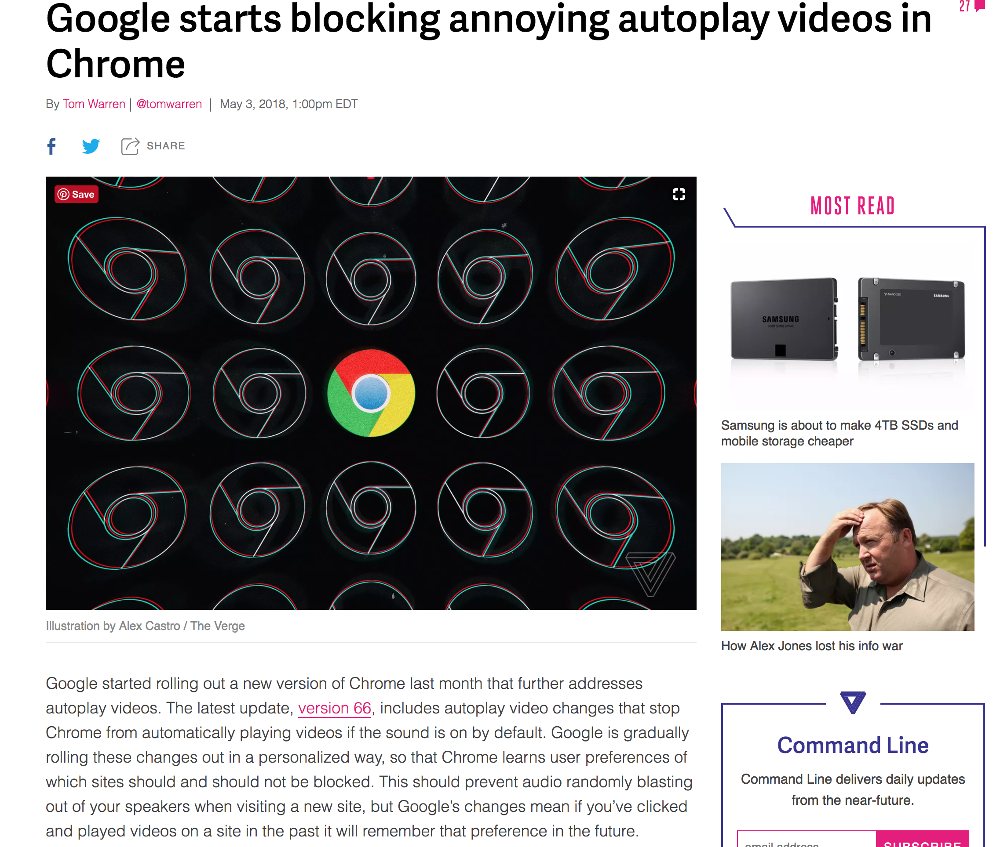

# 1\_html5\_foundation\_filereader

## .1 html semantic tag

* header, nav, , main, article, section, aside, footer, small, mark

https://codepen.io/googleliyang/pen/EpdYEJ

## Tip
- chrome 在第二次播放时，autoplay 失效

https://www.theverge.com/2018/5/3/17251104/google-chrome-66-autoplay-sound-videos-mute
