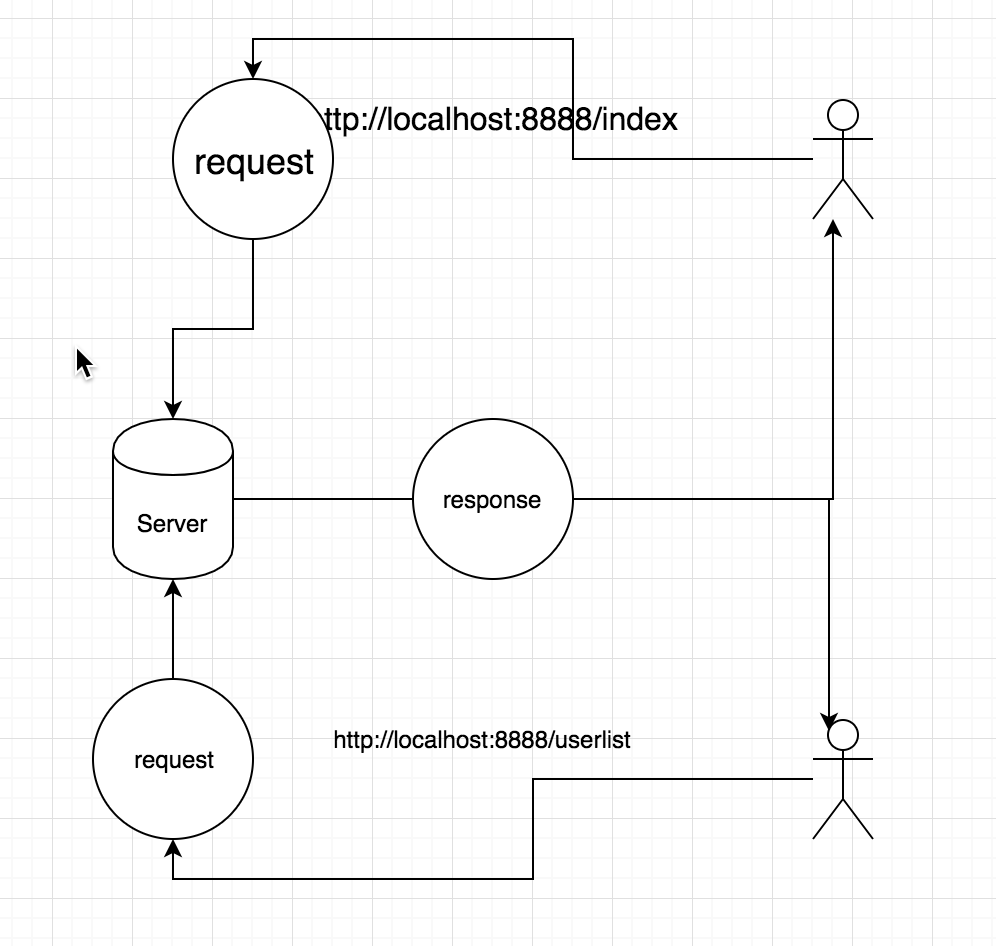

This class for node commmonly module, such as path, url, querystring, http ...


## require 

 > require 执行，如果文件是第一次被加载，将会执行代码加载到缓存中，第二次加载时，将直接从缓存中取，不再执行


## Node.js 常用模块

### Path 


```js 
// todo: code try
// path.join 相比对原生 字符串拼接，会兼容 windows(不同操作胸膛下路径分隔符不同)
path.join(__dirname, '/views')   
path.resolve(__dirname, '/views') // 返回绝对路径
path.parse()
path.format()

```

```js

const path = require('path')

// /Users/liyang/programmer/project/kaikeba/20_node_module_use/views
console.log(path.join(__dirname, 'views'))
    // /Users/liyang/programmer/project/kaikeba/20_node_module_use/views
console.log(path.resolve(__dirname, 'views'))
    // views/views
console.log(path.join('./views', 'views'))
    // /Users/liyang/programmer/project/kaikeba/20_node_module_use/views/views
console.log(path.resolve('./views', 'views'))
    /*
    {
        root: '/',
        dir: '/Users/liyang/programmer/project/kaikeba',
        base: '20_node_module_use',
        ext: '',
        name: '20_node_module_use'
    } 
    */
console.log(path.parse(__dirname))

```

> Node 后台中 需要设置 views 路径

```js
App.set('views', path.join(__dirname ,'views'))

```

### Url

> Resolve

join 方法注意事项

url.resolve(from, to)

- to 前边带 / 将完全替换 path
- from 后边 /, to 后边 无 将拼接


### Querystring

编写代码过程中，参数通常是 &name={}&age={} 的字符串，而diamante中通常使用 对象来表示，二者之间转换可以使用 querystring 模块

#### Escape 

在进行http 数据传输时，通常需要对数据进行编码, &... 以及中文字符都会得到编码， 可以防止sql 输入以及数据传输失败, 在服务器收到数据后 济宁unescape 解码

```js
> querystring.escape('ni&')
'ni%26'
> querystring.unescape(''ni%26'')
...
...
> querystring.unescape('ni%26')
'ni&'
> 
```

### Http
```js
const http = require('http')

// 创建服务器的实例
const server = http.createServer((request, response) => {
    // 设置请求头
    response.writeHead(200, {
            'Content-Type': 'text/html;charset=utf-8'
        })
        // 根据 用户不同的path 响应不同的页面数据
    switch (request.url) {
        case '/index':
            response.write('index')
            break
        case '/about':
            response.write('about')
            break
        default:
            response.write('这是网站跟目录')

    }
    response.end('<p>哈哈 终于结束了</p>') // 通知客户端 数据响应完毕 不用等待了
})

// 启动服务器
server.listen(8888, (err) => {
    if (err) return console.error(err)

    console.log('服务器启动成功')
})
```

#### req, res



- 调用完 res.write([, resText]) 后需要调用 res.end([, resText])表示响应完成
- res.end([, resText]) 可以继续追加响应数据

#### 设置响应类型, 通知浏览器以何种方式解析数据

> 文本

在设置为文时，html 标签将不会在浏览器端解析


```js
 res.writeHead(200, {
        'Content-Type': 'text/plain;charset=utf-8'
    })
``` 
> json
```js
 res.writeHead(200, {
        'Content-Type': 'application/json;charset=utf-8'
    }) 
``` 
> html
```js
  res.writeHead(200, {
        'Content-Type': 'text/html;charset=utf-8'
    })
``` 

> 响应值 200 问题

响应值 为当前页面 http 响应值 可以在一定要求内随意返回，如400 也可以正常加载页面，但浏览器端 会对应显示为 badRequest


#### Http.get

## Tip

- 前端模块化  amd, cmd 
- node.js 模块化, commond.js
- node 中 一个文件是一个模块，用了 webpack 之后所有皆是模块
- 在使用 url 模块时， linux Mac 没有盘符概念 默认指向的就是   / 
- webpack 大量使用 fs 操作文件
- node vsc提示插件 typings, 安装完提示便有了

http://shrekshao.github.io/2016/06/20/vscode-01/

## FAQ

- Mean 架构
- 服务器响应头设置 text/plain 与 applicatin/json 区别 ? 都可以作为 json 对象显示
- 文档参数表示

