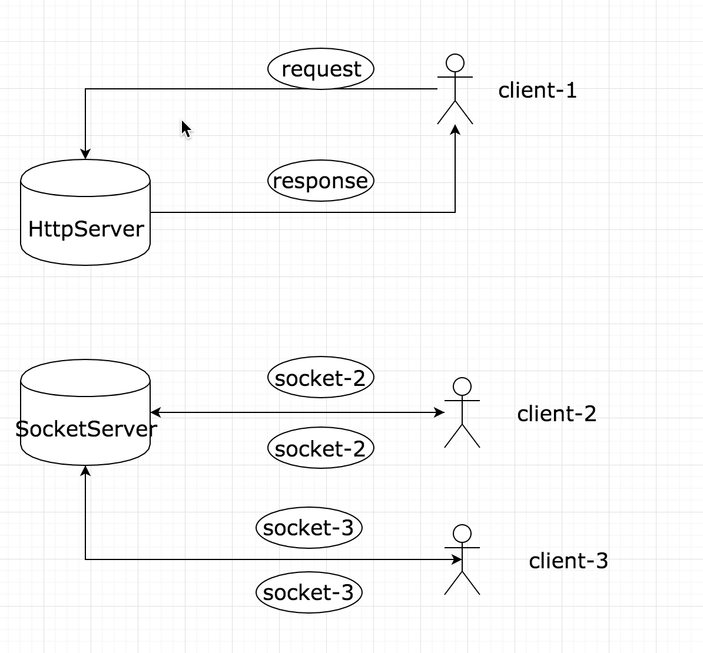
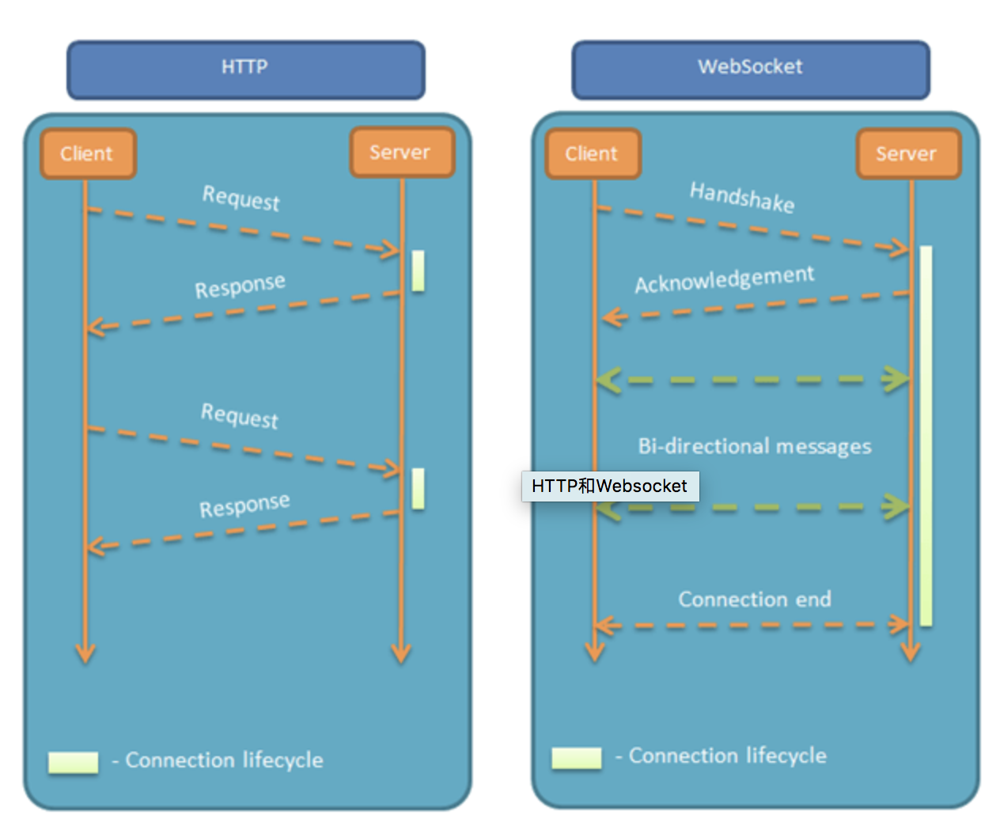

## Socket

socket 基于  tcp

## Socket.io

socket.io 事件驱动

## Tip

- 在程序走 io 流时，二进制想变成 汉子就需要 编码，编码便有编码问题
- \+ "\n" 会换行
- e.switch === 13 enter

## socket 与 websocket

https://github.com/onlyliuxin/coding2017/issues/497

websocket 与 socket 之间关系 就像 java 与 JavaScript

Socket是一个便于使用 TCP/UDP 的接口规范,
WebSocket是一个应用层协议..

> 可以把WebSocket想象成HTTP，HTTP和Socket什么关系，WebSocket和Socket就是什么关系。

> WebSocket一种在单个 TCP 连接上进行全双工通讯的协议。WebSocket通讯协定于2011年被IETF定为标准RFC 6455，并被RFC7936所补充规范。WebSocket API也被W3C定为标准。
　
WebSocket 使得客户端和服务器之间的数据交换变得更加简单，允许服务端主动向客户端推送数据。在 WebSocket API 中，浏览器和服务器只需要完成一次握手，两者之间就直接可以建立持久性的连接，并进行双向数据传输。
　
——维基百科

Socket与WebSocket处于的网络层级是不对等的，很难直接比较。WebSocket在网络七层协议上的层级等同于Http，而Socket位置处于七层协议中的第四层，Socket是操作系统对TCP、UDP的封装。WebSocket处在上层，Socket处在下层，WebSocket依赖于Socket，Socket为WebSocket服务。

## 群聊 & 私聊实现

- socket.io 初始 Demo 是服务器 terminal 实现的, 浏览器需要 websocket
- 浏览器端不支持 socket
