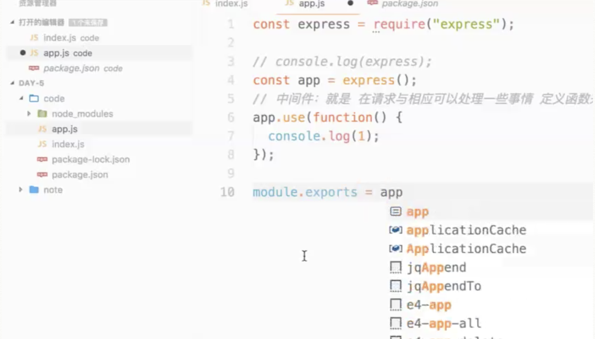
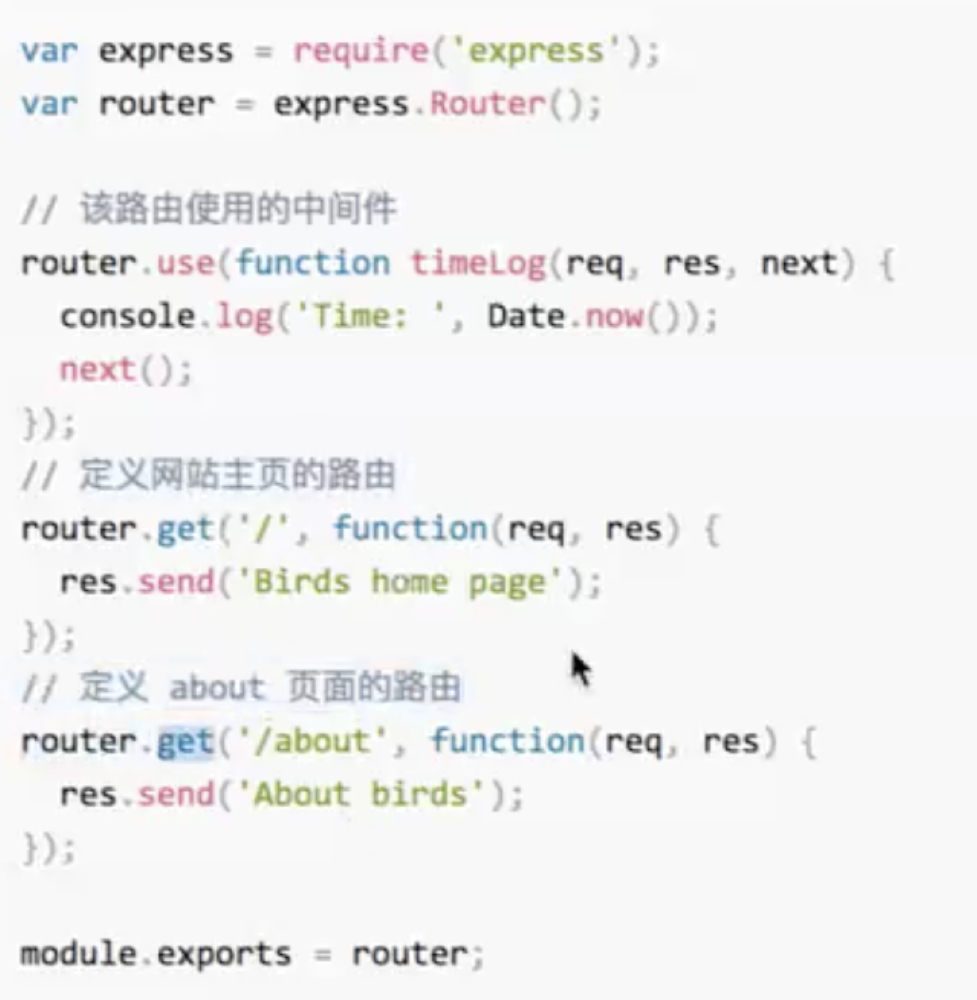
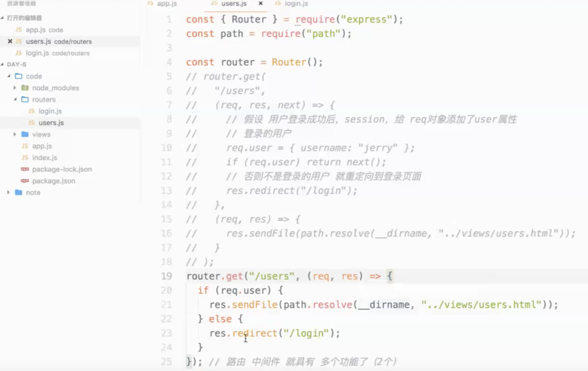
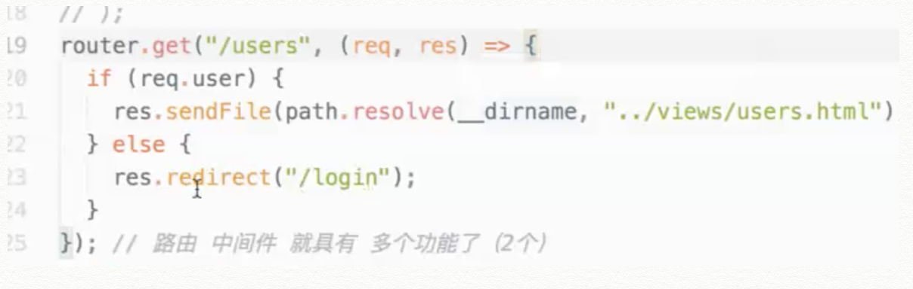
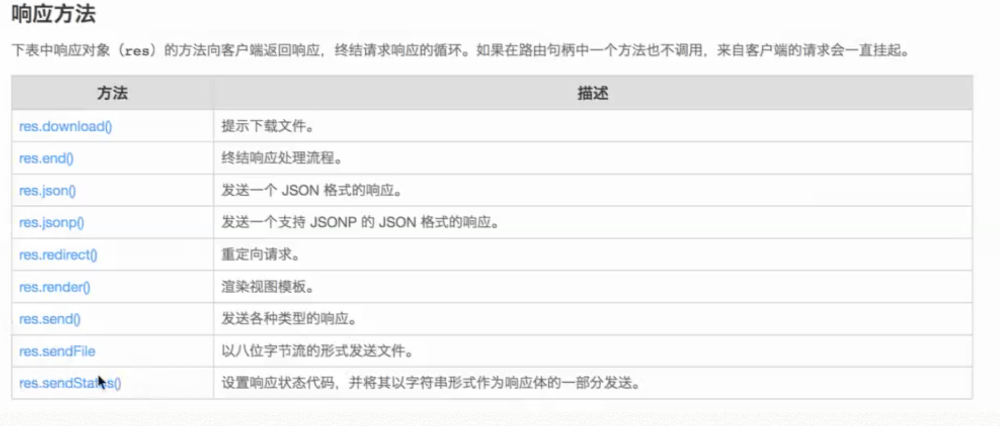
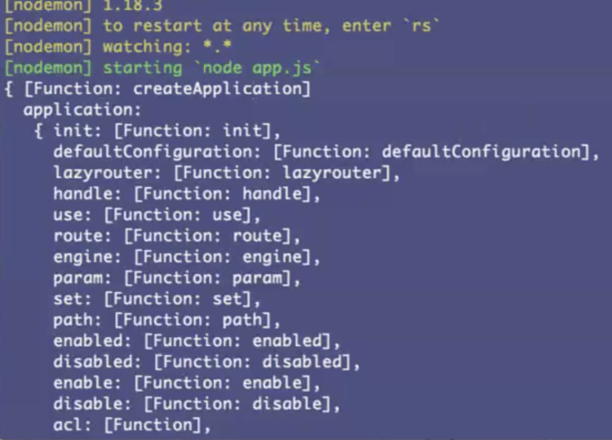

# Express

|  list     |  status     |
| :------------- | :------------- |
|  build express       | ✔️     |
|  doc read       | ✔️     |
|  record youtube video       | ✔️     |
|  statistics footbal       | ✔️     |

> Express 本身没有多少功能, 多数要从 npm 上下载，express 帮我们处理了 路由等问题

## 生成器(router, view)
express 生成器生成的代码很少，通常不用在 实际开发项目中，实际项目中采用 mvc 架构模式.

## 因为有  Index.js  所以我们需要 将 app.js 暴露给 index.js



## build express

1. mkdir Express

2. npm init -y // always yes

    // 此时 node_modules 中有一坨 因为 express 依赖其他的模块

3. npm i express -S // save

4. 新建个 入口文件 Main.js  因为package.json 中默认的 入口为 main.js

5. 路由分组

6. 中间键处理

7. 静态文件

## exress 中间键

> ！！！默认没有 中间件 帮我们把  post 请求的 请求体 放到 req 对象中，想使用的话 需要用到 bodyParse 中间键，引入 Use 下即可


- 如同 Java aop 面向切面编程
- 如果有多个中间键，需要调用 next() 方法让下一个中间键得到执行
- 中间键的位置决定处理的前后顺序，如错误级别中间键需要写到最后

### express 日志中间键

```js
// 应用级别中间键
app.use(function (){
  console.log(`${Date.now()} ${req.method} ${req.path}`)
})
```


### 应用级别中间键

```js
const express = requre('expreess')
express.use(() => {console.log(1)})
```

### 内置中间键
从 4.x 版本开始，, Express 已经不再依赖 Connect 了。除了 express.static, Express 以前内置的中间件现在已经全部单独作为模块安装使用了。请参考 中间件列表。

express.static 是 Express 唯一内置的中间件。它基于 serve-static，负责在 Express 应用中提托管静态资源。

### 第三方中间键

```js
$ npm install cookie-parser

var express = require('express');
var app = express();
var cookieParser = require('cookie-parser');

// 加载用于解析 cookie 的中间件
app.use(cookieParser());
```

### 错误中间键

```js

// res, res 是express 对 原生 req res 对象的一层封装

function (req, res, next) {

}

// 写在最后
app.use((req, res, next) => {
  let error = new Error('404')
  next(error)
})

// 错误中间件
app.use(function(err, req, res, next) {
  console.error(err.message);
  if(err.message == 404) return res.status(404).send('Page Not Found.');
  res.status(500).send('Something Error.');
});

```
## 使用多个回调函数第一个回调函数 需要 next


## 请求路由

路由: 如何定义应用的 端点 以及 给客户端的响应


在编写一个 http 路由时，通常 一个 get 路由(返回页面), 一个 post 路由(处理数据)

> 一个请求的循环结束了 其他的代码就没有任何意义了, send 之后 代码将得不到执行了


### 动态路由
动态路由可以采用正则表达式

> 注意不要 把正则写成字符串

动态路由一个定义方式，可以匹配多种情况


### 路由分组(文件分组)




## 路由句柄

匹配到路由后 我们给到的函数 即是 路由句柄

## 路由句柄拆分

将判断用户 是否登录 放在一个模块写 这样 一个模块便会有两个功能，不利于维护, 现在开发 尽可能让模块功能单一, 如下

这种思想较 职责划分 如公司管理




## 响应方法



## Tip

- 直接 res.send // express 包装的 调用 send 之后 会自动帮我们调用 end 方法了
- koa 为 express 团队开发的 第二代框架
- express 和 ejs 是完美的 cp
- express send 方法 最后默认帮我们调用了 end 方法
- rquire 加载的时候 解构导入 用 : const {userRouter: routers, proRouter }= require('./routers/in导入 用 :x')


## FAQ

- 重定向和存储转发
- 打印 express 看createApplication 是什么



  - 其实返回的是一个工厂函数 调用工厂函数 得到对象

  ```js
  the express obj is function createApplication() {
    var app = function(req, res, next) {
      app.handle(req, res, next);
    };

    mixin(app, EventEmitter.prototype, false);
    mixin(app, proto, false);

    // expose the prototype that will get set on requests
    app.request = Object.create(req, {
      app: { configurable: true, enumerable: true, writable: true, value: app }
    })

    // expose the prototype that will get set on responses
    app.response = Object.create(res, {
      app: { configurable: true, enumerable: true, writable: true, value: app }
    })

    app.init();
    return app;
  }
  ```


- Res.sendFIle()  //  // 指定个 HTML返回去，不用设置  文本格式的 header 吗， 这个方法不常用，后边会用 render
