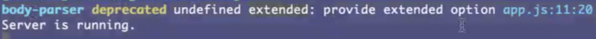

## Build project use cookie-session ...

## Express

### middleWare

- bodyParse

  - extend 设置为 false 则不需要使用 原生的queryString 获取值了

  

- session-cookie

  - signed 验证cookie 是否被修改过，md5 再加密一次，判断值是否相等即可

## Tip

- 使用 req.url 进行重定向 浏览器 url 地址不变
- body-parese post 数据和json数据同样接收方式
- vscode nodeJs 断点调试
- socket 并发
- 全栈最早来自facebook 旨在一个工程师走后，随便另一个可以代替
