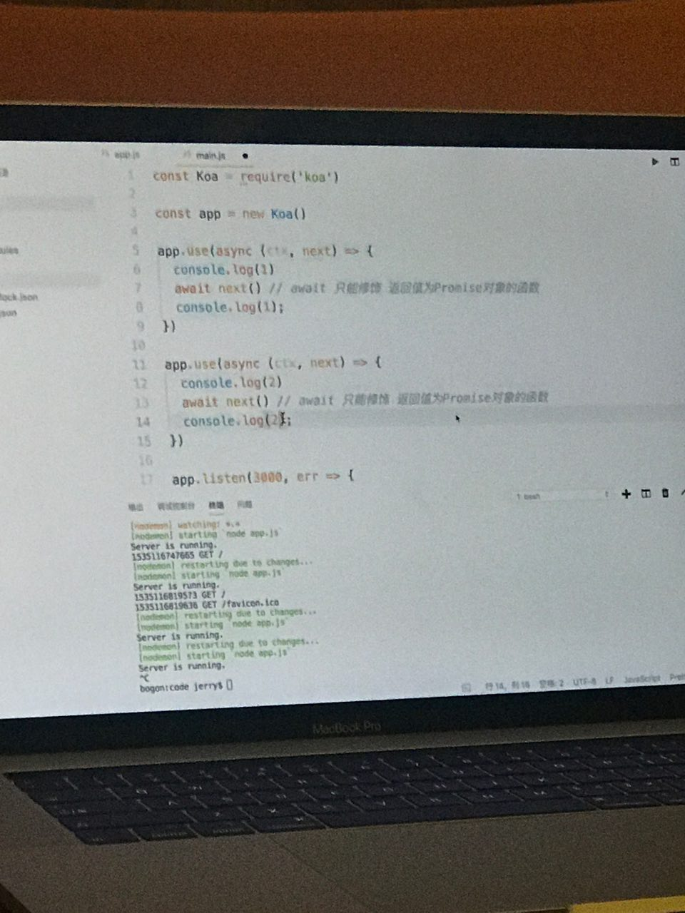
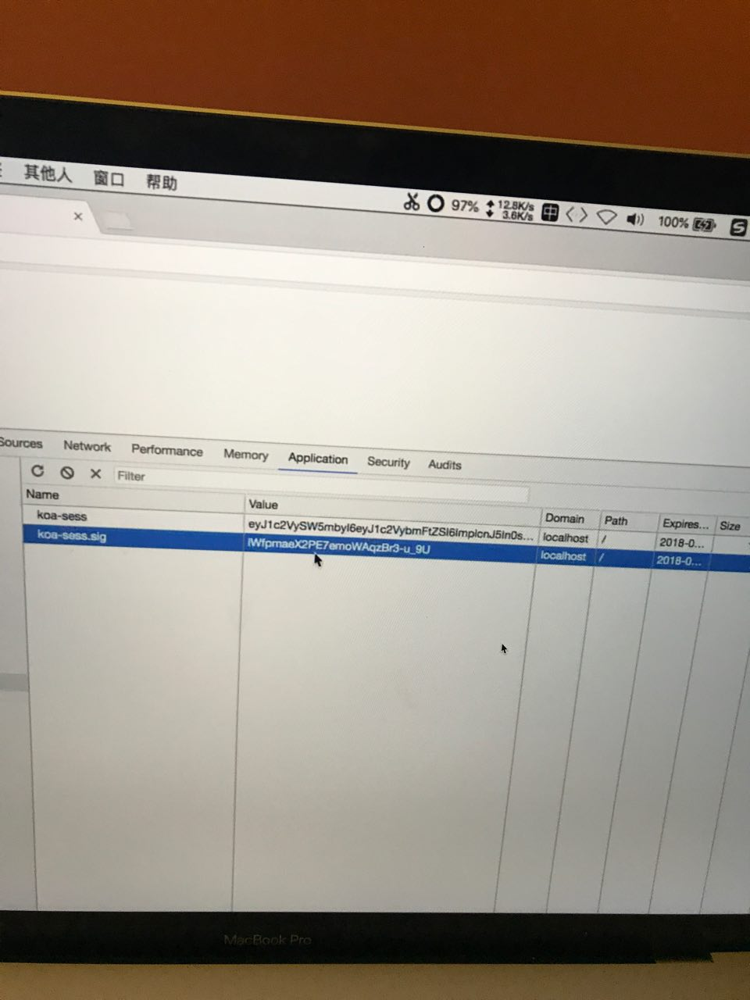

## Koa

```js
// Capital delegate class
const Koa = require('koa')
let app = new Koa()
```

### Overview

koa 是 express 团队开发的 第二代，node.js 框架, 相比于 express 减少了很多东西（如路由，静态文件中间键），并加入 async, awiat, 替换了回调函数, 最初时使用 Promise 对象，后升级为  async

## async

使用 async 定义函数时，实际上就是返回 Promise 对象

```js

fn () {
  return new Promise(function (res, rej) => {
    ...
  })
}

async ...
```

### koa 对比 express

- 中间键使用 都通过 use 方法
- koa 是一个类，express 为工厂函数
- koa 中间键必须调用 next, express 不需要
- koa 基于 async, 并将 req, res 封装入 ctx 对象
- koa 中间键 next 类似递归执行，express 从上向下执行


### Koa 中间键采用递归方式执行



如上图打印结果为 1,2,2,1

> Koa 的实例对象支持，on 绑定事件说明Koa 继承自事件类

### async babel 编译完代码为


> 如果使用 await 写法，因为没有回调的原因可能会有异常得不到捕获，所以尽可能使用 try catch 语句块包裹

```js
try {
  var res = await fn();
} catch (e) {
    throw new Error(e)
}
```

```js
// input
function fn () {

  return new Pormise(res => {
	setTimeout(()=> {
    	res('ok')
    }, 1000)
  })
}

async function fn1 () {
	console.log('start')
  	await fn()
	console.log('end')
}

// output

'use strict';

var fn1 = function () {
  var _ref = _asyncToGenerator( /*#__PURE__*/regeneratorRuntime.mark(function _callee() {
    return regeneratorRuntime.wrap(function _callee$(_context) {
      while (1) {
        switch (_context.prev = _context.next) {
          case 0:
          console.log('start');
          _context.next = 3;
          return fn();

          case 3:
          console.log('end');

          case 4:
          case 'end':
          return _context.stop();
        }
      }
    }, _callee, this);
  }));

  return function fn1() {
    return _ref.apply(this, arguments);
  };
}();

function _asyncToGenerator(fn) {
  return function () {
    var gen = fn.apply(this, arguments);
    return new Promise(function (resolve, reject) {
      function step(key, arg) {
        try {
          var info = gen[key](arg);
          var value = info.value; }
          catch (error) {
            reject(error);
            return;
          } if (info.done) {
            resolve(value);
          } else {
            return Promise.resolve(value).then(function (value) {
              step("next", value);
            }, function (err) {
              step("throw", err);
            });
          } }
          return step("next");
        });
      };
    }

function fn() {

  return new Pormise(function (res) {
    setTimeout(function () {
      res('ok');
    }, 1000);
  });
}

```

### Koa 源码解读


## Tip
- koa 源码解读
- koa 第一代 使用 generate, koa2 使用  async
- next 返回的是 Promise 对象
- 正常写会在 next 前加 await, 加 await 不用回调函数可以得到结果, 如果上下没关系，用不到上边结果

- package.json 发布 npm 时需要指定 Main

- package.json 中 start text 命令可以直接 Npm + 它启动

- koa 相对于 express 多封装了一个 上下文对象

- session cookie 只存于服务器 Mongodb, 客户端只存 证书 rolling

- 因为 ctx.body 被 response 占用了，所以取数据时，ctx.request.body

- 正常开发中 next 函数前加 awiat, 本身返回 promise 对象

- use(router.allowedMethods())
  - 路由中有哪些方法就支持哪些

- cookie session 中间键，设置将签名放在客户端就好，存 session 内容本身 Base64 编码并不安全

- 存签名与内容对比


## Faq

- express 不使用 next 会自动往下调用，Koa 则不会
- promise 源码编写
- Object.crate

```js
if (!Object.create) {

　　　　Object.create = function (o) {

　　　　　　 function F() {}

　　　　　　F.prototype = o;

　　　　　　return new F();

　　　　};

　　}
```
