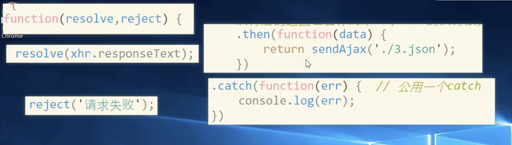
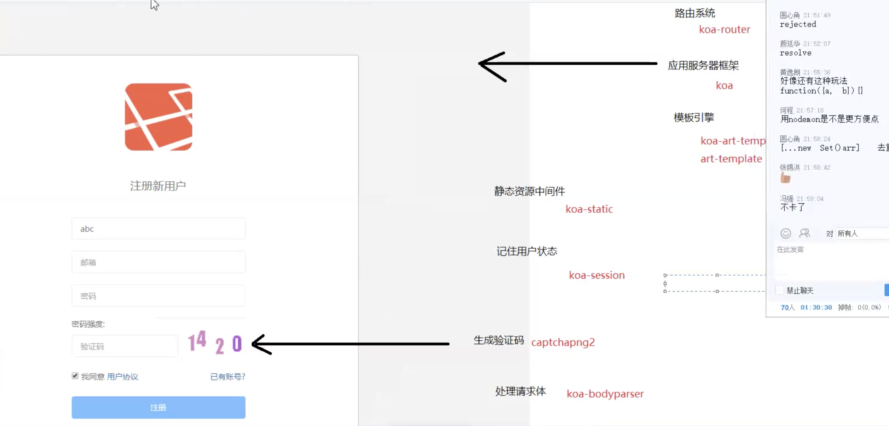
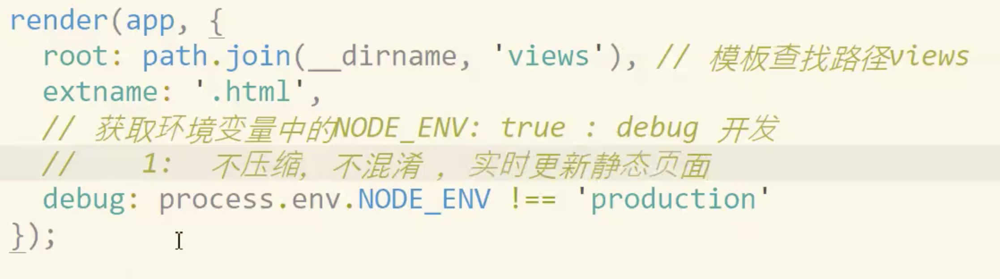
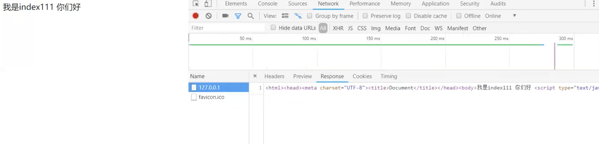
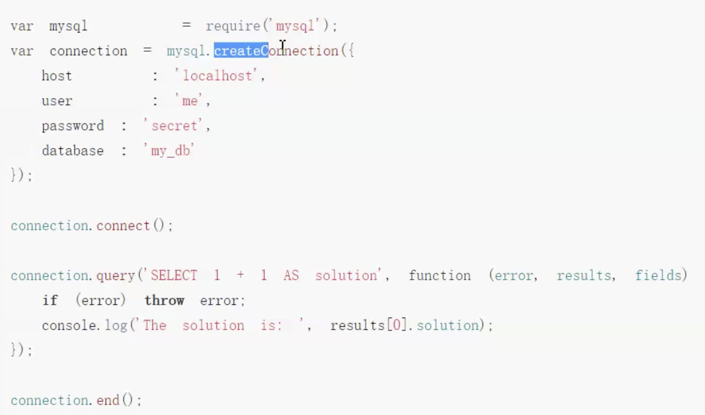
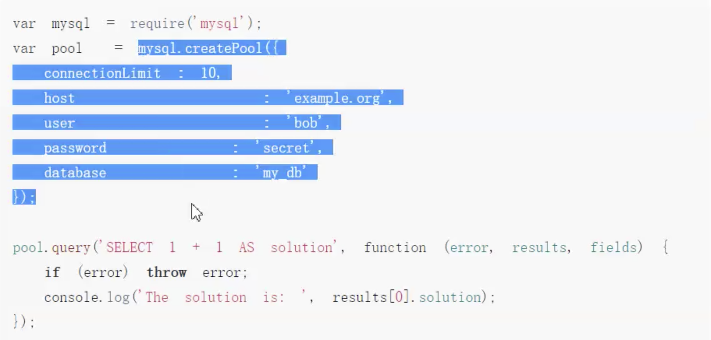
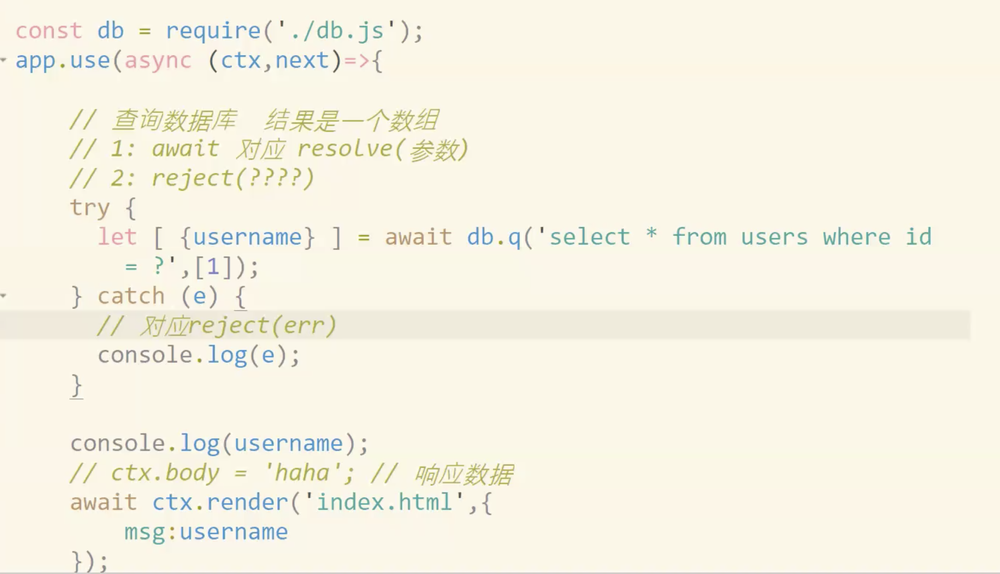

## Es6

### Let, Const

- 如果let 声明在 {} 中，则作用域在 {} 中
- const 声明为常量赋值，则不能再赋值, 性能损耗微乎其微，关键在域于代码的健壮性

> 注意, 对象可以修改对象属性

```
const obj = {name: 'jack'}
// 内存地址改变了，报错
obj = {}
// obj 的内存地址改变了
obj.name = 1
```

### 箭头函数

- 一个括号可省
- 一行语句 {} 可省
> this 问题
- 箭头函数没有 this, 会向上级 绑定 this,
- 由于 没有 this 不能作为  构造函数使用


### promise

作为异步处理的容器, res, rej 记录异步状态

- .then 执行后的返回值会作为下一个then 的执行依据， 一个 .then 中return promise 后续继续 return promise

- 多个 promise 可以共用一个 catch, 可以通过不同 错误 参数判断, 一个出错后进入 catch 后续 then 就不执行了

- Promise .then 还是有 回调函数影子, reolove 对应 then, rej 对应catch

- promise 中三种状态，resolve, reject, pending

- 一经改变无法回退



### 解构赋值

- 对象中解构赋值关键是 Key
- 数组中的 解构赋值 是顺序

## Koa 项目实战

### 流程梳理



### art template

> debug ， production 模式下，静态文件生成后则不更改了，服务器重启才会更改



debug

-

- debug 模式 html页面

  - 代码未压缩, 更改刷新就更新

- production html 页面




### 数据库的连接和获取

### mysql 连接方案


- 建立断开方式，不建议使用


- create pool 方式， 减少服务器性能开销




> replase 放回 pool


#### 封装 连接池函数, 因为连接调用是在外部调用的

> 将错误信息返回到调用处，内部封装一层 promise 进行 res rej 处理

> [{username}] 因为 promise 返回为数组，数组中为对象，所以 如此解构




## Tip

- file 协议到 http 协议跨域
- node 源码 c 和 c++
- 命令行, rs 实现node重启
- cross-env

## FAQ

- resolve 的值 就是 await 的值
- 了解的东西负责人说一下，不是很了解的东西..
- 开发久了，对新东西没兴趣了，语法看过太多了, 保持兴趣可以 80% 90%
- 宁哥?
- 老师图。。
- TJ 大神
- Koa 爬虫爬取 开课吧课程 播放
- node 错误优先 直接 throw err 就可以了 没必要 再 new
- NODE IO 非常快，访问网页，不做太多运算和持久
- nodeJs 还会做很多底层命令行工具  
