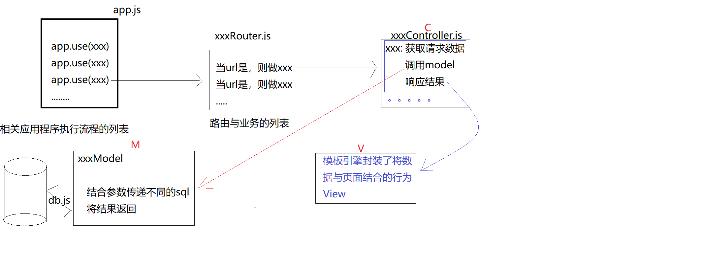
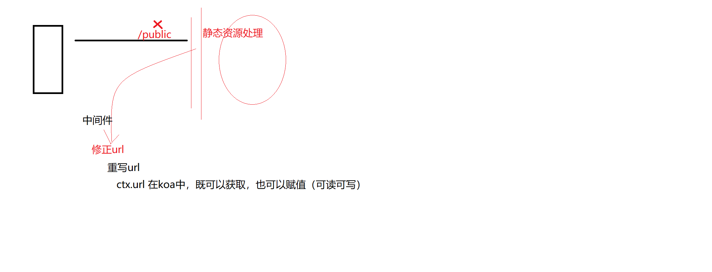
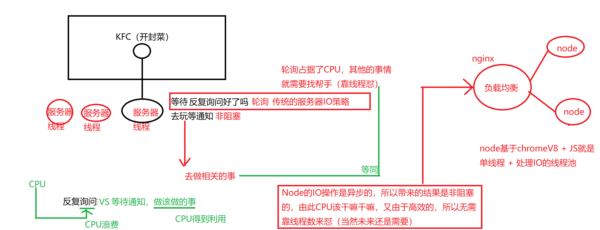

## mysql 事务

事物举例，当两次插入数据，如班级，学生，当班级插入失败，不需要添加学生，或是当学生添加失败，不需要班级，无论哪次操作失败，都需要将操作回退，提交异常等回滚

> 一次数据提交不需要事物，事物相对性能消耗高于普通

```js
connection.beginTransaction(function(err) {
  if (err) { throw err; }
  connection.query('INSERT INTO posts SET title=?', title, function (error, results, fields) {
    if (error) {
      return connection.rollback(function() {
        throw error;
      });
    }

    var log = 'Post ' + results.insertId + ' added';

    connection.query('INSERT INTO log SET data=?', log, function (error, results, fields) {
      if (error) {
        return connection.rollback(function() {
          throw error;
        });
      }
      connection.commit(function(err) {
        if (err) {
          return connection.rollback(function() {
            throw err;
          });
        }
        console.log('success!');
      });
    });
  });
});
```

window 平台可以新建 .cmd 文件

```sh
nodemon ./app.js
```

## Koa

### allowedMethods

- 默认 原本配置了/a 的get请求方式,但你用了post请求方式, 返回404,
- 以下配置可以返回405  方法不匹配
- 默认 如果客户端使用了元·服务器不能支持的请求方式 比如copy, 返回404
- 以下配置可以返回501  方法未实现

## art template

- 登录注册首页，头部，底部，都是相同的，可以抽取，中部根据不同展示，替换即可

```js
const render = require('koa-art-template');
const path = require('path');

render(app, {
  root: path.join(__dirname, 'views'), // 模板查找路径views
  extname: '.html',
  // 获取环境变量中的NODE_ENV: true : debug 开发
  //    1:  不压缩，不混淆 ，实时更新静态页面
  debug: process.env.NODE_ENV !== 'production', //  压缩，混淆 ，不实时更新静态页面
});

```

## Node.js MVC


## 静态资源假设都加了 public 而静态资源中间键刚好指定到public



 这个时候需要一个新的中间键，在访问静态资源之前，将路由拦截并将public 关键词移除

 ## 服务端渲染

 服务端渲染是 前端对应两台服务器，其一 node.js 其二 api 接口提供的 服务器

- 为什么服务端渲染可以提高首屏渲染速度 ?

因为 Node.js 本身处理 IO 速度上 远远高于 java, 所以使用 Node 取数据， 进行页面渲染速度优于直接渲染, 以及 前后端分离 前端渲染

- 为什么不使用 apache

apache 大而全，但是不具备 node.js IO 无阻塞的优势

## Koa 项目 MVC 加 模板引擎

- art template 使用, 公共头部，顶部，抽取，定制 插槽.
- Controller 抽取封装
例: 把user路由放到 useContoller 中，moudle.exports 出来，传给 路由
- 划分 modal 操作数据

## Node 后台对比 传统服务器， 处理 IO(线程池， 到io就一堆人了) 策略 * 多看
传统服务器，轮询反复询问等通知，node 做该做的事，等回调

> 尽可能降低，cpu 使用，如加密计算，通过 forever 机制永不死机



> node 非 IO 部分处理就一个线程执行，可以利用 Nginx, pm2 负载到多个线程


## Tip

- 当遇到包问题，删除后重新安装即可
- 处理静态资源中间键可以如下写法
- Path.resolve 可以直接将路劲转为绝对
- postman 中，Raw, binay 表示原生的, form 类型可以传文件, 第二个常规
- Path.resolve 直接返回目录绝对路径
```bash
path.resolve('./vpn')
'/Users/ly/Programmer/Vpn/vpn-android-web/vpn/vpn'
```

```js
app.use(require('koa-static'))(root)
```
- art template 每次 render 都会去拿主模板填坑
- 如下操作数据 写 sql 语句不合适


## FAQ

- Koa 路由写法，对比两次链式

```js
router.get('', (ctx, next) => {
  ctx.render('')
}).get('/xx', ctx => {
  ...
})
```

- 为什么 Koa 中间键函数 next 前边要用 await

因为 如果后续有代码的话，需要顺序执行, 在next() 后无调用方法时，加与不加都可以，但是尽量还是要加上

```

```

- 模板引擎公共部分抽取封装体会

- 补，服务器安全以及 orm
