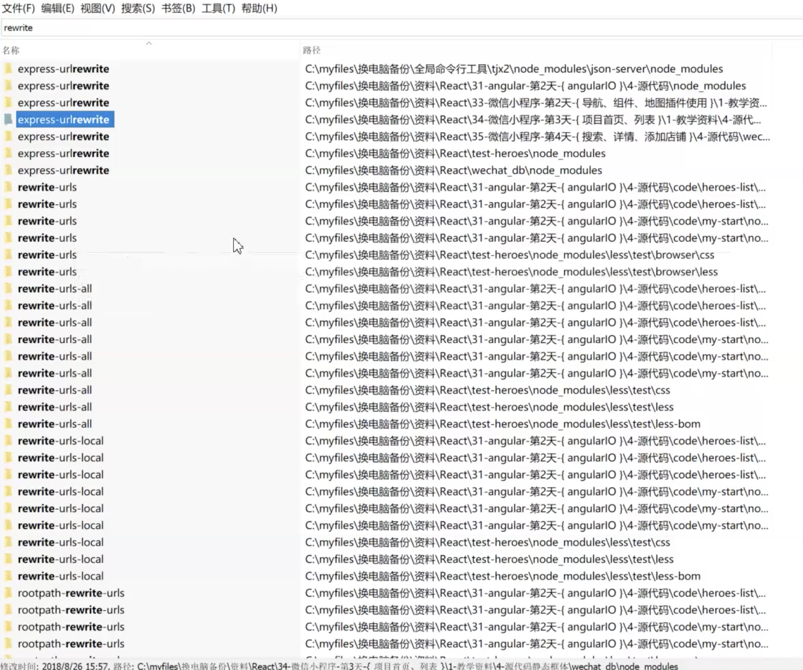
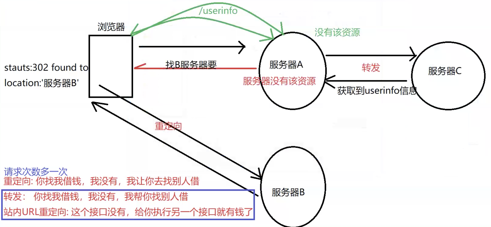
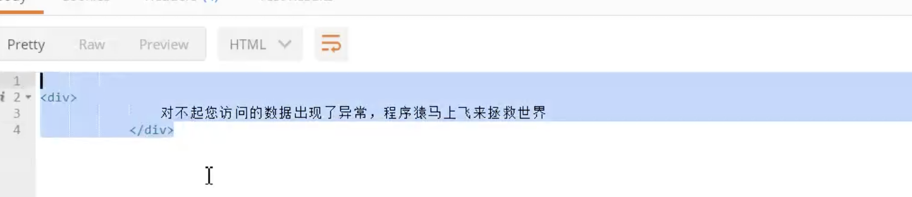
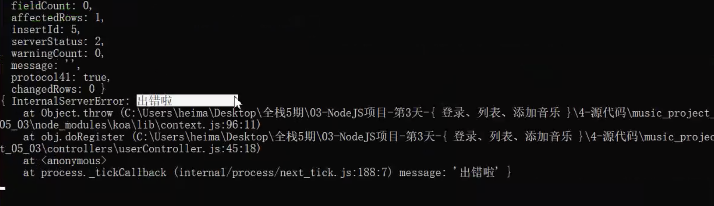
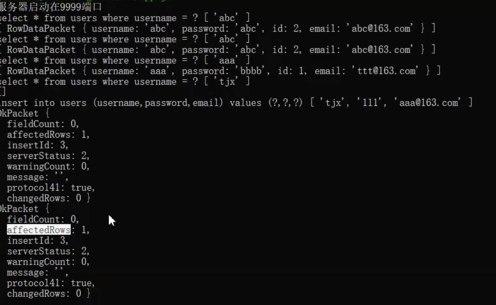

## 重写url 中间键，以及配置性思想

- 访问 / 重写 url 到 登录

```js
// 将rewriteUrl 封装成，返回一个 await 函数，接收数组的函数
app.use(rewriteUrl([
  {src: '/a', dist: '/b'},
  {
    regex: /\/public\/(.*)/
  }
]))

```

## 注册接口


> 抽取 路由中间键(更改 url, 如 / 到首页，静态资源去掉 Public)


> 抽取路由中间键配置的信息，把 端口，路由匹配规则抽离出来

```js
const { rewriteUrlList,port } = require('./config');
app.use(rewriteUrl(rewriteUrlList));

```

```js
module.exports = function (rules) {
    // { src:'/c',dist:'/d' },
    // { regex:/\/public\/(.*)/ ,dist:'/xxx' }

    return async (ctx,next)=>{
        // 判断请求是否以 /public开头，如果是，去除/public
        rules.forEach( rule => {
            // 判断是否有正则的处理
            if(rule.regex) { // result[0]是原字符串,1是分组内容
                let result = rule.regex.exec(ctx.url);
                if(result) {
                    // 判断是否有dist属性，如果有，就整个赋值
                    if (rule.dist) {
                        ctx.url = rule.dist;
                    } else {
                        // 反之就取其中分组的部分
                        ctx.url = result[1];
                    }

                }
            }

            // 处理src => dist
            if(ctx.url === rule.src) {
                ctx.url = rule.dist;
            }
        });
        // 判断用户是否以/ 请求
       // 经过一堆的规则匹配以后，最终放行，实在不行，就完全没有改变url
       await next();
    }
}
```

> db.js 中抽取 dbConfig

同config.js

```js
var pool = mysql.cretePool(dbConfig)
```

> config 文件如下


```js
module.exports = {
    rewriteUrlList:[
      { src:'/a',dist:'/user/login' },
      { regex:/^\/public\/(.*)/  }, // 为了解决前端的/public 多余
      { regex:/^\/xx/,dist:'/user/login'},
      { src:'/',dist:'/user/login'} // 为了访问/ 有登录页看
    ],
    port:9999,
    dbConfig: {
      connectionLimit: 10,
      host: 'localhost',
      user: 'root',
      password: 'root',
      database: 'node_music'
  }
}

```


## 各种框架底部大量使用了 rewrrite



# 以上重写为什么不用重定向（黄逸朗）

## 重定向与转发




- 情况一

  - 当客户端访问服务器资源，服务器中不存在此资源，返回 {status: 302 | 301, location: '
other server'} , 属于 http 协议规定

- 情况二 采用转发
  - 当服务器不存在此资源，自己向别的地方请求接口，获取数据返回给客户端

### 重定向转发对比

重定向浏览器请求两次服务器，转发只请求一次

> 所以以上写转发，浏览器少一次请求，重写url 也是一种站内转发

## 继续以前后端分离的方式来编写代码

> 验证码放到 session 里

## Js 异常上抛 *

```js

ctx.throw('error msg')

会向上抛出，抛到最上层，
这里 Controller -> router -> app.use() 处


// Koa 处理异常

放在第一行，让后边走，如果有异常，在第一行就捕获了, 没有 express 做的好，express 有统一处理异常的中间键

ctx.body 来个页面就好了

ctx.throw('出错啦') // 给浏览器看
console.error(...) // 服务端看


给后台看，给前台看

module.exports = async function(ctx,next){
   try {
     // 让后续先执行，如果出现异常，我来catch
        await next();
   }catch (err) {
        console.log(err); // 给后台看
        // 给前台看
        ctx.body = `
            <div>
                对不起您访问的数据出现了异常，程序猿马上飞来拯救世界
            </div>
        `
   }
}

```
> 错误效果如下




## 抽取异常处理中间键

# 抽取Promise 原理(单独下班节模块)

没必要把自己封装成什么都懂，oppo 25k学生，打击打击了好降价格，打不出刚好学点东西，难道非要去你这家公司吗

> promise.then 函数中存放两个回调函数, 当收到resolve 时执行

> 移交下一个 Promise， 如果 then 中返回  Promise

> .catch 还要再走一层.then 操作

```js
var PENDING = 'PENDING';
var FULFILLED = 'FULFILLED';
var REJECTED = 'REJECTED';
var i = 1;
// 1:构造函数Promise
function Promise(fn) {
    this.id = i++;
    // 2: 构造函数内初始 状态Pending 和value
    this.status = PENDING; // 初始是待发状态
    this.value = null; //初始值
    this.deffered = []; // 下一个要执行的Promise是谁，子promise
// 3:构造函数内调用函数(apply参数是数组,call参数是一个个的，调用函数改变this指向)
    fn.call(this,this.resolve.bind(this),this.reject.bind(this) );

}

// 4: 结束回调函数，执行then  Promise.prototype.then 是函数
// 5: then函数内不需要保存起成果或者失败的函数
Promise.prototype = {
    // 定义成功和失败的回调函数，改变状态，记录数据结果，执行后续的行为
    resolve:function(data) {
        this.status = FULFILLED;
        this.value = data;
        //执行后续的行为
        this.done();
    },
    reject:function (err) {
        this.status = REJECTED;
        this.value = err;
        //执行后续的行为
        this.done();
    },
    // 执行后续的行为
    done:function() {
        //  让这些this.deffered（子promise得到执行）
        this.deffered.forEach( task => this.handler(task) )
    },
    handler:function(task) {
        //  判断当前执行的状态是怎样，调用对应的函数
        var status = this.status;
        var value = this.value;
        var p;
        switch(status) {
            case FULFILLED:
                p = task.onfulfilled(value);
                break;
            case REJECTED:
                p = task.onrejected(value);
                break;
        }

        // 如果 p是一个promise的话，我们需要让他继续执行
        // 把后续（task.promise)的deffer交给这个p
        if(p && p.constructor === Promise) {
            // 是一个promise
            // 把下一个作为then链接的deffer移交p的deffered, 因为要执行 then 中 返回的  promise 上执行操作
            p.deffered = task.promise.deffered;
        }

    },
    constructor:Promise, // 改变回来原型链
    then:function(onfulfilled,onrejected) {

        // 保存该函数
        var obj = {
            onfulfilled:onfulfilled,
            onrejected:onrejected
        }

        // 新来一个Promise对象, 让其存储这些，
        // 并且能根据不同的Promise去then
        // *new 时 新生成promise 创建.then 函数并将then 函数内的 实参 传入 deffer数组
        // then 中继续返回 promise 时， 因为要调用 promise 的 resolve()，resolve 绑定的 promise deffer 中存放 then 的回调
        // 所以 要将 当前 new 出来的 promise 存放 回调函数的 deffered 数组 赋值给 then 成功回调返回的 promise, 等待其 resolve 时执行
        obj.promise = new this.constructor(function(){});
        // 保存起接下来的子promise

        // console.log(this);  // 1
        // console.log(obj.promise); // 2

        // 建立上一个与下一个promise之间的关系
        if(this.status === PENDING) {
            this.deffered.push(obj)
        }

        // 保证不报错  ,未来不能return自己 需要换人 此处 如果继续  reuturn 当前 Promise then 方法将得到多次执行,  返回  空的 promise 继续正promise可以 .then 又可以不报错
        return obj.promise;  // 下一个then的哥们
    }

}


```

## Tip

- 很多框架内部 都是用了 重写 url 

- 使用 查询长度来判断是否成功



- 天使轮对能干成事就好了


- 插入时，根据 affectRows 判断是否成功
， 在我们代码中 id 允许可以为空了，所以基本不存在报错的情况(正常代码不报错，默认所以不用捕获异常)


- 体会这里的 exports 的用法
