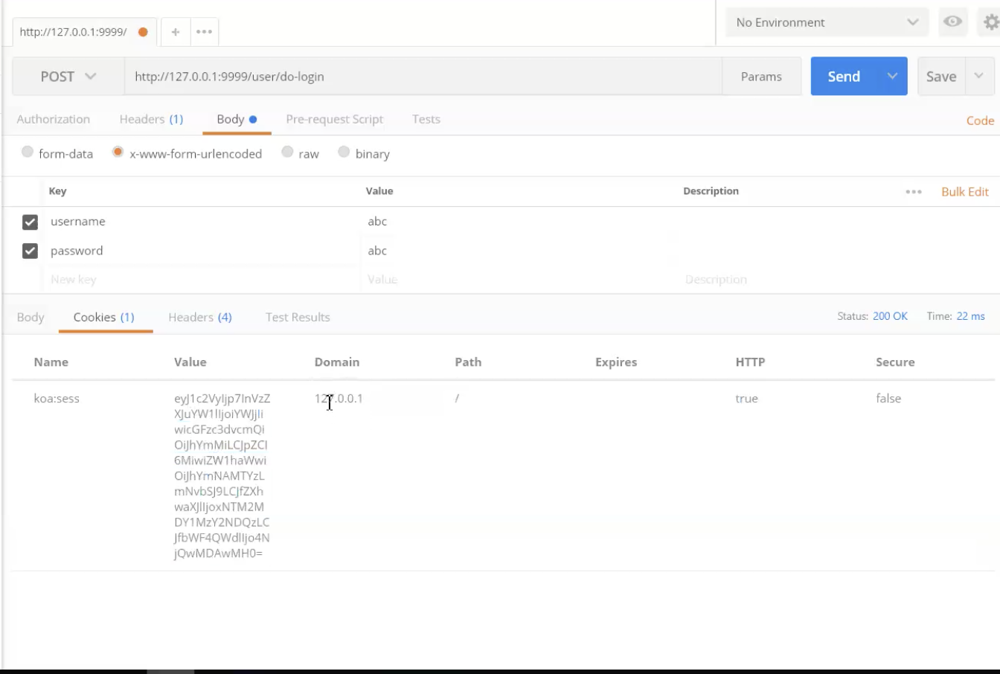
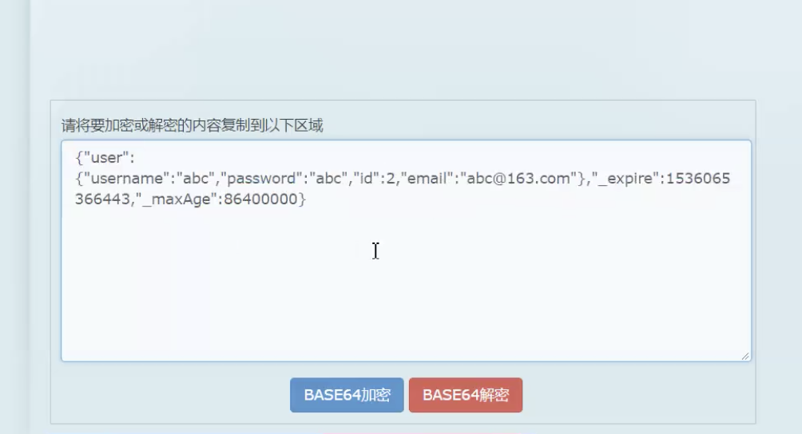
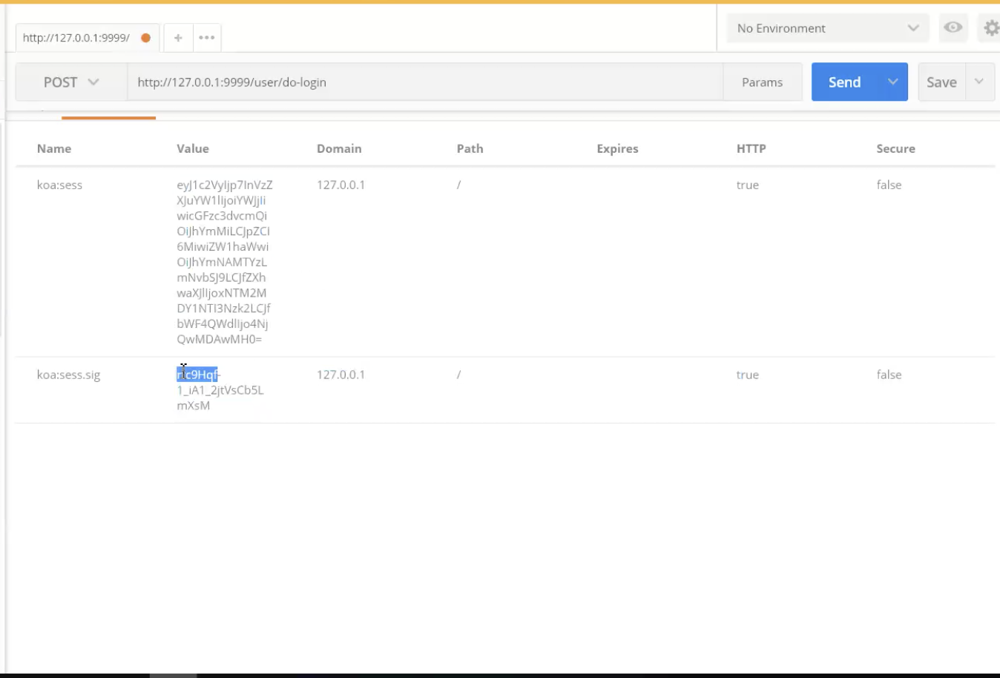
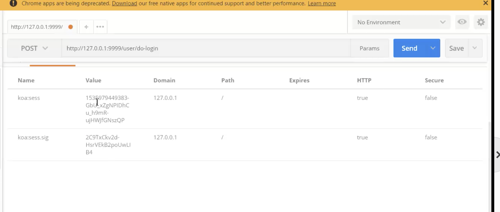
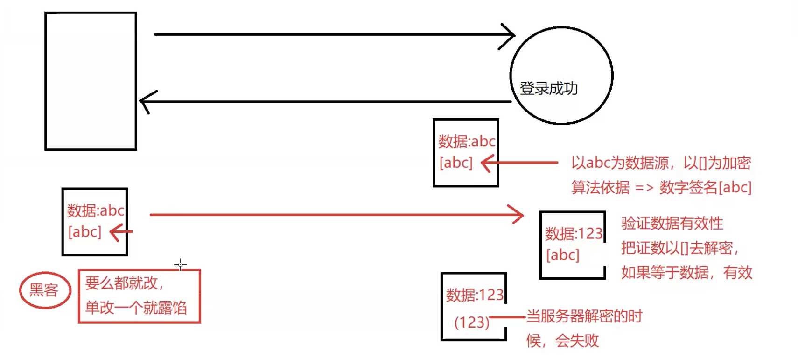
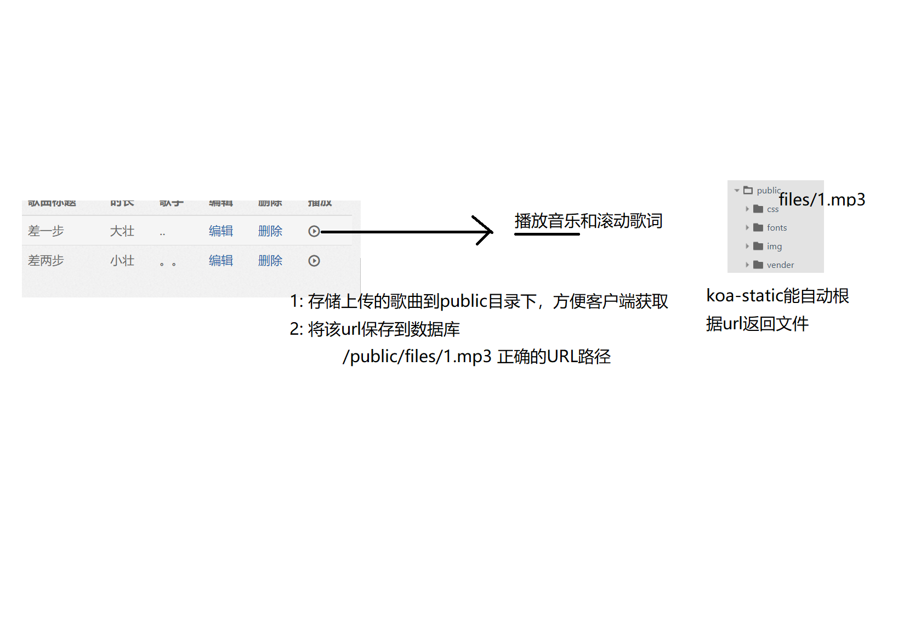

## 28-31

## 9.3 周一 连欠三天第一天, 讲完  promsie 源码第一天

## 继续完成 Koa 音乐播放项目

- 如下 未进行异常处理，会默认上抛到 处理异常的中间键（因为用在 userController 中）

```
let users = await userModel.findUserByUserName(username)
app.use(erroeHandler)
```

## cookie session 签名和数据

根据 key 进行计算，签名可以用来解密，判断是否相同，来判断数据是否变更



> http only 为 true 客户端无法通过，document.cookie 去拿

- sign 设置为 false 时，将存放数据在客户端，如下图
可以直接解base64编码



 - 当使用数字签名后，数据依旧可看但是，会有一对应 koa:sess.sig 此根据数据生成，若数据改动后，签名也会改变，所以签名是为了数据不被改而不是不被看。

 

 - 增加store 属性，将session 对应的数据(如上图可看数据)保存在 服务器上, 可以在内存也可以在数据库中，通常放在内存中

> 如下图  session 内容变为 建，不存储数据详情

 


 > ? 思考为什么这么设计

 > postman Interrput 可以将浏览器的请求拦截，并携带 cookie...， 同步浏览器 cookie 与 postman
 
- 黑客需要知道秘钥才可以破解



> 数据只是base64 编码，签名是 对数据进行签名，加stroe后数据详细内容不放于客户端，而是存放 对应key


### Music Controller 步骤

? 图


# 首页和添加音乐页都需要登录的权限，这东西可以提取出来放到中间键中，如laravel

- 因为依赖 session 所以要放在 session 后边

```js
// routerList 放到 config 中，需要验证登录的路有名
// 如 /user 开头， 还是 /music 开头
app.use(checkLogin(routerList))
```

## check login 代码


```
module.exports = function(routeList) {
    function _checkLogin (ctx) {
        return ctx.session.user;  // true: 有用户
    }
    // 给use函数使用的函数
    return async function (ctx,next) {
        let isNext = true;
        // 遍历routeList
        routeList.forEach( async route => {
            // 如果是正则
            if (route instanceof RegExp) {
                if(route.test(ctx.url)) {   
                    //验证是否登录
                  isNext = _checkLogin(ctx)
                }
            }
            // 如果是字符串
            if(route === ctx.url) {
                // 验证是否登录
               isNext = _checkLogin(ctx)
            }
        });
        if(isNext) {
            console.log('放行了');
             await next();// 都不满足  不放行的条件
        } else {
            console.log('不放行');
            await ctx.render('error',{
                msg:'您为未登录'
            });
            return;

        }


    }
}

```

## restful 方式

- 根据目的采用不同请求行为

  - put 局部更新，patch 整版更新


## 图片 文件 音乐 视频，上传与数据库存储

- 1 存储上传歌曲到 Public 目录，方便客户端获取

- 2 根据 与 public 目录的关系，将文件路径存放到数据库

- 3 /public/files/1.mp3 正确的 url 路径，因为我们已经把 把public 默认去除了 在当前项目中(路由拦截器)



### 处理上传的音乐

- fomidable(文件上传)

- koa-fomidable 与 body-parse 冲突了，两个都存在会有问题，留一个 koa-fomidable 就好了, 还会导致 不能快进，因为相应数据时 头信息不够完整

> 将用到 path 的地方路径放到 config 中，为之后使用进行配置， 如静态资源文件直接改 config 即可

## Tip

- 使 post man 可以使用 cookie 插件, 让 post man 请求支持 session, 同域下可以拦截浏览器请求，并携带 cookie

- \_开始的方法表示私有方法


## FAQ
### 黑马岳父
- 老师名称, 刘老师

- http only 设置为 true, 客户端可以看到 cookie, document.cookie 获取不到.

- 判断类型就一个地方用是否拆方法

- 路由需要给 async 函数做等待，否则一瞬间走完了，那个 引入 formidable 后出的错，调试  userController 那块, 给 async 为了里边的代码 数据库查询得到 同步执行

- 多个请求过来 服务器怎能跑的，那么多 数据查询 await

- 余下 43 人
