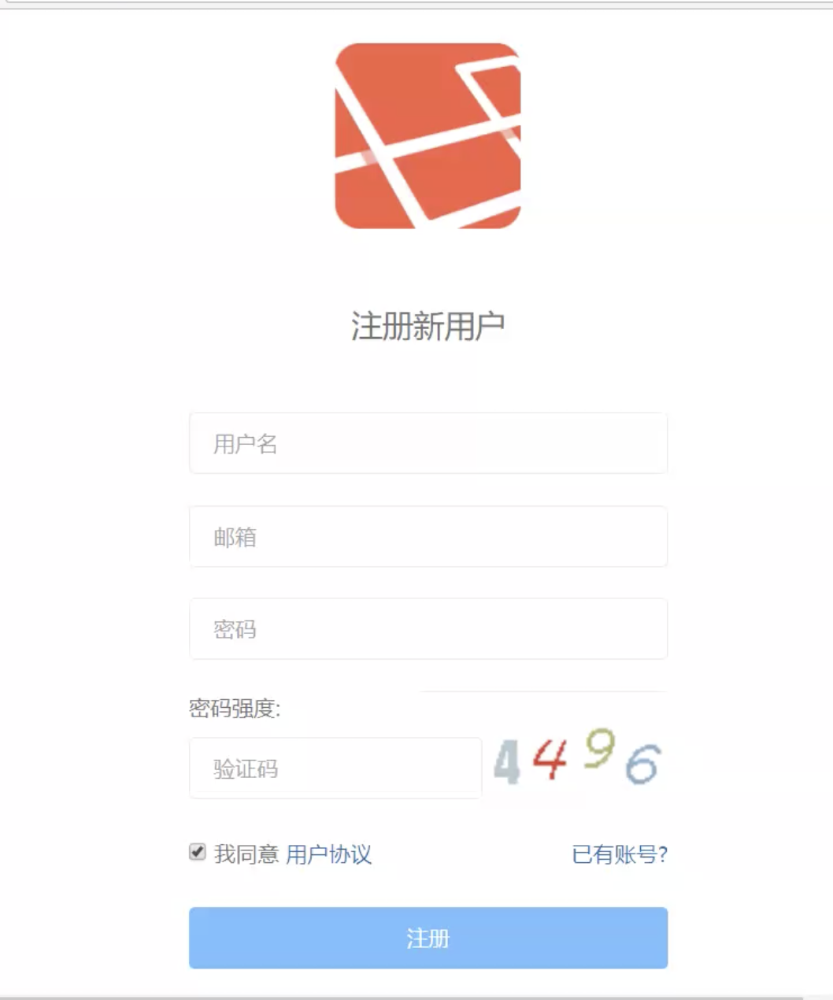

##


## 继续音乐播放器

### 退出

- store 时 destroy 时清除 store 中的值

- 清除 销毁 ctx.session

```
obj.doLogout = (ctx, next) = > {
  // 每个用户都有一个对应的
  // 每个用户访问时有它自己的
  ctx.session = null
  ctx.body = {code: '001', msg: '退出成功'}
}

```

### 更新音乐

- 编辑页面，有现存的数据

- 当音乐不存在时，throw 一个异常处理方式

```
let {id} = ctx.query
let musics = await musicModel.findMusicById(musicId)

if (music.length === 0) {
  ctx.throw('音乐数据不存在')
  return
}
ctx.render('edit', {
    music: musics[0]
})

// 会进入 errorHandle 中间键进行处理


// MusicModel
module.exports = {
  findMusicById: id => musicDB.q('select * from music where id = ?', [id])
}

```

### 配置路由规则使用 Put请求方式(因为基本是对所有字段都更新)

```
router.put('/music/update-music', musicController.doUpdate)
```

### 使用 可变参数有很大好处

> 进行数据库操作时，本身数据库 modal 所需要的参数为 一个数组，使用可变参数传递可以直接使用此数组, 如下

```
module.exports = {
  updateMusic: (...music) => musicDB.q('update musics set title = ?, single = ?, time = ?, file = ?, filelrc = ? where id = ? ', music)
}
```

> 增删改都是 result 对象， result.affectRows 判断结果，查询是数组

> 取请求数据

```
let {id} = req.query
```

> 删除的话，文件实际删除通常在凌晨通过数据库与文件映射去跑, 可以通过，

---

## 换到前端来走， 以上后端代码完成

### 完善页面与后端交互

- 验证码模块

1 图片 src /user/get-pic
2 使用验证码的库，captchapng2, 这里只能做数字，有个 CCAP 可以做中文的(需要c++ 环境，安装一个 visual studio 即可)
```

```
3 将验证码保存到 session 里边，注意在请求图片时，也可以收到 使用 ctx.session 区分用户

```js

obj.getCaptcha = (ctx, next) => {
  let rand = parseInt(Math.random() * 9000 + 1000)
  let png = new capchapng(80, 30, rand)
  // 将答案记录在服务器，针对不通话请求
  ctx.session.v_code = rand
  // 在服务器保存答案，并响应一个 cookie 回去
  // 返回验证码数据
  ctx.body = png.getBuffer();
}
```

4 通过 验证码的 onClick 事件，更改 img src 的值 但是请求地址不变



```
onclick = "this.src = '/user/get-pic?' + Date.now()"
```

5 后台取出验证码

```
if (ctx.session.v_code !== v_code) {
  ctx.body = {code: 003, msg: '验证码不正确'}
}
```

## 前端模式

## 跨域 默认不会携带 cookie 需要配置

## 常见跨域解决方式

cors, 代理

> 每次切换输入框，都需要校验 用户名是否存在，很耗费性能，所以需要一个延迟，在 js 中也叫节流

## Js ？ 节流代码 封装(防止成为全局变量等)

?

- 节流步骤

每次访问
1 清除 timeOut 函数
2 设置 timeOut 函数


## Tip


## FAQ

- visual studio Download
- 思考为什么那么设计，如 CCAP , return text(任何设计都有其原理，虽然未必最好)

- 思考逻辑的完整性，如思考一个项目，它的逻辑是否完成，看到一款 app 也常如此思考

- 之前写的 左侧 Tab 切换，使用节流岂不更好。
