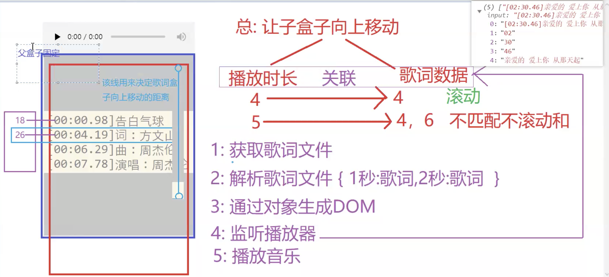
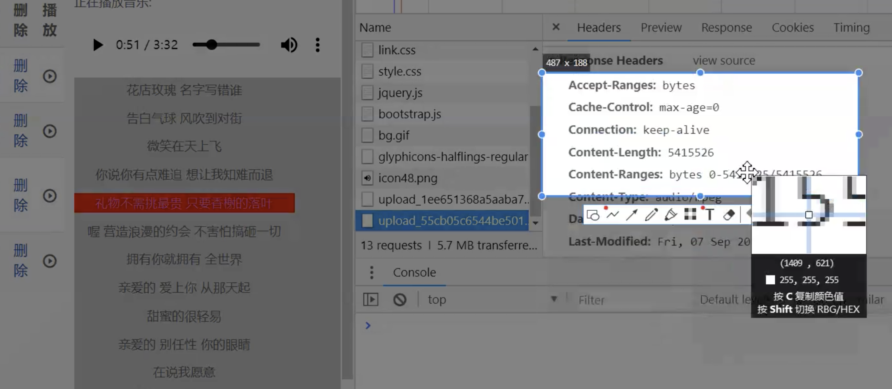
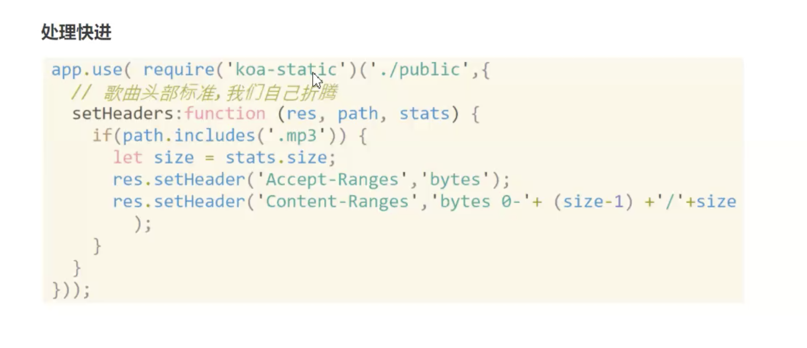
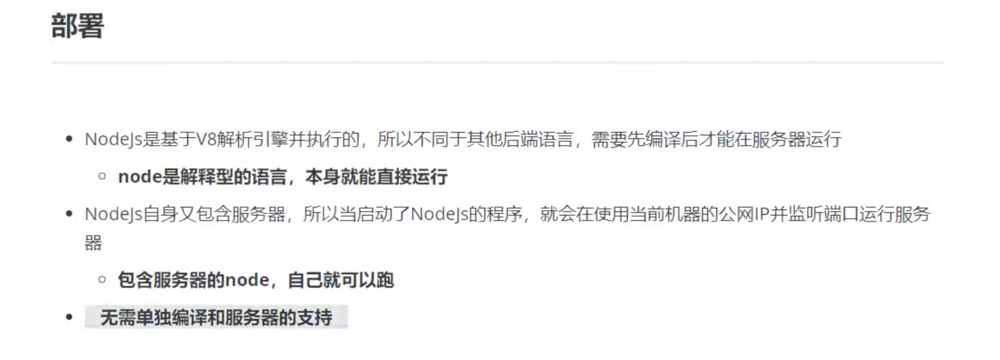
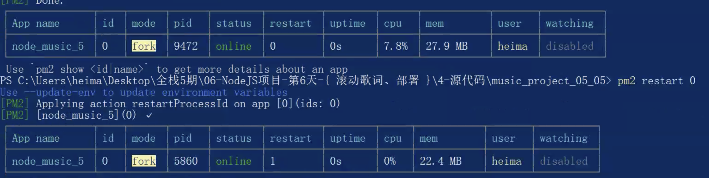
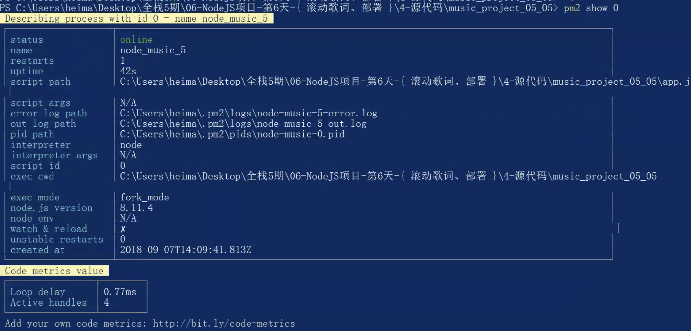
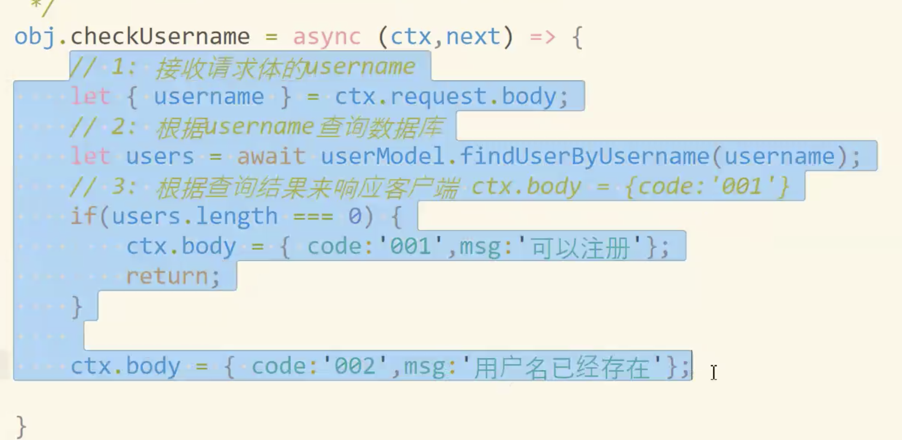

## music 上传，滚动.

> 旧的时候上传使用，使用 flash 现在使用 flash 上传不多了，大多数使用 formData

### 滚动歌词

> Jquery formData 上传注意事项

-  不设置默认头
-  不默认转换为键值对

> 不以 ms 为单位，因为以Ms 为单位监听音乐，一个 ms 会多次触发 。

### 滚动歌词原理

- 只看内部盒子，由于内容将盒子撑高，根据内容距离内部盒子的距离，向上滚动内部盒子即可




### 处理歌词不能快进







## Tip

- jquery fileUploader 做了上传文件兼容性处理

- foreach 继续continue, 终止  return

- Java 会创建线程来处理请求，Node 瞬秒, java靠人多，耗费内存多

- Node io(接收数据，处理请求，响应数据(模板渲染)) 快

- 天猫，node 加 java 处理， java 处理数据，结果给 node node再返回

## 补

- mongodb 一天，模块化一天，mongodb里的定位地图，附近的人

- 扩展给技术好的人，做过没备课，没法讲

## FAQ

- a 标签禁止 默认事件

- 删除操作, 很巧妙, 元素上直接写属性, 代码如下

- ！删除等操作成功后，可以不必请求数据，直接从 dom 上 remove 即可(href 包含query 字符串)

```js
<td><a class="del" href="javascript:void(0)"
my-href="/music/del-music?id={{$value.id}}"
>删除</a></td>
<td><span style="cursor:pointer" src="" class="glyphicon glyphicon-play-circle ply" file="{{$value.file}}" filelrc="{{$value.filelrc}}"></span></td>


$('.del').on('click',function(e) {
       var a = e.target;
       // 获取元素上的url
       var href = $(this).attr('my-href');
       $.ajax({
           url:href,  // 包含查询字符串id=1
           type:'delete',
           dataType:'json',
           success:function(res) {
               if(res.code === '001') {
                   var tr = a.parentNode.parentNode;
                   tr.parentNode.removeChild(tr);

               } else {
                   window.location = '/music/index';
               }
           }
       })
   });

```

> 部署（很重要）



  - 但是当node跑着  程序异常，导致关闭了就停了，于是有了 forever（没有 Pm2 好）, pm2 通过遇到崩溃后不断重启，来维持一直运行


    1. ```npm i -g pm2```
    2. ``` pm2 start ./xxx.js --name projectname```

  - 其他命令

    - ```js
      pm2 examples // 查看常用示例
      pm2 [start||restart||stop||delete] all||name||id // 重启
      pm2 show name||id // 查看信息
      pm2 list // 查看项目
      pm2 flush // 清空日志
      pm2 log name||id // 查看日志
      ```


  ### pm2

  - 通过 名称 | id | all 管理

  > pm2 图表中 重启 则 restart 次数 + 1

  

  - pm2 查看启动的哪个文件夹等

  

  ## Nginx 负载均衡

  - 全局命令 安装 npm -g 为了在任何地方都可用


# ! node 处理请求很快的，但是如果同时进来两个，Node 执行单线程，执行过程中，必然有等待，这个时候，怎么办?

> js 异步很厉害，但是如下代码，同步的，同时过来多个请求，js 难免等待, 出现卡顿



> 解决办法，做分身, pm2 启多个线程 | nginx 负载均衡原理

先把端口改成 9999, pm2 start ./app.js --name 9999
再把端口改成 8888, pm2 start ./app.js --name 8888

这样不论访问 9999 或者 8888 都可以，但是如此看来有两个域名，有一台主服务器进行往这两个域名上分发，这就是  nginx 的负载均衡

## nginx 负载均衡配置

```
upstream localhost {
  ip_hash; # nginx内置的处理
  server localhost:8000 weight=1;
  server localhost:8001 weight=1;
}
#server {.......
  location / {
    proxy_pass http://localhost;
  }
```

## nginx 配置  https

1. 解压nginx.zip
2. 运行setup-x86_64.exe 安装cygwin
3. 通过命令行运行C:\cygwin64\bin目录下的openssl.exe
4. 生成证书(管理员方式打开命令行)

- 1、首先，进入你想创建证书和私钥的目录，例如：nginx/config目录
cd D:\\dev\\nginx-1.13.12\\conf

- 2、创建服务器私钥，命令会让你输入一个口令：
openssl genrsa -des3 -out server.key 1024

- 3、创建公钥（CSR）：
openssl req -new -key server.key -out server.csr

- 4、不用输入密码
cp server.key server.key.org
openssl rsa -in server.key.org -out server.key

- 5、最后标记证书使用上述私钥和公钥：
openssl x509 -req -days 365 -in server.csr -signkey server.key -out server.crt

## nginx servername 是访问的域名

# nginx 最初 server name 以及 Host 文件配置或 域名解析

最初开始讲 Nginx 的时候，会先讲到 host 文件配置，为什么?

因为域名解析的时候，需要解析到服务器不同的端口，但是域名只能解析到 Ip(默认 80端口), 这时候 nginx 只用一个端口不合适，那么为了 绑定域名和端口，nginx 则需要 配置 server_name, listen 端口，来使域名访问的时候，nginx 转发到对应端口数据

> 讲课必须展示出效果，不是在开发，所以换电脑

# nginx 负载均衡 对比 PM2

pm2 所做的是充分利用一台电脑上的 线程， nginx 做两台机子的分发

# nginx 负载均衡 weight 越小 权重越高

# 负载后，发现  8888 端口登陆了，9999端口上并没有登录

# nginx 配置 代码 解决 ajax 跨域 ?

```python

location /apis {
  rewrite ^/apis/(.*)$ /$1 break; # 重写url   
  proxy_pass http://api.douban.com;
}

```

nginx反向代理 这个方法一般很少有人提及，但是他可以不用目标服务器配合，不过需要你搭建一个中转nginx服务器，用于转发请求。

客户机在发送请求时，不会直接发送给，目标主机，而是先发给代理服务器，并接收目标服务器返回的数据，存放在代理服务器硬盘中，再发送给客户端

优点

- 提高访问速度，由于客户端请求的数据存放在代理服务器中

- 过滤不安全信息

- vpn 通过不受限的服务器访问目标站点

## 正向代理对比反向代理

反向代理，是和目标服务器架设在一块，通过缓冲进场被请求的页面，来缓解服务器的工作量,
 正向代理客户机必须指定代理服务器，通过代理服务器，发送web上的 http 请求

## CDN 缓存原理 

# ?webpack 代理解决跨域原理

先请求 node 服务器，然后 node 服务器转发请求，将结果返回给前端。

# iterminal my server config

# 配置完 cdn 后必须访问 cdn 的数据?

# nginx 负载后 登录状态同步问题

> ip_hash 共享session, 通过 IP 来辨识，共有的 cookie 和 session 的值

但是 ip 复杂了(ip 变动)则...

原理，根据客户机Ip固定分配到某一台(登录的那一台，则一直登录)

```

```

## 之前 用户状态存在  storage 内存中，两台服务器各自有自己的

# 为了真正解决真个问题，需要用数据库来存储即可，

- redis 数据库， redis 数据库运行在内存中（存在硬盘中，resdis perl 查数据看）, 适合这种登录，注册频繁的，因为在内存中则速度比较快

- redis-server 是服务，redis-client(命令行中用来连接 redis 的是客户端)

- redis 命令行提示

perl

- help
- help set

# 将数据存于 redis 共享到其他 nginx

```js
// 从数据库中存或者取
var Redis = require('ioredis');
var redis = new Redis();

 let store = {
    set: function(key, session) {
        redis.set(key, JSON.stringify(session));
    },
    get: async function(key) {
        let obj = await redis.get(key);
        obj = JSON.parse(obj);
        return obj
    },
    destroy: function(key) {  
       redis.del(key);
    }
};


```

# Redis 应用场景 基于内存 存储的，一段时间序列化，针对数据小，访问频繁，不很依赖后端

- 改动频繁的，更改的概率比加大的，没有存数据库意义的，改动比较小，又没有依赖计算，如点击数

## 熟读文档  手动实现 文档中扩展内容

# 服务器架构

```
                  -> node               -> java
web -> nginx(负载) -> node    -> nginx  ->  java   ...多层
                  -> node               -> java

```
