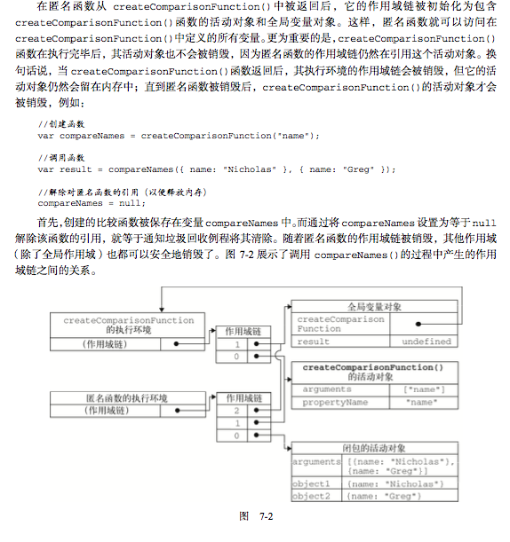

# 5\_prototype\_ao\_eo

Day 5, for js prototype

## Attension

.1 分清，js \__proto\_ 只有作为对象时，才会有这个属性，Object.prototyp 调用了 prototype \(作为构造函数时才会存在\) 所以此处是函数, Object.\_\_proto\_ 则 此时 Object 作为 Function 实例化出来的对象 在 Object 中这两个属性同时存在

.2 原型链在往下下一级指向时，需要加 \__proto\_， Function.prototype !== Object.prototype 需要将 Function.prototype 作为一个由 Object 创建出来的对象，也就是 Function.prototype 的指向 Object.\_\_proto\_

.3 对象的 \__proto\__ 指向自己原型链上一层，在不加改变情况下上一层的原型链指向 Object.prototype, 构造函数的 prototype 的 constructor 指向构造函数

```javascript
// 对象链
new Array().__proto__ === Object.prototype           // false
new Array().__proto__ === Array.prototype              // true
new Array().__proto__.__proto__ === Object.prototype // true

// 函数链
Array.__proto__ === Function.__proto__               // true
Function.__proto__.__proto__ === Object.prototype    // true
```

.3 原型上都有 constructor 属性，指向构造函数

```javascript
new Array().__proto__.constructor === Array // true
```

## 原型链继承

### 原型

原型与构造函数相辅相成，原型储存在狗在函数 prototype 属性所引用的对象

## VO AO

### Vo varible Object : 变量对象

```text
就是执行环境包含了所有变量和函数对象，解析器(引擎)在后台使用，保存于内存中代码无法直接访问。
```

后台每个执行环境都有一个表示变量的对象, 在浏览器中这个环境被认为 是 window, 通常在关闭网页或浏览器时才会被销毁

.1 函数声明 FD

.2 函数形参

.3 变量声明 包含 var a = 10 不含 a = 10

.4 \(注意 arguments 对象在全局环境中不存在\)

### Ao active Object  : 活动对象

函数的执行环境上下文，当执行流进入一个函数时，函数执行环境会被推入一个执行栈中，执行完成后推出，当代码在一个环境执行中执行时，会创建作用域链，当执行为函数时，则将其活动对象作为变量

当某个函数被调用时，会创建一个执行环境\(execution context\)及相应的作用域链。 然后，使用 arguments 和其他命名参数的值来初始化函数的活动对象\(activation object\)。

在创建函数时，会创建一个预先包含全局变量对象的作用域链，这个作用域链 被保存在内部的 \[\[scope\]\] 中

### 函数和变量声明提前

```javascript
demo1 (); //  output: i am run, Vo 会收集全局中的 函数声明变量声明，以及函数形参
// 当调用 test () 函数时候 通过 scope 访问到 test() 函数

function demo1 () {
    console.log('I am run')
}

// 收集时，如果有赋值操作并不会先收集值，而是等到执行到赋值操作时）,
function demo2 () {
    console.log(a) // undefined
    console.log(b) // error
}
var a = 1; // vo 会收集 变量 a
b = 2 // vo 不会收集
```

## 闭包

闭包是指有权访问另一个 函数作用域中的变量的函数。创建闭包的常见方式，就是在一个函数内部创建另一个函数，仍以前面的

```javascript
function createComparisonFunction(propertyName) {
    return function(object1, object2){
        var value1 = object1[propertyName];
        var value2 = object2[propertyName];
        if (value1 < value2){
            return -1;
        } else if (value1 > value2){
            return 1;
        } else {
            return 0;
        }
    };
}


var compare = createComparisonFunction("name");
var result = compare({ name: "Nicholas" }, { name: "Greg" });
```



注意: v8优化之后已经尝试开始回收包所占用的内存了

## FAQ

* super\(\) 执行过程
* 构造函数不写 return 会隐式 return, 如果 return 对象new 出来的对象将不符合正常预期

## Userful links

[https://blog.csdn.net/github\_34514750/article/details/52901781](https://blog.csdn.net/github_34514750/article/details/52901781)

