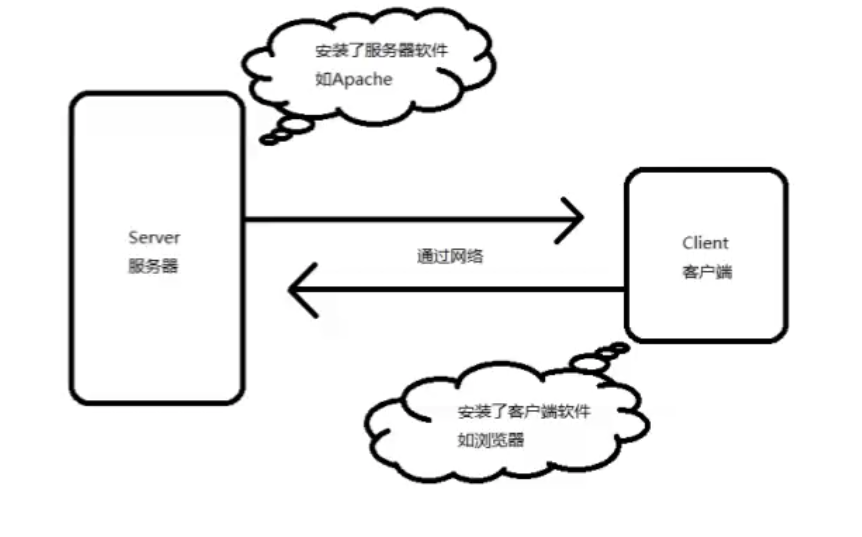
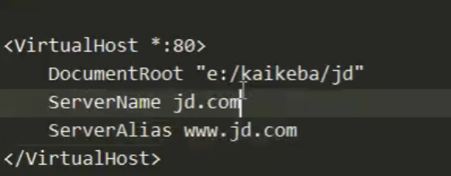

# 9\_php\_server

This for php, simple server, bs, cs



## Ip

主机的一个唯一表示，通过ip找到这台计算机

局域网ip, 使用 路由器连接起来

公网ip, 需要去运营商申请

## FAQ

* 一级域名，二级域名，顶级域名
* 更改host 文件，jd.com 进入虚拟主机流程

1 req jd.com -&gt; host\(jd -&gt; 127.0.0.1\) -&gt; vhosts \(regex serverName\) -&gt; HTML 下图为 匹配 jd.com 使用 ServerName 进行匹配，应用: 运维不同域名，映射80 端口，根据域名走不同服务 

```bash
c.b.a.com
# a.com 可以成为顶级域名也叫一级域名
# 或者 .com 为顶级域名，往左依次 一级，二级....
```

## 小点

* 重新学一门语言, 不建议学  php 了
* cs 架构 早期网络不好，qq 迅雷, 传奇等, 过渡到 网页端，qq 迅雷，传奇等，再到移动端
* 局域网 ip 由路由器或交换机分配，走公网出口，通常家用 公网 出口会变，恒定的需要申请
* 之所以有域名的出现因为 IP 的不方便记忆
* ping 一个网站的 地址 获取网站的 ip，可以直接用 ip 进行访问

  ```bash
  ping www.baidu.com -c 3
  ```

* 域名通过 后缀可以分辨作用,后缀不一样作用不一样
* 计算机提供服务占据一个端口，提供不同的服务占用不同的端口，大概有 6 万多个端口
* 在逻辑简单下，可使用 NodeJs, Go 有处理高并发的优势,nginx 采用 Json 配置文件，tomact 解析java
* 区块链 [https://www.cryptokitties.co/](https://www.cryptokitties.co/)
* 安居客，.com 左边第一位讲为 一级域名
* python web, python 运维, python 人工智能，python测试
* 把路由器 host 等改掉，让路由器出口  走 jd 时，进入自己网站\(不要再购物了\)
* 区块链也是做数据存储, 关系型数据块，非关系型数据库\(读写速度非常快\)

