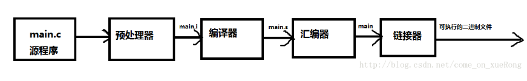

# computer byte exec origin

## 计算机是如何进行工作的

可执行的二进制文件是计算机“认识”的文件，可以直接执行。 

## 二进制算法

```javascript
正数转二进制
以 66 为例子
66 / 2 = 33 % 0
33 / 2 = 16 % 1
16 / 2 = 8 % 0
8 /  2 = 4 % 0
4 /  2 = 2 % 0
2 / 2  = 1 % 0
1 / 2  = 0 % 1

除到 商 为 0，倒序组装 余数, 高为 补 0
0  1 0 0 0 0 1 0

负数转二进制
对正数取二进制 然后取反 + 1
-66 的二进制位
      0 1 0 0 0 0 1 0
~     
      1 0 1 1 1 1 0 1
+                   1
      1 0 1 1 1 1 1 0  // 逢 2 进 1
```

## 位运算在 Js 中的应用

### 字符串 indexOf

```javascript
// 普通写法
url.indexOf（'?'） > -1 ? '&' : '?'

// 如果url含有?号，则后面拼上&符号，否则加上?号
url += ~url.indexOf("?") ? "&" : "?";
```

## REFER

[https://fed.renren.com/2018/03/06/js-bit-algorithm/](https://fed.renren.com/2018/03/06/js-bit-algorithm/)

[https://juejin.im/post/5a98ea2f6fb9a028bb186f34](https://juejin.im/post/5a98ea2f6fb9a028bb186f34)

## FAQ

* 二进制与机器识别执行 二进制只是一个数值编码方式，与编程语言没有直接关系,早期的语言用二进制编码， 二进制编程是 比 汇编更接近 机器的语言，事实上，所有编程语言\(包括汇编\)最后都会翻译成二进制来执行
* 二进制与字节数组 1字节=8位即8个二进制位。
* 汇编
* 计算机执行原理
* 数据在内存中是以 二进制 存储的
* 文件 io 传输，以 字节数组形式，一个字节 = 8 bit, 8 位 为一个二进制基本组成
* 汉字转二进制，根据编码获取 汉字对应的编码数字，再将数字转为 二进制

```java
static void Main(string[] args)
        {
            getByte();
        }

        public static void getByte()
        {
            String unicodeString = "汉字与二进制码的转换";
            Byte[] encodedBytes = Encoding.GetEncoding("gb2312").GetBytes(unicodeString);
            for (int i = 0; i < encodedBytes.Length; i++)
            {
                Console.Write(encodedBytes[i]+" ");
            }
            Console.WriteLine();
            String strName = Encoding.GetEncoding("gb2312").GetString(encodedBytes);
            Console.Write(strName);
            Console.Read();
        }
```

* 字符流字节流

http 传输文本时，使用 字符流, 两个字节地 Unicode 字符，传输文件时使用 字节流

字符流处理的单元为‘2个字节’的Unicode字符，分别操作字符、字符数组或字符串，而字节流处理单元为1个字节，操作字节和字节数组。

音频文件、图片、歌曲，就用字节流

所有文件存储都是字节\(byte\)的存储，磁盘上保留不是文件的字符而是先把字符编码成字节，再储存这些字节到磁盘，在读取文件时，也是一个个字节地读取成字节序列

1 字节流可以用于任何类型的对象，包括二进制对象，而字符流只能处理字符或字符串

2 字节流提供了处理任何类型的 IO 操作的功能，但它不能直接处理 Unicode 字符，字符流可以 3 字节流和字符流可以相互转换

