## 今日主讲 VUE 核心插件


## Vue 组建的六 + 一 种通讯方式， 一为 vuex

-?? 补

- 1 props $emit, 如果组建层级非常多则不适合, abcdefg 嵌套，可以使用 Bus, 中央事件

> 如果组建嵌套非常多, 第一种方式会存在，A -> B -> C 的问题，第一种方式需要将 数据先从 A 传到 B 再从 B传到　Ｃ，　于是　Vue2.4 开始提供了  $attrs 和 $listeners 来解决这个问题， 让 数据可以跨组建传递

- 2 $attrs(绑定属性) 和 $listeners(监听), 简化命名

并不是App 组建直接到 孙子，而是采用 $attr 方式

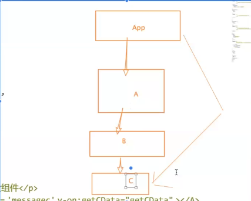


```vue

// App 组建传递值到 A 组建
var App = {
    data() {
        return {
            msg: "message from app",
            message: 'helloC'
        }
    },
    tempalte: '
        <A :message = 'message' :getCdat='getData'> </A>
    ',
    methods: {
        // 事件处理
        getData (val){
            // 通过  linsteners 传递上来的数据
            console.log(val)
        }
    }
}

// component A
Vue.component('A', {
    // 注意这个 后边小马纠正不用再 使用 props 了
    // props:['message'],
    // 接收到值后，采用 $attrs
    template: '
        <B v-bind="$attrs" v-on="$listeners"> </B>
    '
})

// B 组建中继续
        <C v-bind="$attrs" v-on="$listeners"> </C>
    '
// C 组建中直接使用

Vue.component('C', {
    template: '
        <div>
            <div @click='cClickHandle'>
                {{$attrs.message}}
            </div>
        </div>
    '
})    

```

- $attrs 方式依旧很麻烦，所以第三种 中央事件总线

在兄弟组建通讯时，如果只有一层, 可以通过 child1 -> parent, parent -> child2 的方式，如果很多层，处理起来较为繁琐，于是我们可以抽离一个中介，也就是中央事件总线（bus） 方式进行通讯

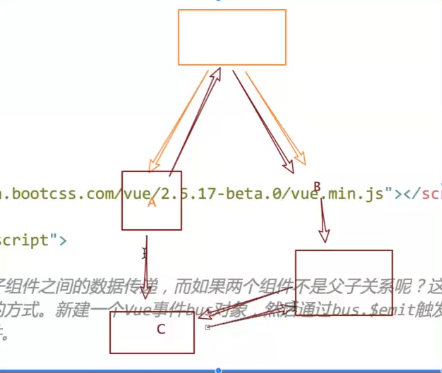

> 使用中央事件总线，bus 必须是一个独立的对象，内存地址不可以变

> 使用 bus 时，不能用 this.$.... 因为每个组建中  this 指向内存地址不同

```js

var bus = new Vue()

// 组建1 监听

bus.$on('globalEve', val => {
    this.brother2Msg = val
})

// 组建2 发送事件

bus.$emit('globalEve', val)


```

- 方式4 通过 provide 来提供变量，然后在子组建中通过 inject 来注入变量, 不论子组建有多深，只要 调用了 Inject 那么就可以注入 provider 中的数据，而不是局限于至你呢个从当前 父组建的props 属性来获取数据，只要在伏组件的生命周期内，子组件都可以调用

```js

// App component

provide: {
    for: 'pass message'
}

// any deep child

inject: ['for'],
created: {
    this.msg = this.for
}


```


- 方式5

第五种方式讲了， 父组建 v-model 给子组建传递值时， 子 props 接收用， props: {value: string}


- 方式6

> v-model 会自动传递一个 value 的属性

$parent $children $root 方式

> $root 可以在任意组建中访问到，根节点，并更改根节点数据响应到ui, $parent, $children 等其他组建也一个样


- $refs 定位子组建方式 当作第五种吧


> 纠正 $attrs listeners 方式 第一个组建  A 组建 就不需要 再写 props 了，上边写了


> 使用场景

牵扯路由，组建之间数据通讯使用 bus 方式较多，父子之间数据通讯，则使用 props 的集合 $attrs 方式


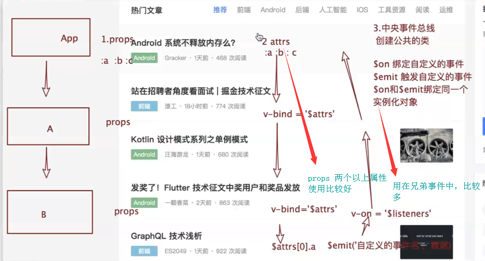


## vuex 简介

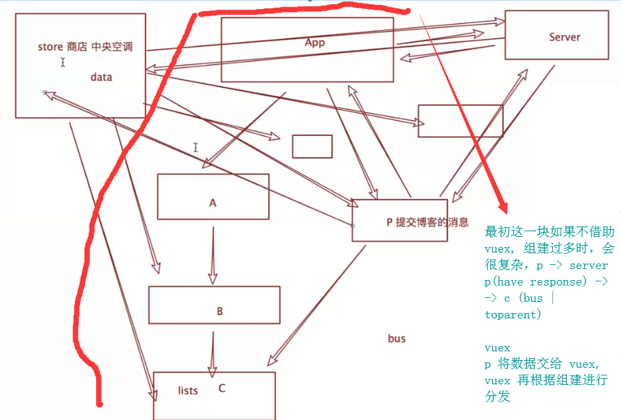

## vue 小点补充

- 获取  dom $refs, 如果定义相同 ref  后者会对前者进行覆盖

> 注意，created 方法仅仅为  vue vm 实例创建的时候 dom 还没有挂载，所以 $refs.{ref} 取不到值，需要在 dom 挂载完成，也就是 mounted 方法中取


>　如果是给　组建绑定 ref 则，this.$refs... 获取的是 这个 组建而不是 dom 对象

> 给 Dom 元素添加事件的特殊情况


- $nextTick

如果一个元素最初隐藏，让他显示后(如input获取焦点)， 不能通过  $refs 立即拿到这个 dom 对象，此时需要 通过 $nextTick 方法

将回调延迟到下次 DOM 更新循环之后执行。在修改数据之后立即使用它，然后等待 DOM 更新。它跟全局方法 Vue.nextTick 一样，不同的是回调的 this 自动绑定到调用它的实例上

```js
this.$nextTick(() => {
    console.log(this)
    this.$refs.input.focus()
})
```

```vue

new Vue({
  // ...
  methods: {
    // ...
    example: function () {
      // 修改数据
      this.message = 'changed'
      // DOM 还没有更新
      this.$nextTick(function () {
        // DOM 现在更新了
        // `this` 绑定到当前实例
        this.doSomethingElse()
      })
    }
  }
})

```

## Vue 生命周期为什么要这么玩

你不需要立即搞明白，但随着不断地学习会逐渐不同理解


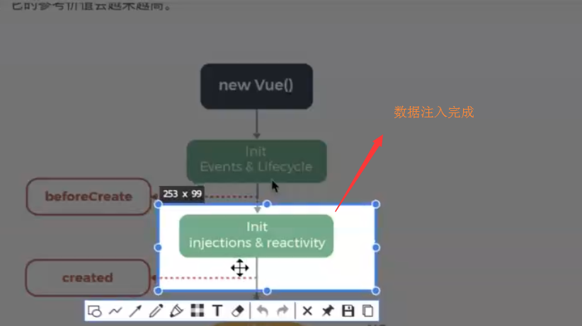

然后往下，把这些 data 渲染到 你的  el 模版中，看你有没有这些参数

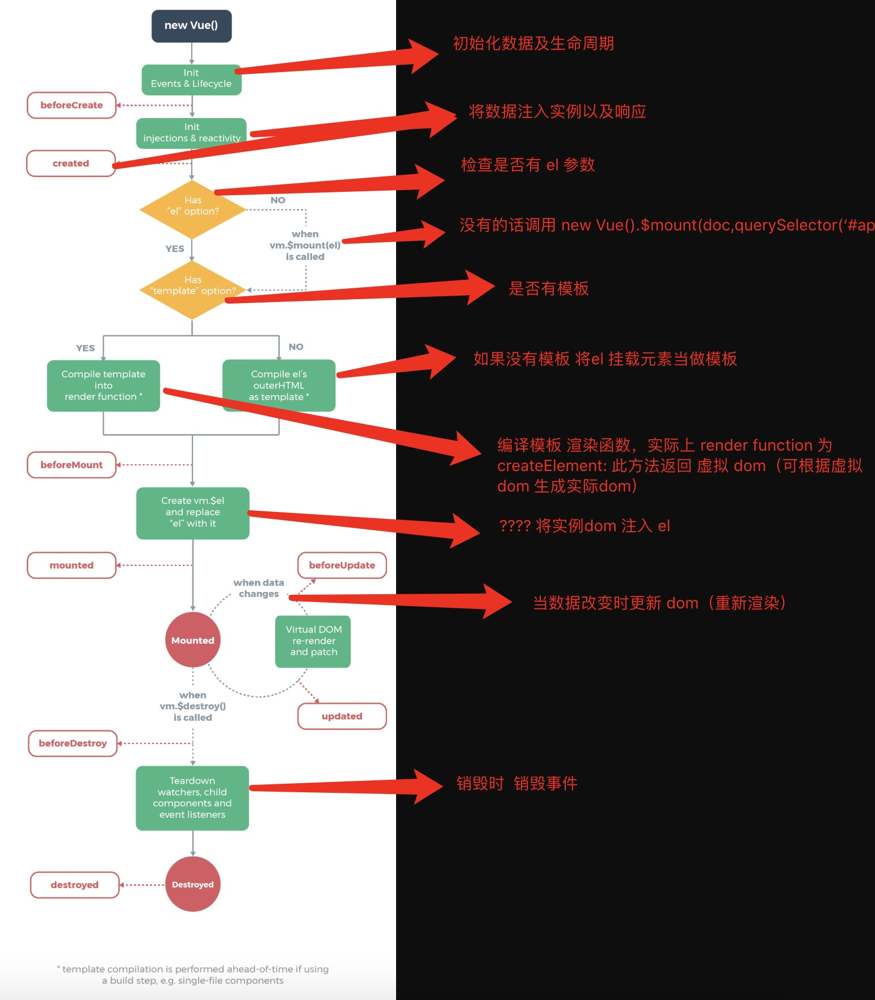

## Vue 路由

- 路由守卫

### 前边音乐播放项目资源比较少，但是如果后边资源多了，访问一个路由可能页面会白屏卡顿


> 饿了吗 的移动端是用 vue 写的, 因为里边有个 elementUI
> 少数派也是vue写的，测试方法，刷新，看 chrome 插件的 vue 图标是否发亮，如下图

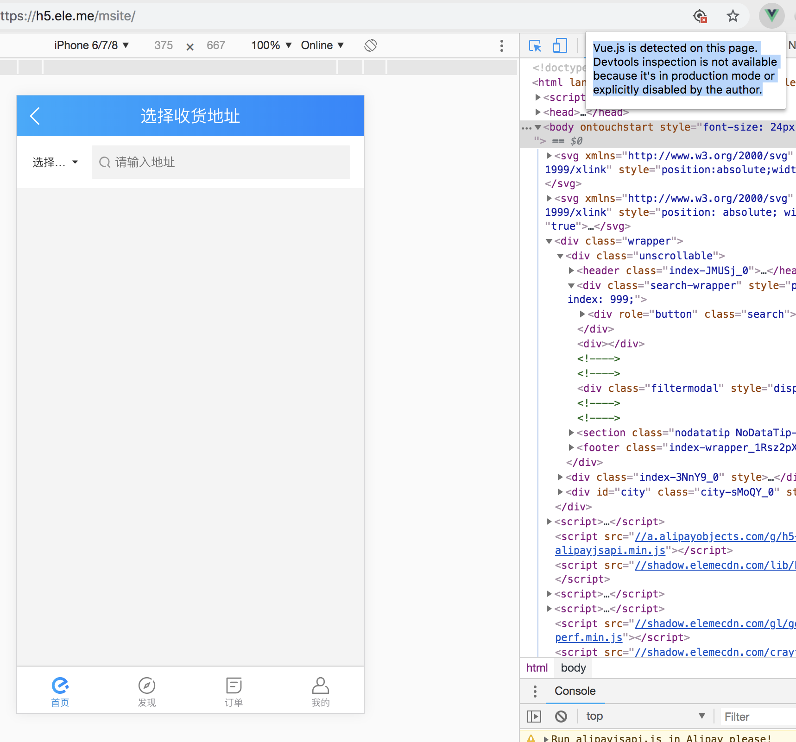

- 传统开发方式，url 改变后，立即发生请求响应整个页面，有可能资源过多，传统开发会让页面白屏

- 单页面应用

 锚点改变后, 不会立即发生请求，而是在某个时间点发生请求，如 created 方法，请求接口数据, 发起 ajax 进行局部数据渲染

 优点: 页面不立即跳转，用户体验好


 ### vue router 实现原理

 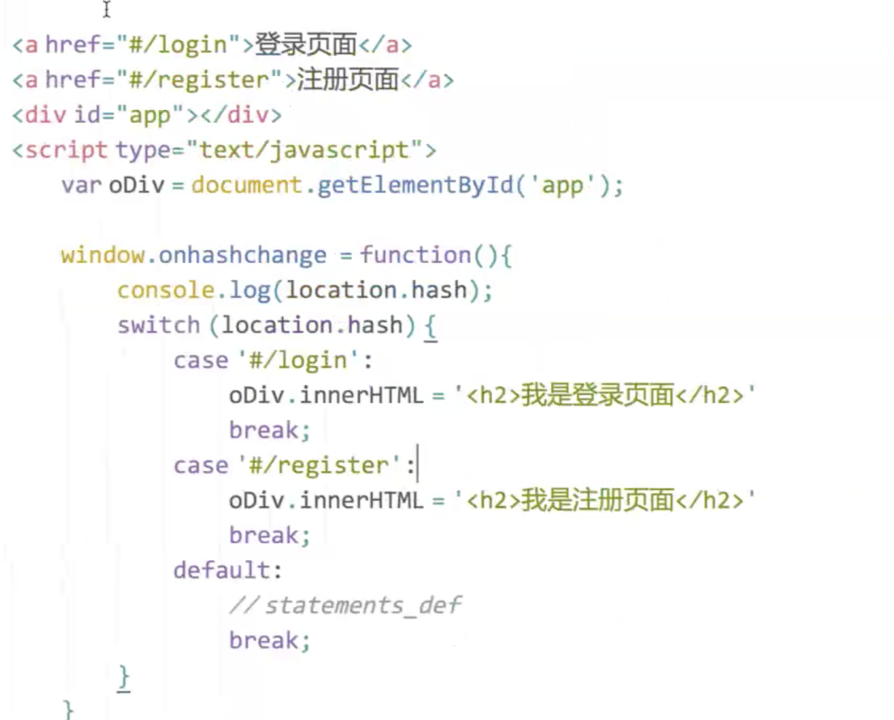

> vue.use(router), 是在 vue 原型上 挂载  router, 但在我们 demo 中，vue 和 router 都是从全局引入的，所以可以不必去 vue.use()

- 查看 vue-router.js 的源代码可以发现，返回了一个 vue-router 的实例，并且早已给我们引入了（后边用到 脚手架后 Vue 对象就不一定是个全局的了，就需要我们使用 vue.use() 挂载到原型上）

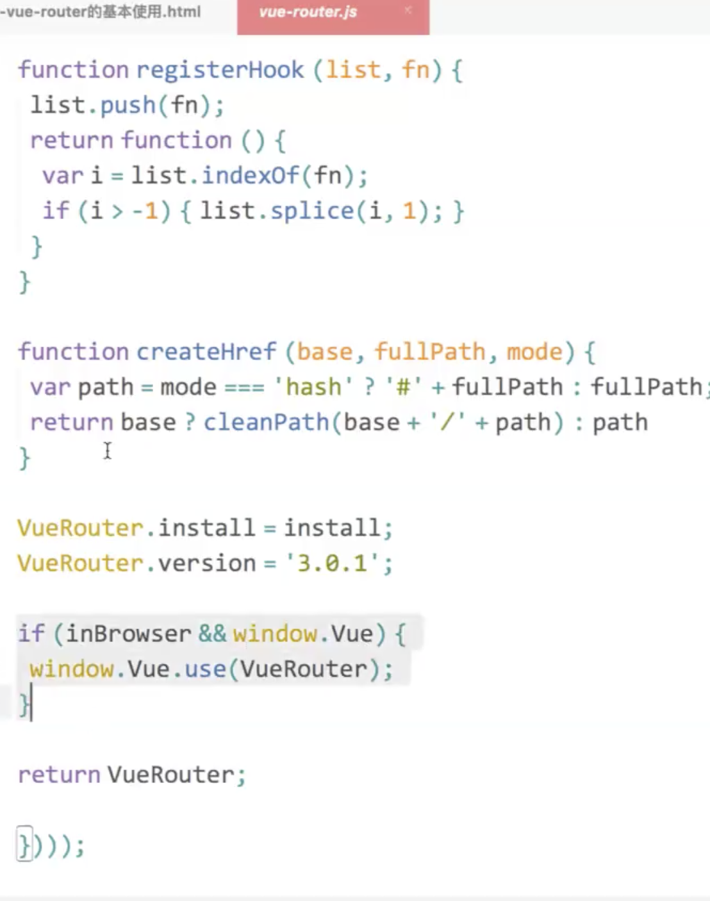


## vue 写的代码需要你写代码的地方 会自动给你添加 注释

> 引入 vue-router 之后，会给我们提供两个全局的组件, router-link, router-view, 路由出口

> 简单的组件

```vue
var Login = {
  template: '
    <Login> 我是登录页面 </Login>
  '
}
```

### 命名路由，给路由起名字

> router name 与 router path 的区别

### 动态路由参数

- /home/1 动态路由参数
- home.html?name='li' 查询字符串路由参数

> 之前写代码中，很少使用vue的动态路由参数方式

```vue

var router = new VueRouter({
    path: '/user/:id',
    name: userP,
    component: UserParams
})

var router = new VueRouter({
    path: '/user',
    name: userQ,
    component: UserQuery
})

```

> 懒加载组件就是 用 require 包起来做处理的方式

```js
import().then()
```

### 前套路由

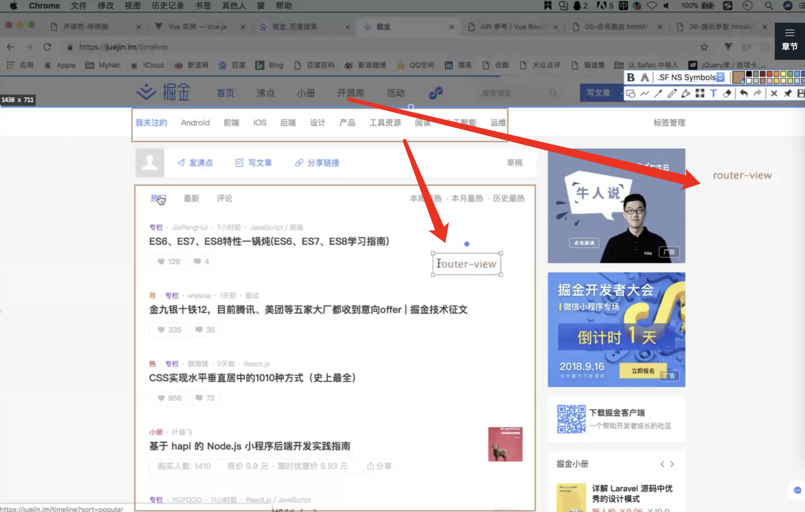

如上图不同点击 tab, 数据不同但布局一样，我们要的是点击内部不同tab, 切换不同布局时使用 嵌套路由


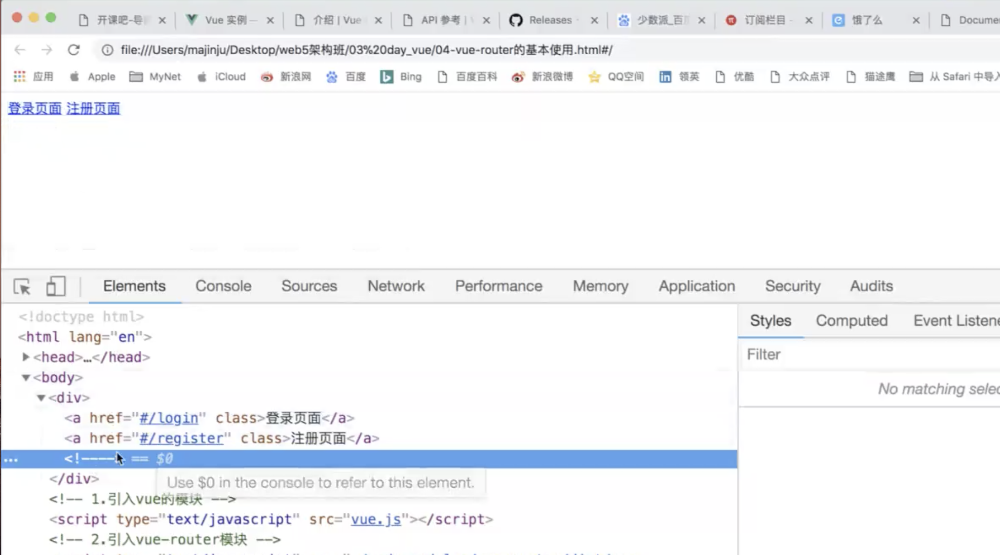

### vue-router 基本使用

vue-router 基于 vue


## 补个小插曲

两年前有个同事，技术风，讲课思路一般, 因觉得前端讲课没大前景，偶然收到一个电话，淘宝背调查，p7, 50 万年薪(阿里望京). 大公司去走走(口才好，讲课赚赚外快，想赚钱很多方式，以提高技术能力为根本), p7 会有 6400股(4year 140 m maybe )

 没方向了，出来聊一聊

 ## 阿里等级

 一般 p3 为助理，p7 为技术专家了

 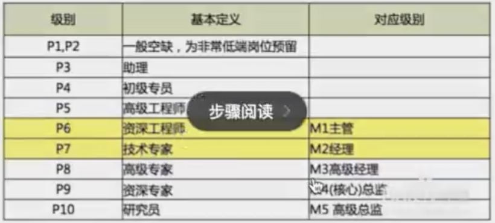

 去阿里走走，再弄进去

 ## vue 框架里的东西

 vue 基础讲的差不多了，现在讲框架里的东西

## Tip

- axios 封装
- 更新的dom 可以在 update 生命周期中拿到
- 如果想玩好vue, vue 里边的每一句话都要读一下
- python Django 框架和 express 很像，玩一玩，然后学学网络编程就好了, 如果有搞java的，去搞python 简单地要死
- 讲师都是 bat 内推，没毛病，很多朋友学生都在里边, 一个在清华研究院，两三个都在百度，想去早过去了, 百度阿里的 不会讲课也讲不清楚
- 服务器渲染比我们这种普通的渲染要好很多


## FAQ

- ! $root 可以在任意组建中访问到，根节点，并更改根节点数据响应到ui, $parent, $children 等其他组建也一个样


- vue 生命周期为什么要这么玩
