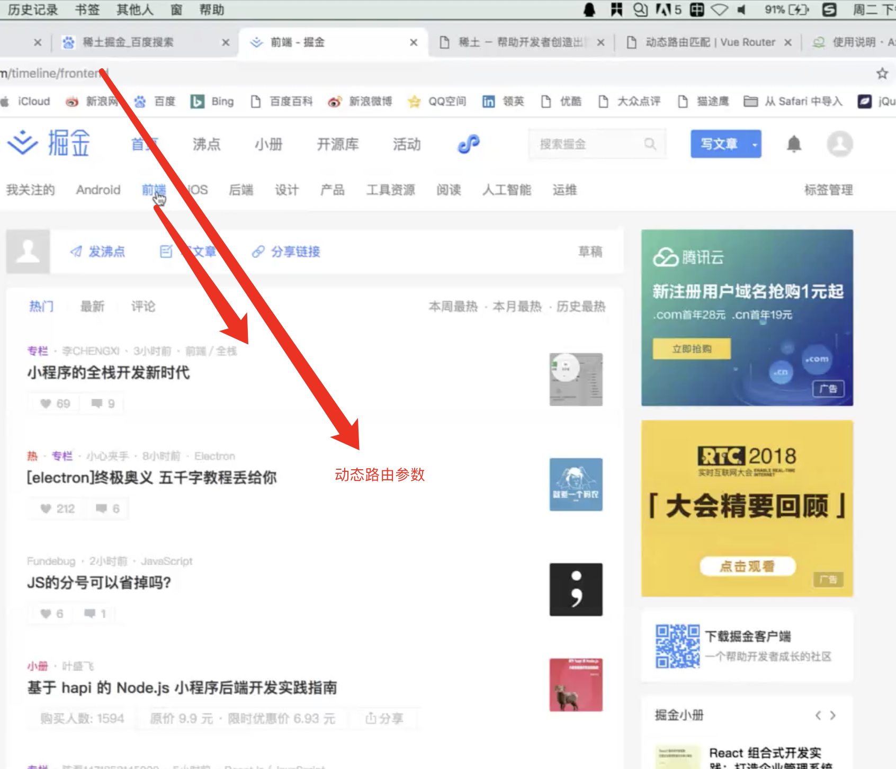
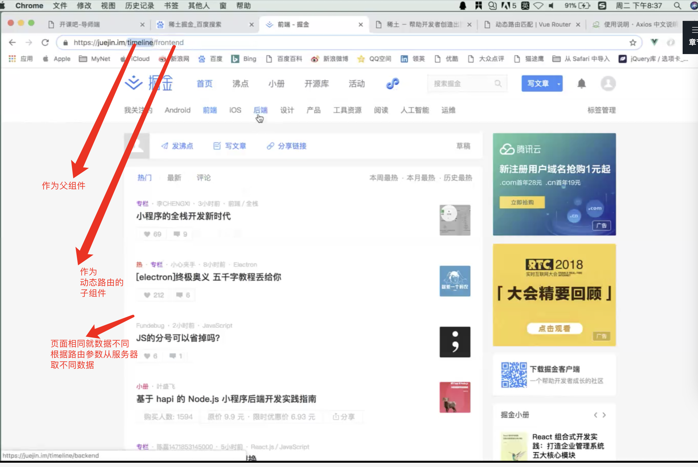
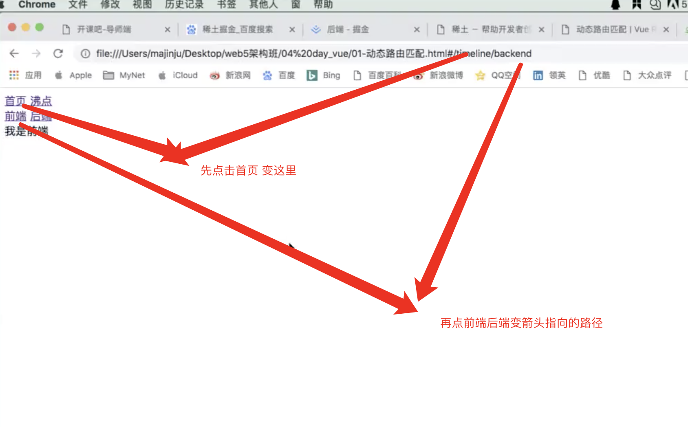
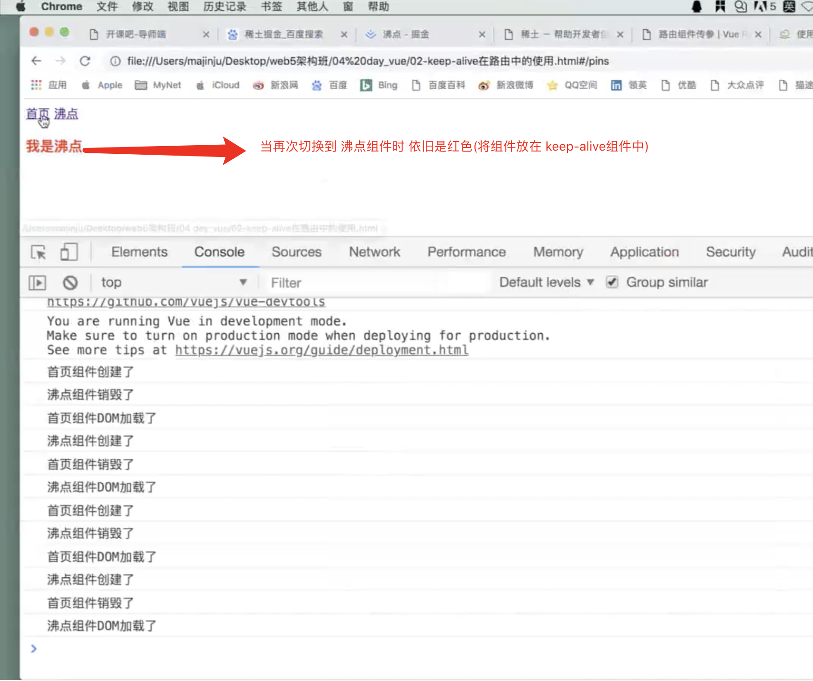
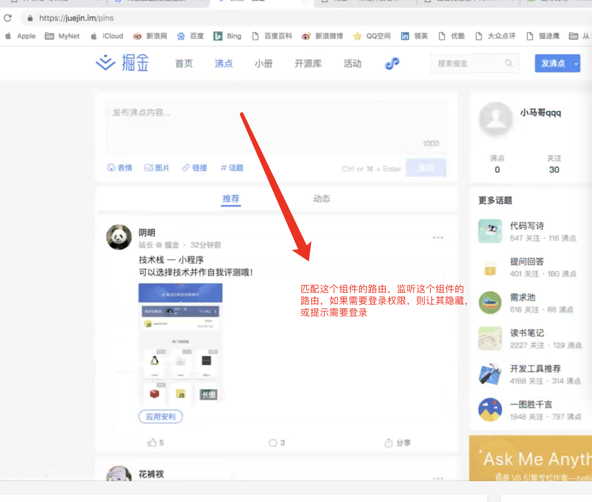
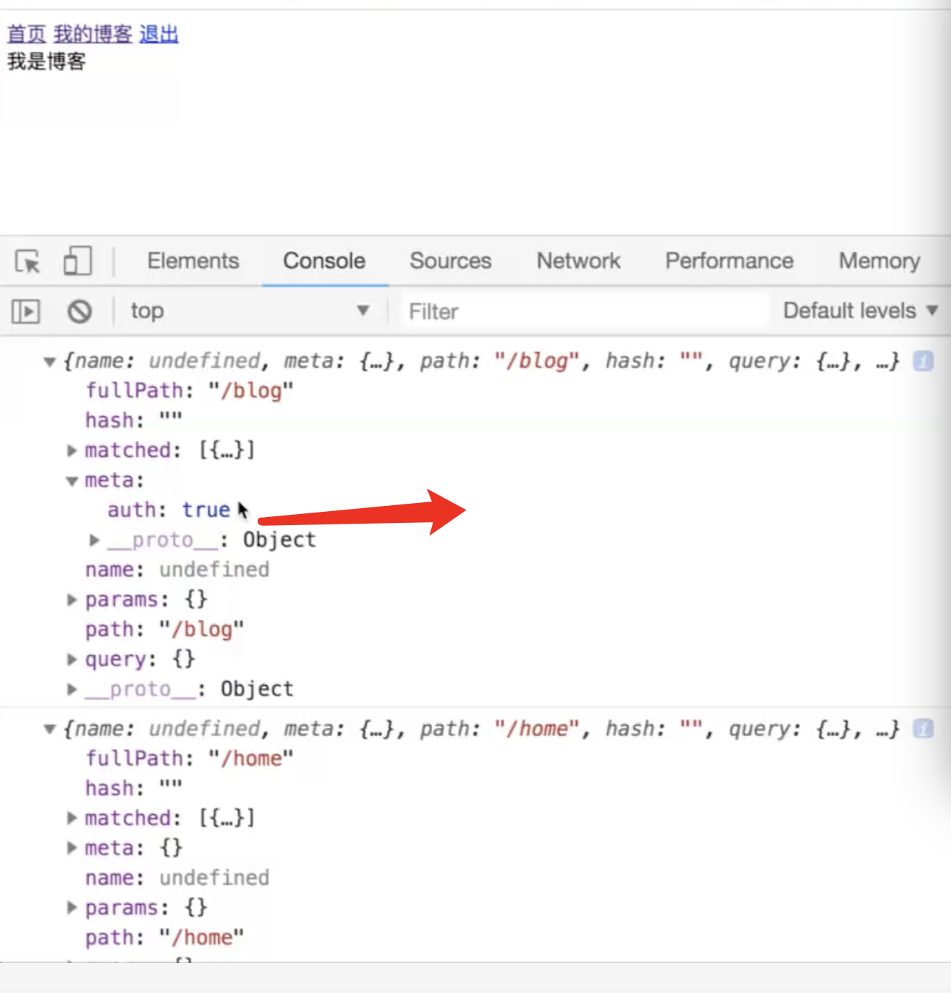
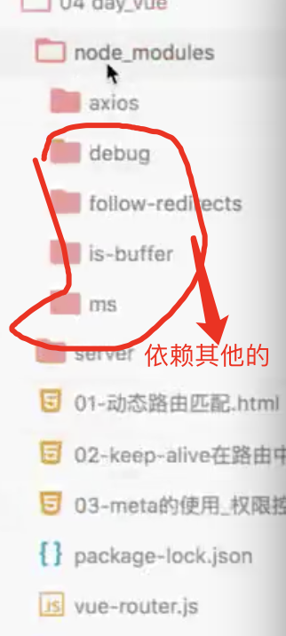
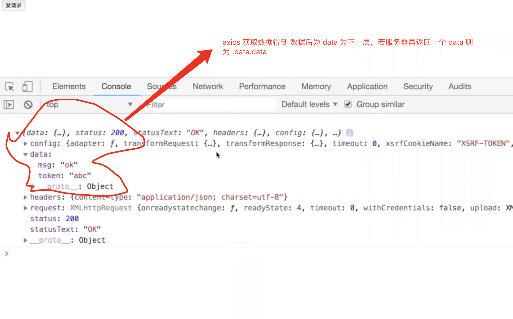

## 中秋节国庆放假

还有一些对于路由的部分没讲解完，放到明天，今天主要讲 axios

## 动态路由参数





> 注意， 当使用 动态路由参数的时候，两个 子 tab 切换的时候，组件并没有重新渲染，生命周期方法没有重新调用，官网解释如下, 如上图，front,与 backend


One thing to note when using routes with params is that when the user navigates from /user/foo to /user/bar, the same component instance will be reused. Since both routes render the same component, this is more efficient than destroying the old instance and then creating a new one. However, this also means that the lifecycle hooks of the component will not be called.

To react to params changes in the same component, you can simply watch the $route object:

```js

const User = {
  template: '...',
  watch: {
    '$route' (to, from) {
      // react to route changes...
    }
  }
}

```

Or, use the beforeRouteUpdate navigation guard introduced in 2.2:
导航守卫
```vue

const User = {
  template: '...',
  beforeRouteUpdate (to, from, next) {
    // react to route changes...
    // don't forget to call next()
  }
}

```

## keep-alive 在路由组件中的使用



## 当你需要 / 路由时，可以做一个重定向

```js

new router({
  routers: [
    {
      path: '/',
      redirect: '/home'
    }
  ]
})

```

## 路由的元(meta)信息, 通常用来做路由守卫(守卫路由切换，也就是钩子)，路由登录权限校验



### 案例，首页，博客，退出包含这三部分的一个页面，访问首页正常显示，博客跳转登录，利用路由元信息 去做

原理 增加路由钩子，from, to 中可以拿到路由元信息，也就是 需要登录权限的路由处你定义的  auth: true, 发现后检测路由即可




> watch 是组件内部的导航守卫，router.beforeEach 全局的，路由每次切换都会调用

> !当使用组件内部的 this.$router 时，前置条件是，Vue.use(vuerouter)

```vue

router.beforeEach

to.meta.auth

```

## axios



## 路由组件传参

## axios

基于 Promise 的 http 库，



### axios 挂载的两种方式

```js

// 这样每个组件中都可以通过 this.$axios 发请求了
Vue.prototype.$axios = axios

Vue.use(axios)

```

### axios 取服务器返回结果



### 并发请求

```js
var App = {
    data(){
        return {
            res1:'',
            res2:''
        }
    },
    template: `

    <div>
      响应1：{{res1}}
                                         响应2：{{res2}}
                                         <button @click = 'sendAjax'>并发请求</button>


    </div>
  `,
  methods:{
    sendAjax(){
      // 请求1 get : /
                                        // 请求2 post : /add
                                        this.$axios.defaults.baseURL = 'http://127.0.0.1:8888/';

                                        var r1  = this.$axios.get('');
                                        var r2  = this.$axios.post('add','a=1');

                                        this.$axios.all([r1,r2])
                                        .then(this.$axios.spread((res1,res2)=>{
                                            // 请求全部成功
                                            this.res1 = res1.data;
                                            this.res2 = res2.data;

                                        }))
                                        .catch(err=>{
                                            // 其一失败
                                            console.log(err);
                                        })


    }
  }
};

Vue.prototype.$axios = axios;
new Vue({
    el: "#app",
    template: `<App />`,
    components: {
        App
    }
});


```


## Tip

- 稀土掘金里边的资源(掘金网使用vue编写的)

## FAQ

- 项目中遇到问题的时候，看 掘金怎么写的，一个网站的解决方案基本一样

- axios 与 xsrf 防御原理

- axios 封装
