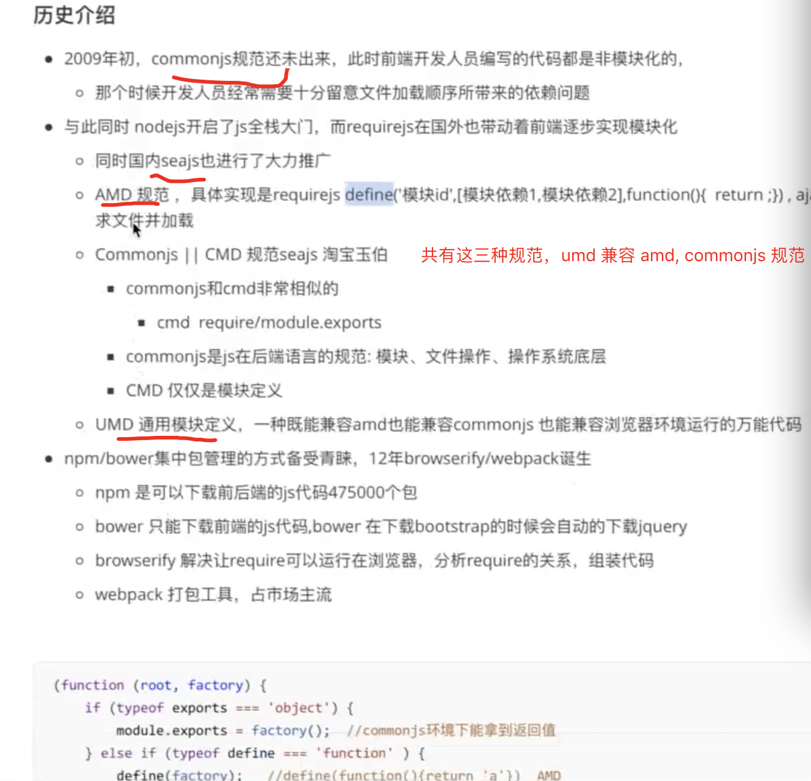
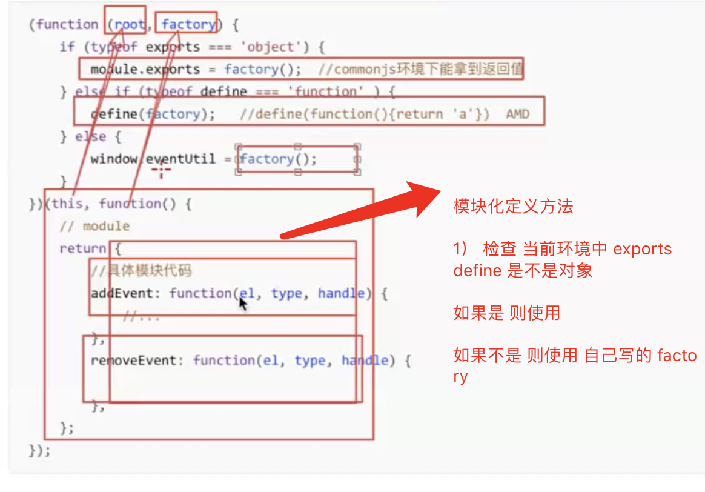
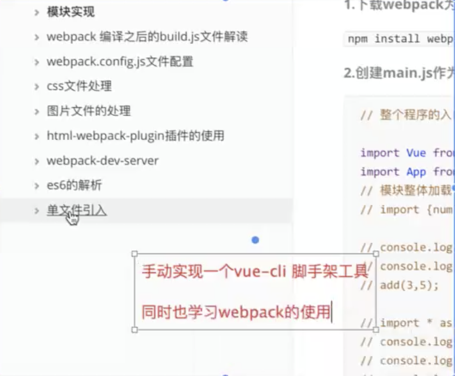
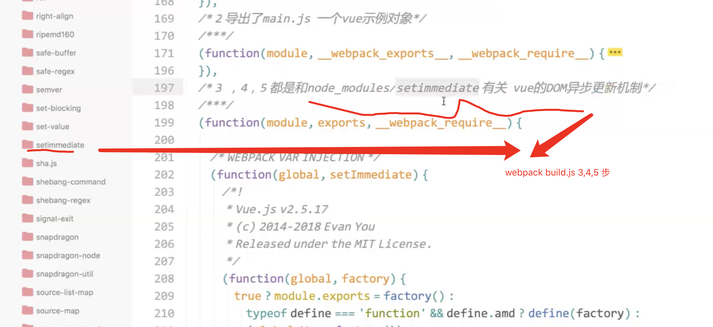
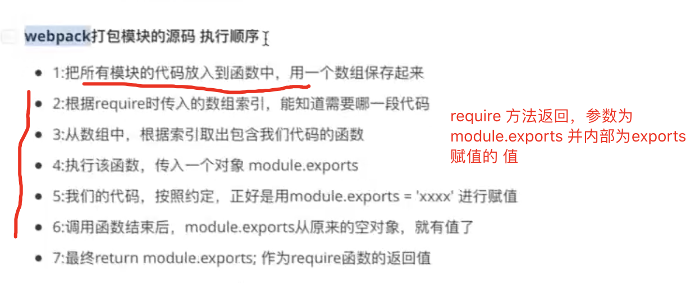
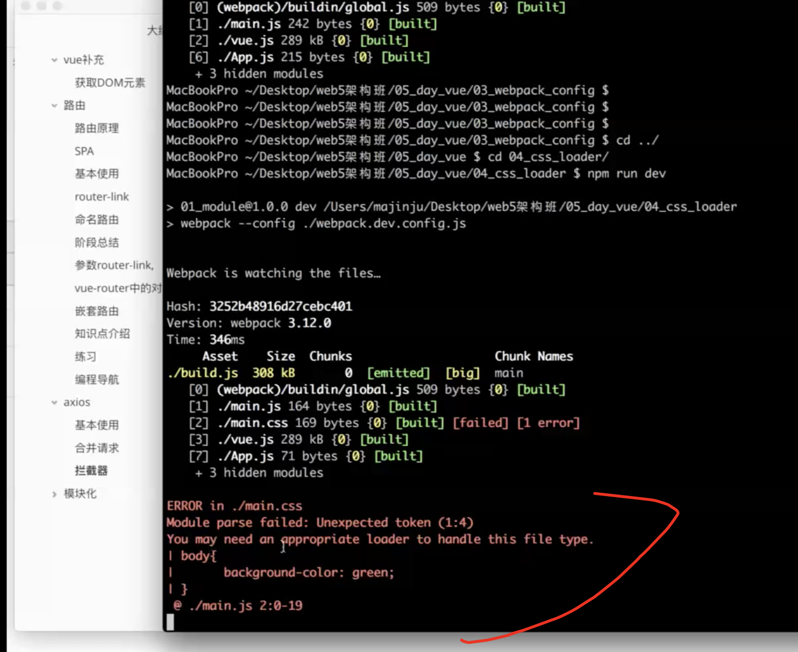
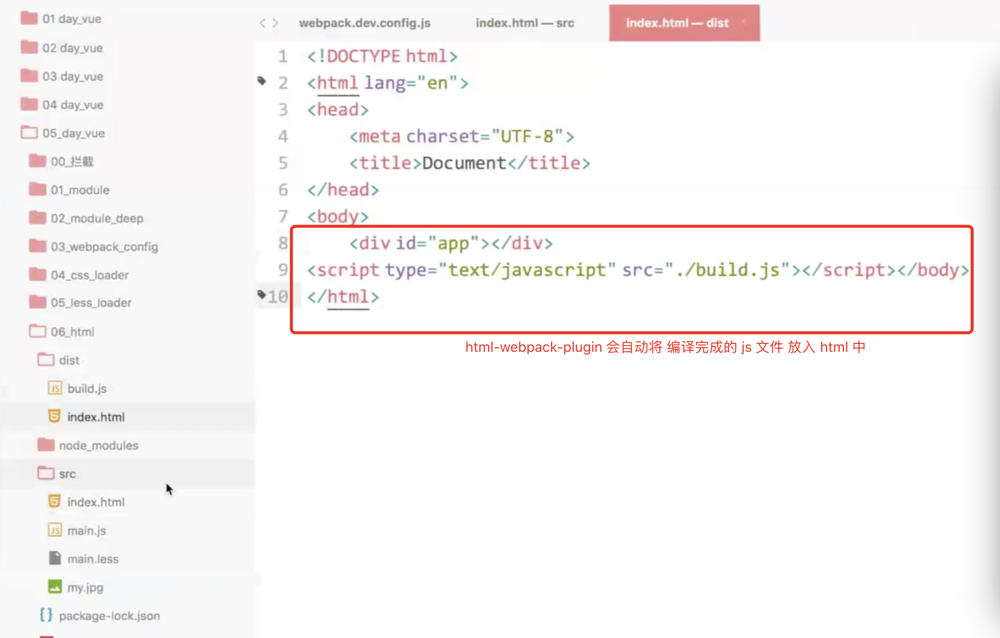

## 小例子

> 年底跳槽，刚好小白离职，薪资高，后找阮一峰顾问，本可清华研究院，课随便听...
好的机会一起研究

## axios 补全，webpack(主讲)


### 请求拦截器

在axios 发送请求之前，用 loading 让状态先加载出来


### 拦截器错误处理

```js
this.$axios.interceptors.request.use(config => {
  console.log(config)
  // 这里通过  Promise reject 回去
}, err => Promise.reject(err))

```

### 上传进度 onUploadProcess

### 取消请求 cancleToken

### 对 axios 进行封装 让代码不冗余

## webpack

### 模块化规范



// ?何意  第 一段 第 48分钟


### 手动实现一个 vue-cli, 同时学习脚手架使用




### webpack 打包机制

#### webpack 打包之后的文件build.js解读



```js

编译完了是一个自执行函数，第二个参数是一个包含各个块的数组

0 导出一个全局对象，在 web 中指的是 window 对象

1 包含了 main.js 相当于 main.js(new 了 vue 对象)

2 代码量最大，是包含vue源代码

3，4，5 都和node_modules/setimmediate 有关系, 与 Vue 异步 dom 更新机制有关系

6 与 app.js 解析有关

```

### webpack module

> \_webpack\_require\_({num})




## 使用 webpack 配置文件

> webpack.config.js

> watch

> webpack 会默认去找  webpack.config.js 但是当你需要指定 哪个配置文件的时候，webpack --config {webpack.dev.config.js}

### 分开生产环境和开发环境

- 生产环境不需要 watch 了就，开发环境需要watch, 分成两个配置文件

- 更改 package.json script 运行命令

```js

"script" : {
  "dev": "webpack --config ./webpack.dev.config.js",
  "prod": "webpack --config ./webpack.prod.config.js",
}

```

### css loader

> webpack 遇到 css 文件时候 并不能解析  需要引入 loader 才可以进行解析



需要两个  loader

- style-loader
将我们的 css 代码 解析完成  style 标签 放到 我们的 header 中

- css-loader 解析 css 文件

```
npm i css-loader style-loader -D
```

> css loader 写法

```js

// 先用 css-loader 解析，然后再用 style-loader 解析生成 style 放到 header 中
loader: 'style-loader!css-loader'
```

```js

var path = require('path')
const HtmlWebpackPlugin = require('html-webpack-plugin');
module.exports = {
	// 入口
	entry:{
		// 可以有多个入口，也可以有一个，如果有一个就默认从这一个入口开始解析
		"main":"./src/main.js"
	},
	output:{
		path:path.resolve('./dist'),//相对转绝对
		filename:'./build.js'
	},
	// 声明模块 包含各个loader
	module:{
		loaders:[
			{
				// style-loader  css-loader
				//  遇到后缀为.css的文件，webpack先用css-loader加载器去解析这个文件
					// 最后计算完的css，将会使用style-loader生成一个内容为最终解析完的css代码的style标签，放到head标签里。
					// webpack在打包过程中，遇到后缀为css的文件，就会使用style-loader和css-loader去加载这个文件。
				test:/\.css$/,
				loader:'style-loader!css-loader'
			},
			{

				// 对于图片的大小小于limit设置的大小  的图片，使用base64编码，
				// 可以减少一次图片的网络请求；那么对于比较大的图片,使用base64就不适合了，
				// 编码会和html混在一起，一方面可读性差，另一方面加大了html页面的大小，
				// 反而加大了下载页面的大小，得不偿失了呢,因此设置一个合理的limit是非常有必要的。

				test:/\.(jpg|png|jpeg|gif|svg)$/,
				loader:'url-loader?limit=60000'
			},
			{
				test:/\.less$/,
				loader:'style-loader!css-loader!less-loader'
			}
		]
	},
	plugins:[
		// 插件
		new HtmlWebpackPlugin({
			template:'./src/index.html',//参照物
		})
	],


	watch:true,//文件监视改动 自动产出build.js
}

```


### 图片解析

图片解析也需要 loader


- url-loader

另外，如果图片较多，会发很多http请求，会降低页面性能。这个问题可以通过url-loader解决。url-loader会将引入的图片编码，生成dataURl。相当于把图片数据翻译成一串字符。再把这串字符打包到文件中，最终只需要引入这个文件就能访问图片了。当然，如果图片较大，编码会消耗性能。因此url-loader提供了一个limit参数，小于limit字节的文件会被转为DataURl，大于limit的还会使用file-loader进行copy。


- file-loader

webpack最终会将各个模块打包成一个文件，因此我们样式中的url路径是相对入口html页面的，而不是相对于原始css文件所在的路径的。这就会导致图片引入失败。这个问题是用file-loader解决的

- url-loader 与 file-loader 之间的关系

url-loader封装了file-loader。url-loader不依赖于file-loader，即使用url-loader时，只需要安装url-loader即可，不需要安装file-loader


### 图片根据 大小决定是否转为 base64

对于较小的图片使用 base64 编码，可以减少图片的一次网络请求，对于较大的如果使用 base64 就不合适了，编码就会和 html 混合在一起，一方面可读性差，一方面增加了 html 页面的大小，反而加大了页面的大小，得不偿失，因此设置一个 合理的 Limit 是非常有必要的

### 编译 less

> 处理 less 需要 less loader, 使用 less-loader 需要依赖 less (npm i less -D)

```webpack
{

    test: /\.less$/,     
    loader: 'style-loader!css-loader!less-loader'
}
```

### 输出 html 模板

html-webpack-plugin



### webpack 热更新

```js

dev: webpack-dev-server --open --hot --inline --config ./webpack.config.js

```

## Tip

- webpack 基于 Node.js(common.js 规范) 直接 module.exports 即可


## FAQ

- ?读md webpack 原理

- 单文件配置，es6, 热加载



## Tip

- require.ensure 的用法

- CommonsChunkPlugin 的用法
 


## FAQ

- options 请求不知道

- webpack 使用 require 方式做懒加载

- Vue 写好之后  ie 上执行不出来，有个插件做这个事情 polyfill

https://github.com/Modernizr/Modernizr/wiki/HTML5-Cross-Browser-Polyfills

Polyfill 是一块代码（通常是 Web 上的 JavaScript），用来为旧浏览器提供它没有原生支持的较新的功能。

比如说 polyfill 可以让 IE7 使用 Silverlight 插件来模拟 HTML Canvas 元素的功能，或模拟 CSS 实现 rem 单位的支持，或 text-shadow，或其他任何你想要的功能

- 不备课直接怼的话 听着不舒服 有￥不负责任
