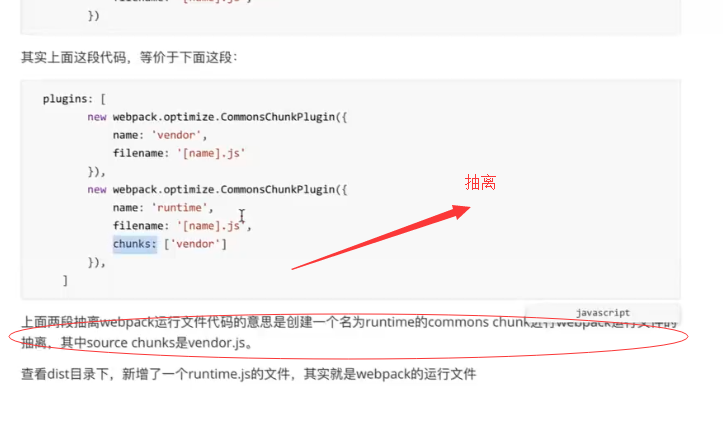

时隔10月1 补三天 十月一 之前欠下的课，预计 10.9 补 2 ， 10.10 补 2

> 补充 webpack commonChunksPlugin，参数以及意义

https://segmentfault.com/q/1010000010656779


https://segmentfault.com/a/1190000012828879#articleHeader6

```

name：可以是已经存在的chunk（一般指入口文件）对应的name，那么就会把公共模块代码合并到这个chunk上；否则，会创建名字为name的commons chunk进行合并
filename：指定commons chunk的文件名
chunks：指定source chunk，即指定从哪些chunk当中去找公共模块，省略该选项的时候，默认就是entry chunks
minChunks：既可以是数字，也可以是函数，还可以是Infinity，具体用法和区别下面会说

```


> webpack 按需加载 code split

https://www.cnblogs.com/webARM/p/5945208.html


## 抽离

- runtime

names: [runtime]

- 三方

```
const config = {
    entry: {
        first: './src/first.js',
        second: './src/second.js',
        vendor: Object.keys(packagejson.dependencies)//获取生产环境依赖的库
    },
    output: {
        path: path.resolve(__dirname,'./dist'),
        filename: '[name].js'
    },
    plugins: [
        new webpack.optimize.CommonsChunkPlugin({
            name: 'vendor',
            filename: '[name].js'
        }),
    ]
}

```

- 三方和common都抽离

```

lugins: [
        new webpack.optimize.CommonsChunkPlugin({
            name: ['vendor','runtime'],
            filename: '[name].js',
            minChunks: Infinity  // 此处vendor runtime 只包含 vendor runtime
        }),
        new webpack.optimize.CommonsChunkPlugin({
            name: 'common',
            filename: '[name].js',
            chunks: ['first','second']//从first.js和second.js中抽取commons chunk
        }),
    ]

```

## webpack 继续

### CommonChunkPlugin 的使用

CommonChunkPlugin 主要用来提取第三方库和公共模块，避免首屏加载的 bundle 文件或者 按需加载的
bundle 文件体积过大，从而导致加载时间过长，是一把优化利器


#### chunk

- webpack 中配置入口文件(entry) 是 chunk, 可以理解为 entry chunk

 - 入口文件以及它依赖文件通过 code splite(代码分割)出来的也是  chunk, 可以理解为
childrenchunk

- 通过  CommonsChunkPlugin 创建出来的文件也是 chunk 可以理解为  commons chunk

#### 指定两个入口文件需要对应指定出口，否则报错


```

- 输出两个文件，可以通过 htmlwebpackplugin 配置  html 引入这两个文件同时


// 后期可通过 htmlwebpackplugin 配置 同时引入这两个 js 文件
module.export = {
    output: {
        path: path.resolve('./dist'),
        filename: '[name].js'
    }
}


```

#### 多次导入同一文件产生的问题

> 当common.js 以及 vue.js 文件被多次个文件引入时，会被打包入多个文件(测试为两个入口文件)


##### 进行模块拆分

＞　生成如下文件


##### 从vendor中抽离静态第三方库

> 以上我们发现， 自己写的 common.js 以及 第三方 vue库都打包进入了 vendor.js, 我们希望 vendor,js 中只包含 第三库
> 因为 自己写的文件 与 其放入 一起的话 每次 打包 文件hash 会发生改变，造成，浏览器缓存失效

> 我们分两步走

- 先单独抽离出 webpack 运行文件

```
// 只需要添加 runtime 即可

plugin: [
    new webpack.optimize.CommonsChunkPlugin({
        name: ['vendor', 'runtime'],
        filename: '[name].js'
    })
]

```


> webpack 运行时文件


> 或者使用如下方式抽离




- 接着单独抽离第三方库，和 自定义公共模块


#### 对比 webpack 拆分以及不拆分 三种情况

> vue, 以及 common 部分都进入了 vendor.js, main1.js main2.js 体积大大减小


### Webpack 异步加载原理

code split 后 webpack 根据需求 发送 http 请求加载这个文件


## Tip

- webpack 是支持 es6 规范的，用 import 的话 需要使用 babel

- vue ui 图形化使用创建项目

## FAQ

- webpack 命令行输出信息中 [1], [2] ...

Webpack hides modules coming from folders like ["node_modules", "bower_components", "jam", "components"] in your console output by default. This helps you to focus on your modules instead on your dependencies.

You can display them by using the --display-modules argument.

https://stackoverflow.com/questions/28858176/what-does-webpack-mean-by-xx-hidden-modules


----  视频看的 先 9.30, 后 8.30 ------ 周六休息一天课, 今天明天上两天课


## 8 点 30 到 9点 30 部分


